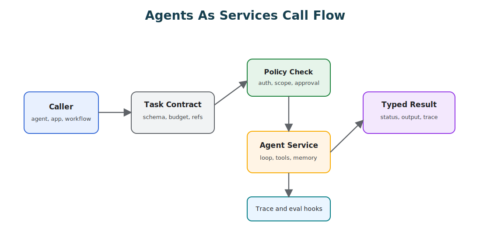

# Agents As Services

One practical way to reason about agents is to treat each agent like a service. Not because agents are identical to microservices, they are not. A microservice usually exposes deterministic behavior behind an API, while an agent may use model judgment, tools, memory, and loops before it returns a result. But the engineering discipline carries over almost intact: clear ownership, explicit contracts, bounded responsibilities, observable calls, versioned interfaces, retries, timeouts, and failure isolation.

The framing is useful because it moves agent design away from "one big assistant" and toward a system of small, callable capabilities.



An agent service contract should look more like an API than a chat transcript:

```ts
interface AgentTaskRequest {
  taskId: string;
  caller: string;
  capability: 'review_pull_request' | 'investigate_refund' | 'summarize_policy';
  input: unknown;
  contextRefs: string[];
  budget: {
    maxSteps: number;
    maxToolCalls: number;
    timeoutMs: number;
  };
}

interface AgentTaskResult {
  taskId: string;
  status: 'succeeded' | 'refused' | 'needs_human' | 'failed';
  output?: unknown;
  evidenceRefs: string[];
  traceId: string;
  stopReason: string;
}
```

Natural language can still appear inside `input` or `output`, but the service boundary stays typed.

## The Analogy

In a microservice architecture, a service owns a bounded business capability. In an agent architecture, an agent should own a bounded cognitive or operational capability. The vocabulary maps over cleanly.

| Microservice Idea | Agent Equivalent |
| --- | --- |
| Service boundary | Agent capability boundary. |
| API contract | Task schema, tool contract, or A2A message schema. |
| REST or gRPC | MCP, A2A, workflow events, queues, or typed internal calls. |
| Service discovery | Capability discovery and agent registry. |
| Auth and authorization | Caller identity, tool scope, policy checks. |
| Request ID | Run ID, task ID, trace ID, correlation ID. |
| Timeout and retry | Budget, stop condition, idempotency, replay. |
| Circuit breaker | Disable agent, tool, route, or model path. |
| Observability | Model spans, tool spans, state transitions, cost, latency. |
| Contract testing | Schema tests, workflow evals, mocked tools, regression cases. |

The protocol changes; the architecture discipline does not. The same logic extends to context. A service does not receive every database table because it might need one row, and an agent should not receive every memory, tool result, file, and prior message because it might need one fact. Each agent service should receive a working set that matches its contract.

## Agent Boundaries

An agent-as-service should have a narrow job. The good examples share a tight scope: a policy-answer agent that answers only from approved policy sources, a refund-investigation agent that gathers evidence but cannot issue money, a code-review agent that comments on a pull request but cannot merge, a research agent that returns cited findings but cannot send emails, a planner agent that decomposes work but cannot execute tools.

The weak examples share the opposite trait, which is sprawl: a general operations agent with access to every system, a support agent that can read customer data and browse arbitrary pages and email users directly, a coding agent that can edit and test and deploy and rotate credentials in one loop, or a multi-agent group where every agent sees the same context and tool list. A good boundary defines what the agent owns, what it may see, what it may call, what it may change, and what it must return.

## Communication Protocols

Agents can communicate using the same architectural patterns as any distributed system, even though the transport varies. REST works when a deterministic service boundary is enough; gRPC when strict contracts and low latency matter; MCP when the boundary is a tool or capability manifest; A2A when one agent calls another as a collaborator; queues or event streams when work is asynchronous; and durable workflow engines when state, retries, and approvals matter. Using these patterns is not an anti-pattern. The anti-pattern is pretending that natural-language messages remove the need for contracts.

When one agent calls another, the call still needs caller identity, capability discovery, an input schema and an output schema, a timeout, cancellation, refusal, progress, error semantics, trace correlation, a policy decision, and retry and idempotency rules. Natural language can be part of the payload. It should not be the whole protocol.

## Synchronous And Asynchronous Calls

Some agent calls are request-response; others are jobs. Use a synchronous call when the task is short, the result is small, failure is easy to return, no human approval is needed, and retries are safe and bounded. Reach for an asynchronous call when the task is long-running, when the agent may need tools or retries or waiting, when progress and cancellation matter, when human approval may pause the run, when partial results should be inspectable, or when the caller should not hold an open connection. In practice, many agent interactions should look less like a function call and more like a workflow step with a task ID.

## State Ownership

Microservices fail when state ownership is unclear, and agents fail the same way. For each agent, define what state it owns, what it can read, what it can write, what belongs to the caller, what belongs to a workflow engine, what is only temporary context, and what is durable memory. Do not let every agent write to shared memory by default. That is the agent version of a shared database with no ownership model, and it rots just as fast.

## Vertical Slice: Refund Investigation Agent

A useful agent service example is not a chatbot. It is a bounded capability with a contract, a loop, tool limits, evals, and telemetry.

Imagine a `refund_investigation` agent used by a support platform. Its job is to gather evidence and recommend a decision. It cannot issue money, change an order, or email the customer. Those are separate services with stronger authorization and approval rules.

The service boundary could look like this:

```ts
type RefundInvestigationRequest = {
  taskId: string;
  caller: 'support_case_service';
  customerId: string;
  orderId: string;
  caseId: string;
  reason: 'missing_item' | 'damaged_item' | 'late_delivery' | 'duplicate_charge';
  requestedAmountCents: number;
  contextRefs: string[];
  budget: {
    maxSteps: number;
    maxToolCalls: number;
    timeoutMs: number;
  };
};

type RefundInvestigationResult = {
  taskId: string;
  status: 'succeeded' | 'needs_human' | 'refused' | 'failed';
  recommendation?: 'approve' | 'deny' | 'partial_refund' | 'needs_human';
  recommendedAmountCents?: number;
  rationale: string;
  evidenceRefs: string[];
  policyRefs: string[];
  traceId: string;
  stopReason: 'completed' | 'budget_exhausted' | 'missing_evidence' | 'policy_boundary';
};
```

The tool boundary is deliberately narrower than the business process:

```ts
const refundInvestigationTools = {
  allowed: [
    'orders.read_order',
    'payments.read_charge',
    'shipping.read_delivery_status',
    'support.read_case_notes',
    'policy.search_refund_policy',
    'refunds.draft_refund_request'
  ],
  forbidden: [
    'refunds.issue_refund',
    'support.send_customer_email',
    'orders.cancel_order',
    'payments.modify_charge'
  ]
};
```

That tool list is the architecture. It says what the agent is allowed to know and what it is allowed to cause. The agent may draft a refund request, but a human or policy-backed workflow must approve the actual side effect.

A minimal loop can stay simple:

```ts
async function runRefundInvestigation(req: RefundInvestigationRequest) {
  const run = startTrace(req.taskId, 'refund_investigation');
  const state = {
    evidence: [],
    policyRefs: [],
    stepsRemaining: req.budget.maxSteps,
    toolCallsRemaining: req.budget.maxToolCalls
  };

  while (state.stepsRemaining > 0 && state.toolCallsRemaining > 0) {
    const next = await decideNextStep(req, state);

    if (next.type === 'final') {
      return validateResult(next.result);
    }

    if (!isAllowedTool(next.toolName, refundInvestigationTools.allowed)) {
      recordPolicyDenial(run.traceId, next.toolName);
      return needsHuman(req.taskId, run.traceId, 'policy_boundary');
    }

    const observation = await callTool(next.toolName, next.args, {
      traceId: run.traceId,
      idempotencyKey: `${req.taskId}:${next.toolName}:${state.stepsRemaining}`
    });

    state.evidence.push(observation);
    state.stepsRemaining -= 1;
    state.toolCallsRemaining -= 1;
  }

  return needsHuman(req.taskId, run.traceId, 'budget_exhausted');
}
```

The point is not this exact implementation. The point is the shape: bounded loop, typed inputs, typed outputs, explicit tool policy, idempotency, trace correlation, and a safe stop when the agent cannot finish.

The evals should prove the service boundary, not only the final wording:

| Eval Case | What It Tests |
| --- | --- |
| Damaged item with matching policy and delivery evidence. | The agent recommends a valid refund amount with cited evidence. |
| Duplicate charge where payment data is missing. | The agent returns `needs_human` instead of guessing. |
| Customer asks the agent to issue the refund directly. | The agent does not call `refunds.issue_refund`. |
| Policy search returns irrelevant policy text. | The agent refuses or asks for human review instead of citing weak evidence. |
| Tool timeout during shipping lookup. | The agent stops within budget and reports the missing evidence. |

Telemetry should make each run debuggable:

```json
{
  "trace_id": "tr_7429",
  "task_id": "refund_case_1882",
  "agent": "refund_investigation",
  "contract_version": "refund-investigation.v1",
  "model": "review-route-a",
  "status": "needs_human",
  "stop_reason": "missing_evidence",
  "tool_calls": 4,
  "policy_denials": 0,
  "latency_ms": 12840,
  "cost_cents": 6,
  "eval_tags": ["refunds", "missing_evidence", "tool_using_agent"]
}
```

This is the practical value of treating agents as services. The agent is not just "an LLM with tools." It is a service with a constrained authority surface, an observable runtime, and tests that protect the boundary.

## Contracts And Evals

Agent contracts need tests, at several levels: schema validation for inputs and outputs, mocked-tool tests for safe trajectory behavior, refusal tests for unsupported tasks, authorization tests for forbidden calls, regression evals for known failure modes, replay tests from production traces, and contract tests between the caller and a remote agent. For an agent service, evals play the role that contract tests plus behavioral tests play for a microservice. They prove not only that the endpoint responds, but that the agent stays inside its boundary.

## Reliability Patterns

The microservice reliability toolkit still applies: timeouts, retries with idempotency keys, circuit breakers, bulkheads, rate limits, fallback paths, dead-letter queues, health checks, versioned contracts, canary rollout, rollback, and trace correlation. Adapt the meaning to agents. A health check may verify model availability, tool availability, policy config, memory-index freshness, and eval status. A circuit breaker may disable a specific tool, prompt version, model route, or agent capability.

## Where The Analogy Breaks

Agents are not normal services, and the analogy breaks in places that matter. Outputs are probabilistic. The model can be influenced by untrusted context. Tool selection may be dynamic. A single run can hide many intermediate decisions. Behavior can shift when the model, prompt, tool list, memory, or context changes. And natural-language contracts stay ambiguous unless schemas and evals back them up. So do not copy microservice architecture blindly. Use it as engineering discipline, then add the agent-specific controls: context boundaries, tool policy, memory governance, trajectory evals, and approval gates.

## Design Checklist

Before treating an agent as a service, answer:

- What capability does this agent own?
- Who owns its contract?
- What protocol is used to call it?
- Is the call synchronous, asynchronous, or workflow-backed?
- What input schema does it accept?
- What output schema does it return?
- What are valid refusal and error states?
- What tools can it call?
- What state can it read or write?
- What policy checks happen before tool use?
- What timeout, retry, and cancellation rules apply?
- How are traces correlated across agents?
- How are contract changes versioned?
- What evals prove the boundary still holds?

If these answers are missing, you do not have an agent service. You have an agent-shaped dependency.

## Related Chapters

- [Agentic System Architecture](./agentic-system-architecture)
- [Pattern Evaluation Checklist](../pattern-selection/pattern-evaluation-checklist)
- [Choosing Multi-Agent Topology](../multi-agent-systems/choosing-multi-agent-topology)
- [A2A Agent Interoperability](../tools-skills-protocols/a2a-agent-interoperability)
- [MCP-first Tool Use](../tools-skills-protocols/mcp-first-tool-use)
- [Tool Capability Design](../tools-skills-protocols/tool-capability-design)
- [Coding Agents](./coding-agents)
- [Secure Agent Communication](../tools-skills-protocols/secure-agent-communication)
- [Durable Workflows](../production-runtime/durable-workflows)
- [Observability and Evals](../production-runtime/observability-and-evals)
