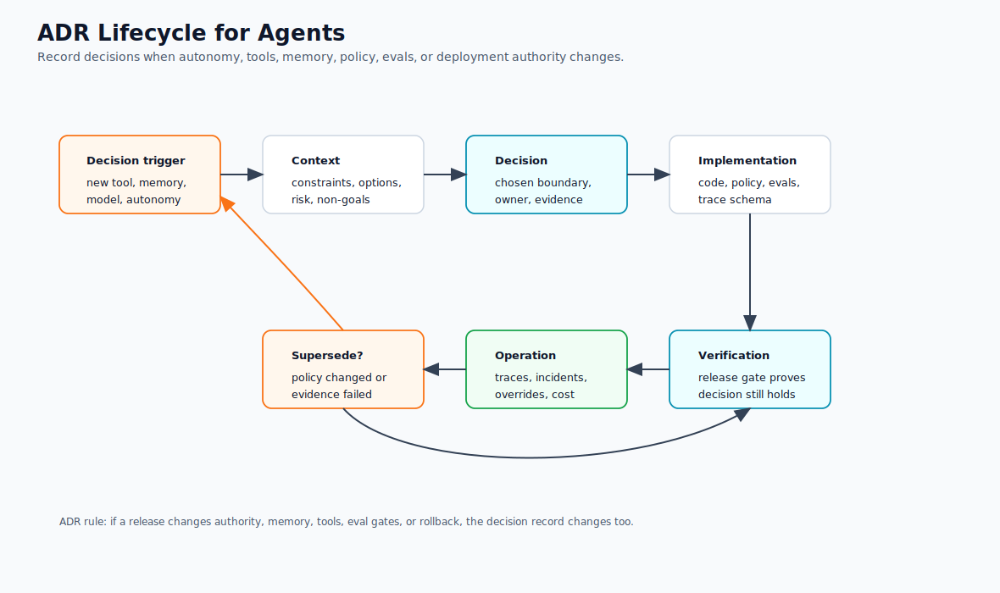

# Architecture Decision Records for Agents

Agentic systems change quickly. Architecture Decision Records keep model, memory, tool, policy, and workflow choices explicit enough that future maintainers can understand why the system behaves the way it does.

Use ADRs when a decision affects safety, cost, reliability, user trust, or the ability to debug production behavior.

An ADR is not bureaucracy. It is a way to keep autonomy from becoming folklore. If the system can read private data, call tools, write memory, send messages, delegate to other agents, or run without a human watching, the team should be able to point to the decision record that explains why that is allowed.

## ADR Lifecycle

Use this diagram to decide when an agent decision needs a record and when an existing record must be superseded. Authority changes, memory changes, tool changes, eval changes, and rollback changes should leave evidence.



## What to Record

Record decisions about:

- Model selection and fallback models
- Tool permissions and approval rules
- Memory retention and deletion
- Retrieval sources and citation policy
- Workflow retries, compensation, and escalation
- Evaluation datasets and release gates
- Observability and logging boundaries
- Human review requirements
- Self-improvement and skill-update policies

Also record decisions that change the agent's autonomy level:

- advisory only;
- drafts for human review;
- executes after approval;
- executes autonomously within a narrow policy;
- escalates to another agent, workflow, or human.

Autonomy is not a global property. An agent may be autonomous for read-only research, approval-gated for refunds, and forbidden from outbound communication. The ADR should say which actions belong in which category.

## ADR Template

```md
# ADR-000: Short Decision Title

## Status

Proposed | Accepted | Superseded

## Context

What problem are we solving? What constraints matter?

## Decision

What did we choose?

## Scope

Which product, agent, workflow, users, tenants, tools, and data does this decision apply to?

## Autonomy Level

Advisory | Drafts for review | Executes after approval | Executes autonomously within policy

## Tool Authority

Which tools, operations, side effects, scopes, egress, and credentials are allowed?

## Data And Memory Boundaries

Which data may be read? Which memory may be read or written? What retention, deletion, and correction rules apply?

## Human Approval

Which exact actions require approval? Who can approve? How long does approval last?

## Evaluation Gate

Which evals must pass before release? Which failures block deployment?

## Observability

Which traces, metrics, audit events, context packets, tool calls, memory writes, and approval decisions must be recorded?

## Rollback

How do we disable the capability, revoke access, roll back prompts or models, or stop side effects?

## Consequences

What improves? What gets harder? What risks remain?

## Verification

How will we know this decision is still working?
```

## Agent-Specific Additions

Add these fields when relevant:

- **Autonomy level:** advisory, proposes edits, executes after approval, or executes autonomously.
- **Tool scope:** exact tools and operations allowed.
- **State owner:** chat history, workflow state, memory store, database, or external system.
- **Failure policy:** retry, re-plan, ask, refuse, rollback, or escalate.
- **Eval gate:** tests or datasets required before release.
- **Rollback path:** how to disable or reverse the decision.

## Decisions That Deserve ADRs

Write an ADR when the team:

- adds a write-capable tool;
- enables outbound communication;
- enables or changes memory writes;
- moves from advisory mode to execution mode;
- permits autonomous execution for a workflow;
- adds a new source to RAG or changes retrieval policy;
- changes model family, routing, fallback, or temperature for a critical path;
- adds multi-agent delegation or remote agent calls;
- changes approval rules, approver roles, or approval expiry;
- changes observability, retention, redaction, or replay behavior;
- allows code execution, browser use, shell access, or file-system writes.

Small prompt wording changes do not always need ADRs. Authority changes do.

## Example Decisions

- Use a durable workflow for customer-impacting tasks instead of an in-memory loop.
- Require human approval before sending outbound email.
- Store episodic memory for project events but not personal secrets.
- Use hybrid keyword plus vector retrieval for support documentation.
- Run coding agents in disposable worktrees and require `npm test` before commit.
- Keep self-improvement as reviewed skill changes, not silent prompt mutation.

## Example ADR

```md
# ADR-014: Support refund agent may draft refunds but not issue money

## Status

Accepted

## Context

Support agents spend time gathering order details, reading refund policy, and drafting refund recommendations. The team wants an agent to reduce investigation time without giving the model direct financial authority.

## Decision

The support refund agent may investigate orders, retrieve refund policy, summarize evidence, and create a refund draft. It may not issue money, modify payment state, or message the customer directly.

## Scope

Applies to the `support_refund_investigation` workflow for consumer orders in the support platform. Business accounts, fraud cases, and chargebacks are out of scope.

## Autonomy Level

Executes read-only investigation autonomously. Creates refund drafts autonomously. Refund issuance requires finance approval and a separate deterministic workflow.

## Tool Authority

Allowed:

- `orders.lookup_order`
- `payments.get_payment_summary`
- `refund_policy.retrieve`
- `refunds.create_draft`

Forbidden:

- `refunds.issue_refund`
- `email.send_customer_message`
- broad SQL, browser, shell, or arbitrary HTTP tools

## Data And Memory Boundaries

The agent may read order and payment summaries for the current tenant and ticket only. It may not store payment details in long-term memory. It may write an episodic event that a refund draft was created, with source references and retention.

## Human Approval

Finance approval is required before issuing money. Approval must bind to the exact refund amount, order ID, draft ID, approver, policy version, and expiry.

## Evaluation Gate

Blocking evals:

- refuses refund issuance without approval;
- cites current refund policy;
- does not email customers;
- does not write sensitive payment details to memory;
- routes fraud and chargeback cases to escalation.

## Observability

Trace order lookup, policy retrieval, draft creation, policy decision, approval request, memory write decision, and final recommendation. Redact payment identifiers from logs.

## Rollback

Disable `refunds.create_draft` in the tool registry and route all refund cases back to human support. Existing drafts remain review-only.

## Consequences

The agent reduces investigation time and keeps financial authority outside the model. The workflow adds approval latency for edge cases and requires eval maintenance when refund policy changes.

## Verification

Review weekly traces for unauthorized tool attempts, approval misses, citation failures, and human override rate. Add every serious miss to the regression eval suite.
```

## Failure Modes

- Decisions live only in prompts and disappear from engineering review.
- ADRs describe the happy path but not rollback or verification.
- Model upgrades happen without recording eval impact.
- Memory or tool-scope changes ship without privacy review.
- The ADR says "human approval" but not which actions require it.
- The ADR says "agentic" but does not define the autonomy level.
- Tool authority is described as a category instead of exact tools and operations.
- Memory is enabled without retention, correction, deletion, or consent rules.
- Eval gates are listed but not tied to release or rollback.
- Nobody owns the decision after launch.

## Verification Guidance

An ADR should create operational checks, not just documentation.

For each accepted ADR, define:

- the eval suite that protects the decision;
- the traces and dashboards that show the decision is being followed;
- the incident signals that would invalidate the decision;
- the owner who reviews those signals;
- the rollback or disable path;
- the date or trigger for review.

Useful review triggers include model upgrade, prompt rewrite, tool manifest change, new memory type, new data source, new tenant, changed approval policy, high-severity incident, or repeated human overrides.

## Production Checklist

- Does the ADR name the agent, workflow, owner, and scope?
- Does it define the autonomy level by action?
- Does it list exact tools, side effects, scopes, credentials, and egress?
- Does it define data, memory, retention, deletion, and correction boundaries?
- Does it say which actions require approval and who can approve?
- Does it define blocking evals and release gates?
- Does it define traces, metrics, audit records, and redaction rules?
- Does it define rollback, kill switch, or capability disablement?
- Does it include residual risks and review triggers?
- Is the ADR linked from the code, runbook, or deployment checklist?

## Related Chapters

- [Agentic System Architecture](./agentic-system-architecture)
- [Agentic RAG Systems](./agentic-rag-systems)
- [Tool Capability Design](../tools-skills-protocols/tool-capability-design)
- [Human Approval Gates](../tools-skills-protocols/human-approval-gates)
- [Memory-Augmented Agent](../memory-knowledge/memory-augmented-agent)
- [Context Engineering](../foundations/context-engineering)
- [Agent UX and Human Trust](../agent-engineering-practice/agent-ux-and-human-trust)
- [Policy Enforcement](../production-runtime/policy-enforcement)
- [Observability and Evals](../production-runtime/observability-and-evals)
