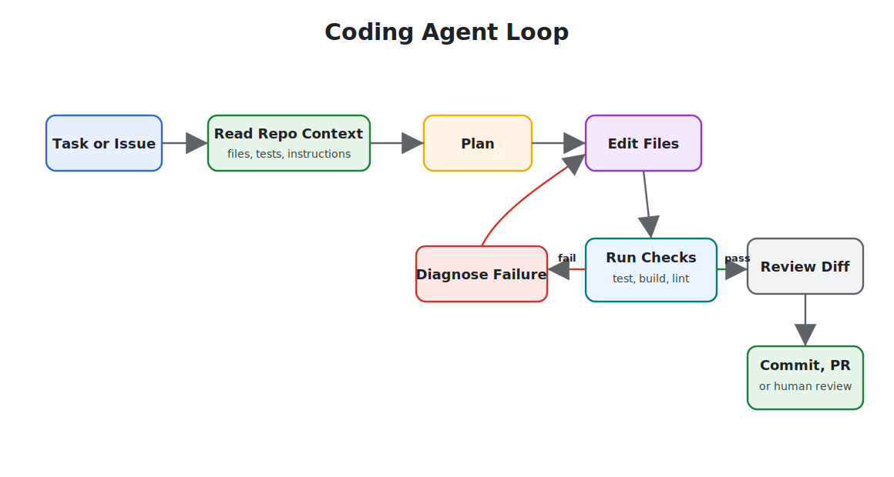

# Coding Agents

Coding agents operate inside software repositories. They read code, edit files, run commands, inspect failures, produce diffs, and often create commits or pull requests. Codex, Cursor Agent and Cloud Agent, Claude Code, OpenHands, and similar tools are examples of this architecture class.

The pattern is not "AI autocomplete." It is a controlled development worker with repository context and execution privileges.

## Examples

- [Codex CLI](https://developers.openai.com/codex/cli) and [Codex IDE extension](https://developers.openai.com/codex/ide)
- [Cursor Agent](https://cursor.com/docs/agent/overview), [Plan Mode](https://cursor.com/docs/agent/plan-mode), and [Cloud Agents](https://cursor.com/docs/cloud-agent)
- [Claude Code](https://code.claude.com/docs/en/overview)
- [OpenHands](https://openhands.dev/) and [OpenHands GitHub](https://github.com/OpenHands/openhands)

## Core Loop

## Surfaces

- **Local CLI:** runs near the repository and can use local tools.
- **IDE agent:** shares editor context, selected files, inline diffs, and local commands.
- **Cloud or background agent:** clones or mounts the repository in an isolated environment and returns a branch, diff, or PR.
- **CI/review agent:** reviews pull requests, comments on diffs, or proposes patches.
- **Multi-agent workspace:** runs several agents on separate branches or worktrees.

## Architecture Concerns

Coding agents need unusually clear boundaries because they can change source code and run commands.

Design for:

- Repository instructions: coding standards, commands, architecture constraints, and review expectations.
- Workspace isolation: branch, worktree, container, or cloud environment per task.
- Approval policy: which commands and file edits need human approval.
- Test signal: fast checks first, then broader regression checks.
- Diff review: humans inspect changed behavior, not just final prose.
- Secret handling: no credentials in prompts, logs, or generated code.
- Dependency policy: explicit approval before adding packages or changing lockfiles.

## Use When

- The task can be verified with tests, builds, type checks, screenshots, or review.
- The desired change can be described in concrete acceptance criteria.
- The agent can inspect enough repository context to follow local patterns.
- You can isolate work and review the resulting diff.

## Avoid When

- The repository lacks tests or runnable checks and the change is high risk.
- The task is vague, political, or primarily product discovery.
- The agent needs broad production credentials.
- Multiple agents would edit the same files without coordination.

## Operating Patterns

- Ask for a plan before large edits.
- Make the agent cite files and commands it used.
- Prefer small tasks with clear completion criteria.
- Use worktrees or branches for parallel agents.
- Require tests or type checks before commit.
- Review generated code like human code.
- Keep durable repo guidance in a project instruction file.

## Failure Modes

- Plausible code that compiles but violates architecture.
- Broad refactors that mix behavior changes with formatting.
- Tests updated to match broken behavior.
- Hidden dependency changes.
- Shell commands that mutate local state unexpectedly.
- Agents fighting over the same files.
- Review fatigue when diffs are too large.

## Design Rule

The coding agent should never be the only reviewer of its own code. It can propose, edit, test, and explain. A separate check, reviewer, or policy gate should decide whether the change lands.

## Related Chapters

- [Goals and State](../foundations/goals-and-state)
- [Skills](../tools-skills-protocols/skills)
- [Human Approval Gates](../tools-skills-protocols/human-approval-gates)
- [Observability and Evals](../production-runtime/observability-and-evals)
- [Architecture Decision Records for Agents](./architecture-decision-records)
