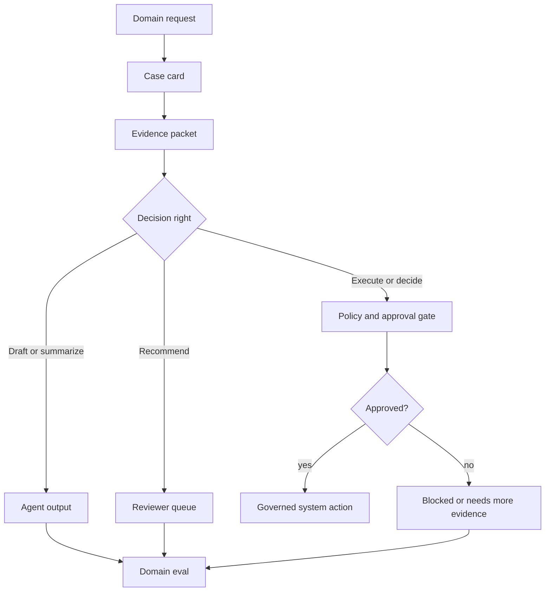
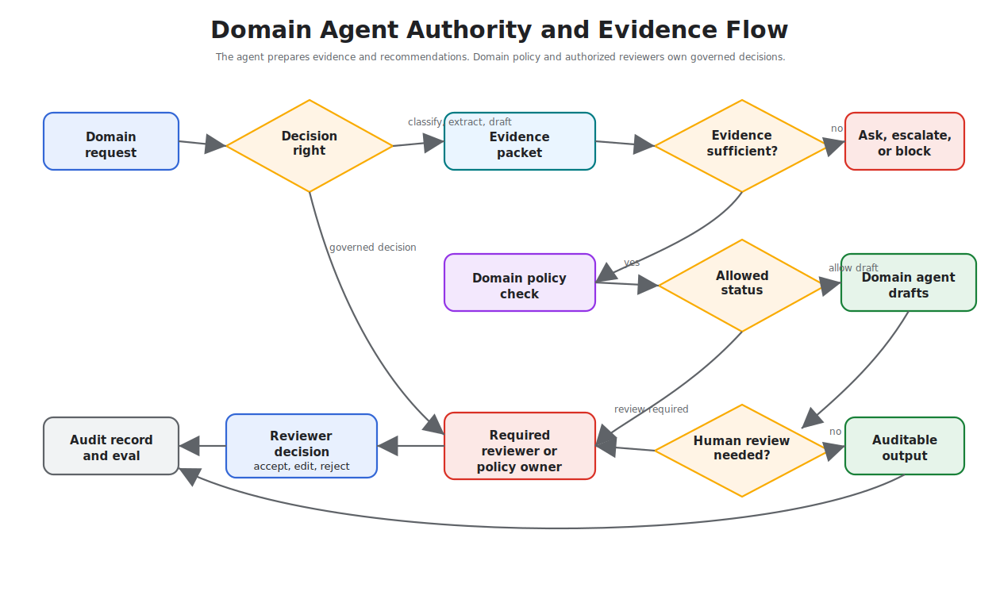

# Domain Agent Architectures

Domain agents apply agentic patterns inside a specialized field such as healthcare, finance, legal operations, education, science, insurance, or software engineering. The pattern is not "add an agent to a domain." The pattern is to encode the domain's evidence, constraints, risk, and review process into the architecture.

Use this chapter when an agent must operate under domain-specific standards rather than generic productivity expectations.

Download the reusable review artifact: [domain agent architecture review checklist](/capstone-assets/templates/domain-agent-architecture-review-checklist.txt).

## Intent

Build agents that respect the domain's knowledge sources, vocabulary, decision rights, compliance boundaries, and failure costs.

The architecture should make domain judgment auditable.

## Domain Design Questions

Start with the domain, not the model.

- What decisions can the agent make?
- What decisions can it only recommend?
- What evidence is authoritative?
- What evidence is forbidden or insufficient?
- What requires professional review?
- What user data is sensitive?
- What are the domain-specific failure modes?
- What laws, policies, or standards apply?
- What record must be retained?
- What explanation must be shown to users or reviewers?

The answers shape tools, memory, evals, approval gates, and deployment.

## Decision Rights

The first architecture decision is not the model or framework. It is decision rights.

| Decision Type | Agent May | Agent Must Not |
| --- | --- | --- |
| Classification | assign a draft category with evidence and confidence | silently finalize regulated outcomes |
| Recommendation | propose next action, cite policy, explain uncertainty | execute irreversible action without approval |
| Drafting | prepare messages, reports, forms, or plans | send obligation-creating communication without review |
| Extraction | extract fields from documents with source spans | invent missing fields or hide uncertainty |
| Triage | route cases by risk and urgency | deny service, coverage, care, or access without policy |
| Analysis | summarize evidence and compare options | present unsupported judgment as fact |

Write the decision-rights table before implementation. It tells the team where the model can help and where the runtime, policy, or professional reviewer must remain in charge.

## Common Domain Shapes

| Domain Shape | Agent Role | Architecture Notes |
| --- | --- | --- |
| Healthcare or clinical support | Summarize, triage, draft, explain, prepare evidence. | Keep licensed humans in decision roles; cite sources; log recommendations. |
| Finance or insurance | Analyze documents, classify risk, prepare decisions. | Enforce policy, audit data lineage, require approval for financial actions. |
| Legal operations | Search, summarize, compare, draft, extract obligations. | Preserve privilege boundaries; show citations; avoid unsupervised legal conclusions. |
| Education | Tutor, assess, adapt difficulty, produce feedback. | Track learning goals; avoid over-personalized unsupported claims. |
| Scientific research | Search literature, propose hypotheses, analyze data. | Separate hypothesis generation from validation; track provenance. |
| Software engineering | Search code, edit, test, review, prepare PRs. | Sandbox execution; preserve diffs; require CI and review gates. |

Different domains can share patterns while requiring different risk controls.

## Concrete Domain Examples

| Domain | Safe Agent Role | Hard Boundary |
| --- | --- | --- |
| Support | Summarize ticket history, retrieve policy, draft response. | Cannot promise refunds, credits, or account changes without approval. |
| Healthcare | Prepare visit summaries, patient questions, or evidence packets. | Cannot diagnose, prescribe, or replace licensed review. |
| Finance | Extract statement fields, flag anomalies, draft risk notes. | Cannot move money, approve credit, or change entitlements without controls. |
| Legal operations | Compare clauses, summarize matter history, draft obligation lists. | Cannot provide unsupervised legal judgment or cross privilege boundaries. |
| Insurance | Classify claim documents, retrieve policy terms, draft recommendation. | Cannot deny or approve claim without governed review. |
| Internal operations | Triage access requests, draft runbooks, summarize incidents. | Cannot grant production access or close incidents without owner acceptance. |

These examples share one pattern: the agent prepares evidence and recommendations; the governed system owns authority.

## Production Case Cards

Use case cards when a domain team says, "We need an agent for our process." The card turns that request into evidence, authority, review, and eval decisions.

| Domain | Example Request | Agent May Produce | Must Block Or Escalate | Release Eval |
| --- | --- | --- | --- | --- |
| Support | "Refund this order and tell the customer." | Ticket summary, policy match, draft recommendation, customer-message draft. | Refund issue, customer promise, account credit, or missing policy. | Above-threshold refund requires approval before any promise language. |
| Healthcare | "Summarize this visit and suggest next steps." | Visit summary, patient questions, evidence packet for clinician review. | Diagnosis, treatment plan, medication change, or cross-patient data. | Missing clinician review blocks treatment-language output. |
| Finance | "Explain why this account was flagged." | Anomaly summary, source transactions, risk-note draft, reviewer queue reason. | Money movement, credit approval, entitlement change, or unsupported risk conclusion. | Wrong jurisdiction or stale policy blocks recommendation. |
| Legal operations | "Compare these clauses and advise which is safer." | Clause comparison, cited differences, obligation list, review questions. | Legal advice, external communication, filing, or cross-matter source use. | Privilege or matter-boundary violation fails the eval. |
| Internal operations | "Grant the engineer production access for the incident." | Access-request summary, runbook match, owner recommendation, expiry proposal. | Permission grant, incident closure, destructive command, or owner bypass. | Access change requires owner approval and expiry before execution. |

Each card should name one forbidden sentence or action. For support, "Your refund has been approved" is forbidden before approval. For healthcare, "You should start this medication" is forbidden unless the licensed workflow owns that decision. For internal operations, "Access granted" is forbidden until the identity and owner checks pass.



The case card is not documentation after the fact. It is the architecture input. If the card cannot name the authoritative evidence, forbidden action, reviewer, and release eval, the domain agent is not ready to build.

## Reference Architecture

```text
Domain request
  -> identity and authorization
  -> domain router
  -> evidence retrieval
  -> domain tool execution
  -> policy and risk checks
  -> agent or workflow decision
  -> human review when required
  -> auditable output
```

The domain router should select sources, tools, and approval paths. It should not bypass governance.



Read the diagram from left to right. The first gate is decision rights: if the task asks the agent to execute, deny, approve, diagnose, or decide, the flow moves toward policy or reviewer ownership before the model can produce a governed outcome.

## Domain Policy Contract

Domain policy should be executable enough to test.

```ts
type DomainPolicyDecision = {
  domain: "healthcare" | "finance" | "legal" | "insurance" | "support" | "internal_ops";
  taskType: string;
  actorRole: string;
  dataClass: "public" | "internal" | "confidential" | "regulated";
  evidenceStatus: "sufficient" | "missing" | "stale" | "conflicting";
  proposedAction: "answer" | "draft" | "recommend" | "execute" | "escalate";
  decision:
    | { status: "allow"; reason: string }
    | { status: "allow_with_review"; reviewerRole: string; reason: string }
    | { status: "deny"; reason: string }
    | { status: "needs_more_evidence"; missing: string[] };
};
```

The exact type will vary, but the principle should not: domain policy is a runtime decision, not a paragraph in the prompt.

## Evidence Design

Domain agents need explicit evidence policy.

Define:

- authoritative source types;
- freshness requirements;
- citation format;
- source conflict handling;
- minimum evidence for an answer;
- unsupported claim behavior;
- source redaction rules;
- tenant and role boundaries.

If the agent cannot cite or explain the basis for a domain answer, it should lower confidence, ask for clarification, or escalate.

## Domain Evidence Packet

Every domain recommendation should carry an evidence packet. The packet should be small enough for a reviewer to inspect and structured enough for evals to test.

```ts
type DomainEvidencePacket = {
  domain: "support" | "healthcare" | "finance" | "legal" | "insurance" | "internal_ops";
  caseId: string;
  actorRole: string;
  taskType: string;
  decisionRight: "classify" | "draft" | "recommend" | "execute" | "escalate";
  sources: Array<{
    sourceId: string;
    sourceType: "policy" | "record" | "contract" | "clinical_note" | "ticket" | "runbook" | "database_result";
    version: string;
    effectiveDate?: string;
    jurisdiction?: string;
    tenantId?: string;
    freshness: "current" | "stale" | "unknown";
    citedSpan?: string;
  }>;
  uncertainty: Array<{
    issue: string;
    impact: "low" | "medium" | "high";
    requiredReviewer?: string;
  }>;
  forbiddenActions: string[];
  finalStatus: "draft" | "recommendation" | "needs_more_evidence" | "needs_review" | "blocked";
};
```

The packet should make unsafe evidence obvious. A missing jurisdiction, stale policy version, cross-tenant source, or unsupported claim should change the final status before the user sees a confident answer.

## Domain Playbooks

Use domain playbooks to avoid treating every specialized field as the same architecture with different vocabulary.

| Domain | Minimum Evidence | Default Agent Output | Mandatory Review Trigger |
| --- | --- | --- | --- |
| Support | ticket, account scope, current policy, prior actions | draft response or recommendation | refund, credit, account change, or missing policy |
| Healthcare | patient-scoped record, approved reference, date, reviewer role | summary, question list, or evidence packet | diagnosis, treatment, medication, or conflicting clinical facts |
| Finance | transaction record, policy, jurisdiction, risk class | anomaly note, extracted fields, or draft analysis | money movement, credit decision, entitlement change, or high-risk flag |
| Legal operations | matter scope, source document, privilege boundary, clause span | clause summary, obligation list, or draft comparison | legal conclusion, privilege risk, filing, or external communication |
| Insurance | claim record, policy version, effective date, required documents | claim summary or draft recommendation | approval, denial, exception, missing document, or conflicting evidence |
| Internal operations | request, owner, runbook, access policy, incident state | triage, draft runbook step, or owner recommendation | production access, incident closure, permission grant, or destructive action |

The playbook should be local to the domain and owned by the team accountable for the outcome. Do not let a generic agent prompt decide which evidence is enough.

## Worked Slice: Insurance Claim Triage

An insurance claim triage agent can help a reviewer move faster without giving the agent claim authority.

| Step | Runtime Owner | Agent Role | Required Evidence | Stop Condition |
| --- | --- | --- | --- | --- |
| intake | workflow service | none | claim ID, policy ID, claimant, submitted documents | invalid or cross-tenant claim |
| document extraction | extraction tool and verifier | extract fields with source spans | invoice, incident date, policy number, requested amount | missing required field |
| policy retrieval | retrieval service | none | policy version, effective date, coverage terms | stale or mismatched policy |
| triage | domain agent | draft coverage questions and risk notes | extracted fields and policy spans | conflicting evidence or exception |
| recommendation | domain agent | recommend next reviewer action | evidence packet and uncertainty list | approval, denial, or exception requested |
| review | licensed or authorized reviewer | none | recommendation, source spans, policy checks | reviewer accepts, edits, rejects, or escalates |
| audit | workflow service | none | final decision, reviewer ID, reason, trace | retained case record |

The agent may say, "This claim appears to need more evidence because the incident date is outside the visible policy period." It must not say, "Claim denied." The architecture keeps triage language separate from governed decision language.

## Domain Release Gate

Before a domain agent reaches real users or reviewers, require evidence that the domain boundary works.

| Gate | Passing Evidence |
| --- | --- |
| decision rights | tests prove the agent drafts, recommends, or escalates instead of making forbidden decisions |
| source authority | evals fail when the answer uses unapproved, stale, cross-tenant, or wrong-version evidence |
| reviewer workflow | reviewer can see source spans, policy checks, uncertainty, and proposed action |
| privacy and retention | traces, prompts, memory, and outputs redact or omit regulated data according to policy |
| negative cases | system escalates missing evidence, conflicting evidence, and policy exceptions |
| override learning | reviewer edits and rejections become labeled regression cases |
| communication safety | drafts avoid final decision, diagnosis, promise, obligation, or approval language |

Do not treat a high score on generic answer quality as a domain release. The release gate should prove the system respects the domain's authority model.

## Jurisdiction, Tenant, and Version Boundaries

Domain answers often depend on where, when, and for whom the question is asked.

Track:

- tenant or customer boundary;
- jurisdiction or region;
- policy version;
- document version;
- effective date;
- reviewer role;
- data retention class;
- source freshness.

A finance policy from the wrong jurisdiction, a clinical note from the wrong patient, a legal document from the wrong matter, or an insurance policy from the wrong effective date is not weak evidence. It is unsafe evidence.

## Review and Approval

Domain agents often produce recommendations rather than final decisions.

Use human review for:

- clinical, legal, financial, or compliance decisions;
- low-confidence classifications;
- conflicting evidence;
- exceptions to policy;
- irreversible actions;
- communications that create obligation or liability.

The review interface should show evidence, policy checks, extracted fields, uncertainty, and the proposed action.

Reviewer decisions should become data. Capture whether the reviewer accepted, edited, rejected, or escalated the recommendation and why. Those records can update evals, policy examples, prompts, and training material.

## Domain Evals

Generic evals are not enough.

Add evals for:

- domain terminology;
- document extraction;
- citation accuracy;
- missing evidence;
- policy exceptions;
- escalation thresholds;
- privacy constraints;
- adversarial or ambiguous inputs;
- reviewer override cases.

Use subject matter experts for labels where judgment matters.

## Domain Eval Matrix

| Eval Type | Example |
| --- | --- |
| Evidence grounding | answer must cite current policy or source span |
| Extraction accuracy | required fields match labeled document fixtures |
| Missing evidence | system asks for more evidence or escalates |
| Policy exception | recommendation follows exception workflow |
| Privacy boundary | agent refuses cross-tenant or unauthorized data |
| Jurisdiction/version | answer uses correct region and policy date |
| Reviewer override | overridden recommendations become regression cases |
| Communication risk | drafts avoid obligation, diagnosis, promise, or final decision language |

Domain evals should include negative cases. The system must prove it knows when not to answer.

## Failure Modes

- The agent sounds authoritative while evidence is weak.
- Domain-specific policy lives only in prompts.
- The agent treats recommendations as decisions.
- Retrieval mixes tenants, jurisdictions, or policy versions.
- Evals measure language quality but not domain correctness.
- Human review lacks enough evidence to make a decision.
- The system uses a general web source where only approved domain sources are allowed.
- Reviewer overrides are not captured, so the same mistake repeats.
- A draft message creates legal, financial, clinical, or contractual obligation.
- Memory stores regulated or sensitive facts without retention and deletion rules.

## Review Questions

Before piloting a domain agent, ask:

1. Which decisions are the agent forbidden to make?
2. Which evidence sources are authoritative, stale, forbidden, or insufficient?
3. Which human role owns final review?
4. Which tenant, jurisdiction, policy, or document version applies?
5. What must be retained for audit?
6. What must be redacted from prompts, traces, memory, and final output?
7. Which eval fails the release if the agent sounds confident but lacks evidence?
8. How do reviewer corrections become regression tests?

## Related Chapters

- [Agentic RAG Systems](./agentic-rag-systems)
- [Policy Enforcement](../production-runtime/policy-enforcement)
- [Human Approval Gates](../tools-skills-protocols/human-approval-gates)
- [Evaluation-Driven Agent Development](../agent-engineering-practice/evaluation-driven-agent-development)
- [Knowledge-Bound Agents](../memory-knowledge/knowledge-bound-agents)
