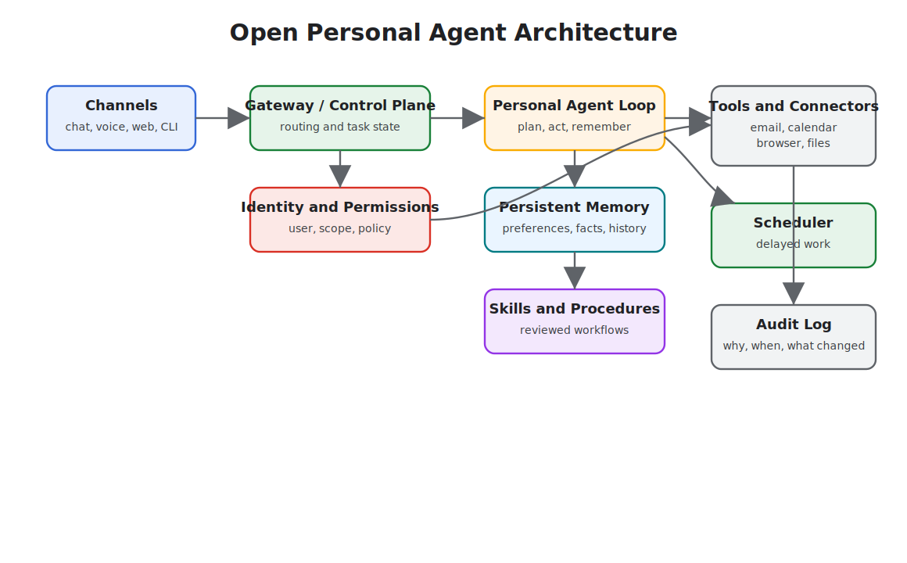
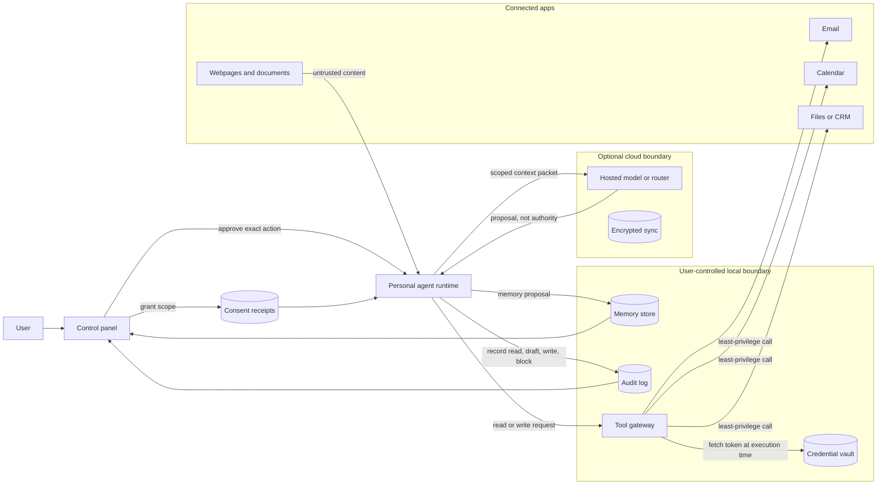

# Open Personal Agent Architectures

Open personal agents are self-hosted or user-controlled assistants that connect to chat apps, calendars, inboxes, browsers, files, memory, and automations. OpenClaw and Hermes Agent are useful examples because they emphasize different sides of the architecture: broad personal action versus long-term learning.

This chapter is not a product ranking. It uses these projects to explain the architecture of persistent personal agents.

Download the reusable review artifact: [personal agent architecture review checklist](/capstone-assets/templates/personal-agent-architecture-review-checklist.txt).

## Examples

- [OpenClaw](https://openclaw.ai/) and its [GitHub repository](https://github.com/openclaw/openclaw): a personal assistant that runs on user-controlled infrastructure and acts through channels such as chat apps, device surfaces, and connected tools.
- [Hermes Agent](https://hermes-agent.nousresearch.com/docs/) and its [GitHub repository](https://github.com/nousresearch/hermes-agent): a persistent agent focused on memory, skill creation, and learning from repeated use.
- [AutoGPT](https://github.com/significant-gravitas/autogpt): a platform for creating and running continuous agents.
- [OpenHands](https://github.com/OpenHands/openhands): an open-source platform for software-development agents.

## Core Architecture



## Trust Boundary Flow

Read the architecture as a set of boundaries, not as one assistant with many plugins. Consent grants scope. The runtime prepares context. The tool gateway executes with credentials that never enter model-visible context. The audit log sends evidence back to the user.



The graph gives the review rule for the rest of the chapter: each arrow needs a reason, a scope, a retention rule, and a user-visible control. If a product cannot explain an arrow, the agent should not receive that authority.

## What Makes Them Different

A normal assistant answers in the current session. A personal agent keeps context and can act over time. That creates value and risk.

Useful capabilities:

- Persistent user preferences
- Project and relationship memory
- Scheduled work
- App integrations
- Reusable skills
- Multi-channel access
- Long-running tasks

New risks:

- Over-broad OAuth scopes
- Mistaken identity in email or chat
- Memory storing private or incorrect facts
- Automation without enough review
- Prompt injection through inboxes, calendars, pages, and documents
- Operational burden when self-hosted

## Privacy Model

Personal agents need a privacy model before they need more tools. The system should classify data by where it came from, who can see it, how long it lasts, and whether it may leave the user's environment.

| Data Class | Examples | Default Rule |
| --- | --- | --- |
| Session context | current chat, current task files, temporary tool output | expire unless the user saves it |
| User preference | writing style, working hours, preferred tools | store with user inspection and deletion |
| Sensitive personal data | inbox, calendar, contacts, documents, health or financial records | minimize, redact, and avoid durable memory by default |
| Credentials and tokens | OAuth tokens, API keys, browser sessions | never place in model-visible context |
| External content | email body, webpage, shared document, chat message | treat as untrusted data, not instructions |
| Action history | sent messages, file edits, automations, approvals | retain as audit log with redaction rules |

The key design rule is separation. A useful fact for the current task should not automatically become durable user memory. A connector credential should never become context. A webpage should not be able to rewrite the user's standing policy.

## Local And Cloud Split

Open personal agents often mix local execution, hosted models, cloud connectors, and user-controlled infrastructure. Make the split explicit.

| Responsibility | Prefer Local When | Prefer Cloud When |
| --- | --- | --- |
| File inspection | files are private, large, or sensitive | user explicitly chooses cloud processing |
| Memory store | user wants ownership, export, or deletion | multi-device sync matters and policy is clear |
| Tool execution | tools touch local apps, browser state, or secrets | connector API is hosted and scoped |
| Model calls | content is highly sensitive or offline use matters | quality, latency, or specialized models matter |
| Audit logs | user wants private local history | team or managed service needs central operations |

Do not hide the split behind vague settings. The user should be able to see which data stays local, which data is sent to a model provider, which connectors can read or write data, and which automations can run without approval.

## Connector Risk

Connectors are the power and the risk of personal agents. Email, calendar, chat, browser, file, and automation connectors create a confused-deputy problem: hostile content can ask a trusted agent to use trusted credentials.

Treat each connector like a tool surface:

- narrow OAuth scopes;
- task-specific permissions;
- read and write separation;
- sender or actor verification;
- tenant or account boundary;
- audit events for every external action;
- approval for outbound messages, purchases, deletions, permission changes, and account updates.

The agent should not receive one global "personal assistant" permission. It should receive the minimum connector access for the current route.

## Scenario: Meeting Follow-Up Agent

A user asks: "After every sales call, draft a follow-up email, create CRM notes, and remind me tomorrow if I have not replied." This looks simple, but it crosses email, calendar, CRM, memory, and automation.

| Step | Agent Wants To Do | Required Boundary |
| --- | --- | --- |
| read calendar event | inspect meeting title, attendees, and notes | read-only calendar scope and attendee verification |
| inspect transcript | extract decisions, tasks, and customer names | transcript source labeled untrusted unless user imported it |
| draft email | prepare message to external recipient | draft mode only; no send without exact approval |
| create CRM note | write summary to customer record | account match, CRM write permission, and audit record |
| save preference | remember user's preferred follow-up tone | user-visible memory proposal with delete path |
| schedule reminder | create reminder for tomorrow | reversible automation with visible schedule |

The safest design does not ask one agent to "handle follow-up." It routes each action through a connector-specific boundary. The user approves the external email and CRM write separately because they have different recipients, data scopes, and rollback paths.

## Control Panel Architecture

The control panel is part of the architecture, not a settings afterthought. It is the user's runtime console for a persistent agent.

| Panel | Shows | User Can Do |
| --- | --- | --- |
| Connections | connected accounts, scopes, last access, write permissions | disconnect, reduce scope, pause writes |
| Automations | schedules, triggers, next run, last result | pause, edit, run once, delete |
| Approvals | pending exact actions, data used, expiry | approve, deny, edit draft, require future approval |
| Memory | saved preferences, inferred facts, source, sensitivity | edit, delete, export, mark wrong |
| Activity | recent reads, drafts, writes, blocked attempts | undo, report problem, open trace |
| Safety | suspicious instructions, connector blocks, emergency stop | pause all, pause connector, restore previous mode |

Every row should link to an audit record. A user should be able to answer three questions quickly: what can the agent access, what can it do without asking, and what has it already done?

## OpenClaw-Style Pattern

OpenClaw-style systems optimize for reach: one assistant connected to many channels and tools.

Architecture emphasis:

- Gateway-first design
- Chat-native interaction
- Tool and app connectors
- User-owned deployment
- Broad task automation

Use this style when the main problem is giving a user one assistant across daily applications.

## Hermes-Style Pattern

Hermes-style systems optimize for learning over time.

Architecture emphasis:

- Persistent memory
- Skill extraction from repeated workflows
- Self-improvement loops
- Long-running agent presence
- User model that deepens over sessions

Use this style when the main problem is making the assistant better at one user's recurring workflows.

## Safety Architecture

Personal agents need stronger safety boundaries than chat-only assistants because they can touch private systems.

Minimum controls:

- Identity verification for requests from email, chat, and shared channels
- Tool scopes narrowed by task type
- Human approval before sending messages, spending money, changing access, or deleting data
- Separate memory types for preferences, facts, credentials, and task state
- Audit logs for every external action
- Prompt-injection filters for retrieved documents, emails, and webpages
- Secrets stored outside model-visible context

## User Control Surface

A personal agent should expose its control plane to the user. At minimum, the user should be able to inspect and change:

- connected accounts and scopes;
- active automations and schedules;
- pending approvals;
- durable memories;
- recent actions;
- failed runs;
- blocked or suspicious instructions;
- emergency stop state.

The user control surface is not a nice-to-have. It is how a person supervises an agent that works across time and applications. If the user cannot see what the agent remembers, what it can access, and what it has done, the system is asking for trust without giving control.

## Permission Modes

Personal agents need permission modes that match user trust, task risk, and connector authority. Avoid a single global automation setting.

| Mode | Agent May | Agent Must Not |
| --- | --- | --- |
| Observe | read scoped context and summarize it | write, send, delete, schedule, purchase, or change access |
| Draft | prepare messages, files, calendar changes, or tool actions | execute the draft without approval |
| Ask-each-time | request approval for one exact action | reuse approval for a different action, recipient, amount, or account |
| Auto-low-risk | execute narrow, reversible, low-impact actions | touch sensitive data, external messages, money, credentials, or permissions |
| Paused | retain configuration and audit history | run scheduled work, poll connectors, or invoke tools |

The mode should be visible in every connector, automation, and memory view. A user should not need to infer whether the agent can act.

## Permission Transitions

Most personal-agent incidents happen when a system silently moves from reading, to drafting, to acting. Treat every transition as a product and security boundary.

| Transition | Required User Signal | Required Runtime Evidence |
| --- | --- | --- |
| disconnected to observe | user connects an account or folder | connector, scope, account, timestamp, and data classes visible in Connections |
| observe to draft | user enables draft mode for a task or connector | route, allowed draft types, source data, and no-send guarantee |
| draft to ask-each-time | user allows exact-action approval prompts | approval template, expiry, recipient or target, and edit path |
| ask-each-time to auto-low-risk | user opts into a narrow reversible action | action allowlist, risk class, undo path, rate limit, and audit record |
| auto-low-risk to paused | user pauses, risk detector triggers, or policy blocks | pause reason, affected connectors, pending work, and resume rule |

Never collapse these transitions into one broad permission. "Let the assistant help with email" is not a safe permission. "Draft replies from these labels, never send without approval" is a reviewable permission.

## Consent Receipts

When a personal agent gains access, stores memory, or starts automation, the user should receive a receipt they can inspect later.

```ts
type PersonalAgentConsentReceipt = {
  receiptId: string;
  userId: string;
  grantedAt: string;
  scope: "connector" | "memory" | "automation" | "approval_policy";
  resource: string;
  mode: "observe" | "draft" | "ask_each_time" | "auto_low_risk";
  dataClasses: string[];
  allowedActions: string[];
  forbiddenActions: string[];
  expiresAt?: string;
  revokePath: string;
  auditViewPath: string;
};
```

Consent is not a checkbox buried in onboarding. It is an operational record. The product should use it when deciding what the agent may read, remember, automate, or ask to approve.

## Personal Agent Audit Record

Every external action should leave a record the user can understand without reading traces or logs.

```ts
type PersonalAgentAuditRecord = {
  actionId: string;
  timestamp: string;
  mode: "observe" | "draft" | "ask_each_time" | "auto_low_risk" | "paused";
  connector: "email" | "calendar" | "chat" | "browser" | "files" | "automation" | "memory";
  action: string;
  actor: "user" | "agent" | "schedule" | "external_event";
  dataUsed: string[];
  approvalId?: string;
  result: "drafted" | "executed" | "blocked" | "failed" | "reverted";
  userControls: Array<"approve" | "deny" | "undo" | "delete_memory" | "pause_connector" | "report_problem">;
};
```

The audit record should answer: what happened, why it happened, what data was used, which approval allowed it, and what the user can do now. If an action cannot be explained this way, it should not run autonomously.

## Memory Write Policy

Persistent personal agents need a memory write gate:

```ts
type PersonalMemoryWrite = {
  proposedMemory: string;
  source: "user_statement" | "observed_behavior" | "tool_result" | "imported_data";
  sensitivity: "low" | "medium" | "high";
  retention: "session" | "until_changed" | "expires" | "do_not_store";
  userVisible: boolean;
  correctionPath: string;
};
```

The default should be conservative. Store explicit user preferences more readily than inferred facts. Do not store sensitive facts unless the user can inspect, correct, and delete them.

## Failure Modes

- The agent trusts a spoofed sender and acts on private data.
- A chat instruction overrides the user's standing policy.
- The agent stores a temporary fact as durable memory.
- A connector exposes more data than the task needs.
- The user cannot inspect why an action happened.
- The system has no emergency stop or approval mode.
- A webpage, email, or shared document injects instructions that cross into another connector.
- Cloud processing receives data the user expected to stay local.
- A memory migration preserves stale or incorrect facts.
- A broad connector token turns one prompt-injection bug into account-wide access.

## Review Questions

Before piloting a personal agent, ask:

1. What can the agent do while the user is away?
2. Which data stays local, and which data can leave the user's environment?
3. Which connectors can read data, and which can write data?
4. What action requires approval every time?
5. How can the user inspect, edit, export, or delete memory?
6. How does the agent treat emails, webpages, documents, and chat messages as untrusted content?
7. What does the audit log show after an action?
8. How does the user stop all automation immediately?

## Design Rule

Treat the personal agent like an employee with keys. It needs identity, permissions, training, supervision, logs, and a way to revoke access.

## Related Chapters

- [Skills](../tools-skills-protocols/skills)
- [Memory-Augmented Agent](../memory-knowledge/memory-augmented-agent)
- [Human Approval Gates](../tools-skills-protocols/human-approval-gates)
- [Policy Enforcement](../production-runtime/policy-enforcement)
- [Agentic System Architecture](./agentic-system-architecture)
