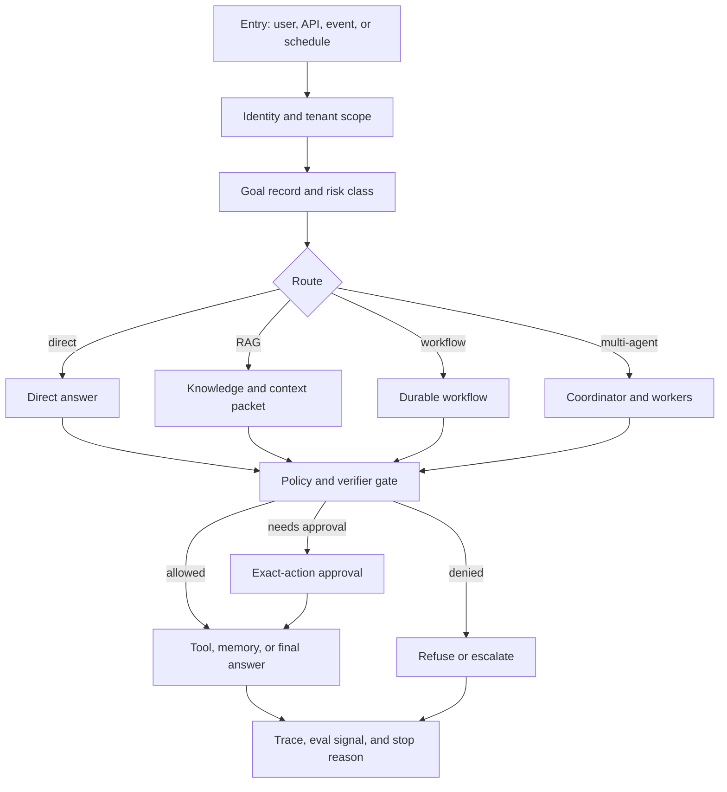

# Reference Architecture

This reference architecture combines the core patterns in the book into a production-ready agentic system. It is intentionally conservative: deterministic software owns state, policy, and side effects; model calls propose decisions inside bounded loops.

Use this chapter as the bridge from pattern selection to system design. The diagram is not a framework prescription; it shows the ownership boundaries a production system needs before agents handle private data, external actions, or long-running work.

## Architecture

Read this diagram as an ownership map for production systems: deterministic services own identity, state, policy, retrieval, approvals, and traces around bounded model calls.


Download the reusable review artifact: [reference architecture review checklist](/capstone-assets/templates/reference-architecture-review-checklist.txt).

## Boundary Flow

Use this flow to review one request from entry to final status. It separates the control plane that decides what is allowed from the execution plane that retrieves evidence, calls tools, and writes state.



The flow should fail closed. A model proposal can move forward only after state, policy, schema, evidence, approval, or verifier checks accept it.

## What This Architecture Is For

Use this shape when the agent may touch private data, call tools, wait for approval, run longer than one request, or affect customers, money, infrastructure, compliance, or internal operations. It is heavier than a prompt chain, but the extra structure buys reviewability.

Do not start here for a read-only prototype, a one-shot summarizer, or a workflow whose steps are fully deterministic. For those systems, use the smallest pattern that solves the task and keep the production controls proportional to the risk.

## Readiness Questions

Use these questions before a design review:

1. What can the system do that a normal chat answer cannot?
2. Which action creates the highest risk, cost, or user impact?
3. Which service owns the state that survives retries, crashes, and approval waits?
4. Which policy check runs before retrieval, before tool use, before memory write, and before final answer?
5. Which evidence must the model see, and which evidence must stay outside model context?
6. What exact event moves a run from draft to approved action?
7. What trace proves that the system followed the intended path?
8. What switch disables the risky behavior without disabling the whole product?

If a team answers these with prompt text alone, the design is still a prototype.

## Layered View

| Layer | Owns | Must Not Delegate To The Model |
| --- | --- | --- |
| Entry layer | User, tenant, event source, request validation, rate limits. | Authentication, tenant scope, raw input trust. |
| Routing layer | Direct answer, workflow, loop, RAG, or multi-agent path. | Whether a high-risk route is allowed. |
| Goal and state layer | Goal record, run state, checkpoints, stop reason, replay data. | Durable state mutation rules. |
| Context and knowledge layer | Retrieval, memory, freshness, citations, source policy. | Source eligibility or access control. |
| Tool and execution layer | Tool schemas, timeouts, idempotency, side-effect records. | Permission to call external systems. |
| Policy and approval layer | Authorization, risk class, exact-action approval, escalation. | Final authority for risky actions. |
| Evaluation layer | Offline evals, runtime verifiers, release gates, regression data. | Quality or safety judgment without thresholds. |
| Observability layer | Traces, audit logs, costs, latency, tool calls, incidents. | Hidden reasoning as the only explanation. |

The layers do not require separate services. A small system can implement several layers in one codebase. What matters is ownership: another engineer should be able to find where each decision is made, tested, logged, and rolled back.

## Control Plane vs Execution Plane

Keep control decisions out of free-form model text. The model can propose, summarize, classify, or draft. Runtime-owned services decide whether the proposal may affect state, tools, memory, approvals, or users.

| Plane | Owns | Examples | Release Evidence |
| --- | --- | --- | --- |
| Control plane | authorization, routing, policy, budgets, approval, release gates | route policy, risk class, policy decision, eval threshold, kill switch | policy logs, eval report, approval trace, rollback drill |
| Execution plane | retrieval, tool calls, workflows, memory writes, model calls | vector search, order lookup, draft refund, workflow resume, memory write | tool manifest, source metadata, idempotency record, workflow trace |
| Evidence plane | provenance, citations, state snapshots, audit trail | context packet, citation map, state version, run transcript | successful trace, failed trace, redaction proof |

This split prevents a common failure: a model both proposes an action and implicitly authorizes it. Production architecture should make the authorization path visible and testable.

## Maturity Ladder

Adopt the architecture in stages. Do not build every platform component before the system has proved value.

| Level | System Shape | Required Controls | Promotion Test |
| --- | --- | --- | --- |
| 0 - Prototype | Local or internal read-only demo. | Clear non-production label, basic trace, no private data or side effects. | The team can explain what would break before using real data. |
| 1 - Scoped Assistant | One bounded task with retrieval or read-only tools. | Identity, tenant scope, source policy, citation check, stop reason. | Unauthorized or missing evidence produces denial, refusal, or escalation. |
| 2 - Tool-Assisted Workflow | The system drafts or prepares actions through typed tools. | Tool manifest, schema validation, idempotency for drafts, trace correlation. | Unauthorized write-capable tools cannot be called from model text alone. |
| 3 - Approved Action | The system can trigger customer-visible, financial, operational, or durable effects after approval. | Exact-action approval, policy decision log, audit record, rollback or disable path. | A risky action cannot execute without policy and approval evidence. |
| 4 - Production Runtime | The system runs continuously with eval gates and incident response. | Durable state, replay, dashboards, alerting, release gates, runbook, rollback drill. | Operators can reconstruct and disable a failed path without redeploying everything. |
| 5 - Platform Capability | Multiple products or teams reuse the runtime, tools, policies, or evals. | Versioned contracts, compatibility tests, ownership matrix, tenant isolation, shared observability. | A contract change cannot silently break downstream agent behavior. |

The ladder is not a status badge. It is a scope control. A level 1 system can be excellent for a read-only task. A level 3 system that cannot prove approval binding is not production-ready.

## First Implementation Path

Start with one user workflow and one risk boundary. A useful first implementation should be small enough to review in one design meeting.

| Step | Build First | Defer Until Needed |
| --- | --- | --- |
| Goal | One task with explicit success and refusal criteria. | Broad assistant scope or multi-domain routing. |
| State | Run ID, actor, tenant, route, stop reason, and trace link. | Long-term memory, cross-session personalization, or agent self-improvement. |
| Knowledge | One approved source with freshness and citation rules. | Multiple indexes, automatic ingestion, or open web retrieval. |
| Tools | One read tool or one draft-only tool. | Write tools, browser control, shell access, or payment actions. |
| Policy | Deny unsafe route, unauthorized source, and missing evidence. | Full policy platform with dynamic rule authoring. |
| Evaluation | Five cases: success, missing evidence, unauthorized source, tool failure, and refusal. | Large judge-based eval suites and synthetic data generation. |
| Operations | Trace sample, owner, known limits, and disable switch. | Full dashboard suite and multi-team on-call rotation. |

This path keeps architecture tied to evidence. Each added layer should close a named risk, not satisfy a diagram.

## Request Flow

1. Authenticate the user or event source.
2. Create a goal record with constraints, user scope, and requested outcome.
3. Route the task to a direct answer, Agentic RAG, durable workflow, or multi-agent process.
4. Run policy checks before retrieval, tool use, or side effects.
5. Persist observations, decisions, tool calls, and outputs.
6. Verify evidence, output quality, and policy compliance.
7. Return an answer, request approval, refuse, or escalate.
8. Store traces for debugging and eval dataset improvement.

## Example: Support Refund Request

A customer asks for a refund. The architecture should keep three decisions separate.

| Decision | Owner | Example Outcome |
| --- | --- | --- |
| Can the system inspect this order? | Entry, identity, and policy layers. | Allow same-tenant read or deny cross-tenant access. |
| Is the refund policy satisfied? | Retrieval, policy, and eval layers. | Draft recommendation with policy citation or escalate missing evidence. |
| Can money move? | Approval and execution layers. | Require finance approval; the model cannot issue the refund. |

The model may draft a recommendation. It does not authenticate the user, choose its own tools, decide payment authority, write memory without policy, or mark the workflow complete without a stop reason. That separation is the point of the reference architecture.

## Control-Point Mapping

Turn the architecture into implementation tickets by assigning every risky transition to a concrete control point.

| Transition | Required Control | Evidence To Store | Release Test |
| --- | --- | --- | --- |
| request enters system | identity, tenant scope, rate limit | actor ID, tenant ID, source, request ID | cross-tenant request denied before retrieval |
| route selected | route policy and risk class | route, risk class, routing reason | high-risk route cannot be selected by prompt text alone |
| context assembled | source eligibility, freshness, budget | context refs, source owner, freshness, token count | stale or unauthorized source excluded |
| model proposes action | schema and policy validation | proposal, schema result, policy result | malformed proposal rejected |
| tool call requested | tool manifest, permission, idempotency | tool name, authority, arguments, idempotency key | unauthorized write denied |
| approval needed | exact-action binding | approver, action, amount or target, expiry, trace ID | broad approval rejected |
| result emitted | final verifier and stop reason | answer, citations, final status, stop reason | missing evidence cannot produce completed status |
| memory written | memory class and retention rule | memory type, owner, retention, deletion path | sensitive memory denied or redacted |

If a row has no owner, test, or stored evidence, the architecture is still a drawing. The implementation is ready only when each transition can fail closed.

## Control Points

- **Before retrieval:** enforce access control and source eligibility.
- **Before tool use:** validate schema, permission, budget, and approval needs.
- **Before final answer:** verify claims, citations, and policy.
- **Before memory write:** classify what kind of memory is being stored.
- **Before release:** run evals and regression checks.

## Reference Implementation Slices

Build the architecture in slices. Each slice should produce one deployable proof, not a diagram-only promise.

| Slice | Build | Must Prove |
| --- | --- | --- |
| Read-only answer | entry validation, routing, context packet, trace | The system can answer with scoped evidence and a replayable trace. |
| Tool-assisted answer | tool gateway, schemas, timeouts, idempotency | Tool calls are authorized, typed, logged, and reversible where possible. |
| Approval workflow | approval request, exact action binding, expiry, audit log | A human approves one concrete action, not broad future behavior. |
| Durable workflow | state store, checkpoints, retries, stop reasons | The run survives failure without duplicating side effects. |
| Production release | eval suite, runbook, rollback switch, dashboards | Operators can detect, stop, debug, and improve the system. |

This sequence keeps teams from building orchestration before they can prove state, policy, and evidence boundaries.

## Deployment Shapes

The reference architecture does not require a large platform on day one. Use the smallest deployment shape that preserves the control points for the risk you are taking.

| Shape | Use When | Acceptable Compression | Do Not Compress |
| --- | --- | --- | --- |
| Prototype | The system is read-only, internal, and disposable. | One application service can own routing, state, retrieval, and traces. | Authentication, tenant scope, source eligibility, and stop reason. |
| Pilot | A small group uses the system on real work with limited authority. | Policy checks and approval records can live in the application database. | Tool permission, trace correlation, eval gates, and rollback switch. |
| Production | The system affects users, records, money, infrastructure, or operations. | Several layers can still share a repository or runtime. | Durable state, idempotency, audit logs, incident ownership, and release evidence. |
| Regulated or high-risk | The system touches compliance, sensitive data, payments, security, healthcare, legal, or employment decisions. | Model calls can stay behind a single runtime gateway. | Independent policy enforcement, approval audit, redaction, retention, and evidence review. |

Compression is safe only when ownership stays explicit. A prototype can share code paths. It cannot share away the question of who owns state, policy, tool authority, evidence, and rollback.

## Boundary Placement Guide

Use this guide when deciding whether a component belongs inside the agent runtime, the application service, or a separate platform service.

| Boundary | Keep Inside The App When | Split Into A Service When |
| --- | --- | --- |
| Policy | Rules are few, product-specific, and reviewed with the feature. | Multiple products, tenants, risk classes, or compliance owners use the same rules. |
| Tools | Tools are narrow, low-risk, and owned by one team. | Tools are shared, write-capable, expensive, credentialed, or audited. |
| Retrieval | Sources are small, local, and low-sensitivity. | Sources require access control, freshness policy, citations, deletion, or owner review. |
| Memory | Memory is task-local or short-lived. | Memory crosses sessions, users, tenants, privacy classes, or retention rules. |
| Workflow | Runs finish in one request and have no side effects. | Runs wait for approval, retry, resume, schedule work, or call irreversible tools. |
| Evaluation | The feature has a small fixed eval set. | Evals block releases, compare versions, feed incident review, or serve multiple teams. |
| Observability | Logs are enough to debug a toy run. | Operators need traces, redaction, cost, latency, tool, policy, and approval records. |

The split should follow ownership and risk, not fashion. A separate service without a stronger owner is just more distributed code.

## Evidence Bundle

A design that claims to follow this architecture should attach these artifacts:

| Artifact | Proves |
| --- | --- |
| Architecture diagram | Ownership of state, tools, policy, memory, evals, approvals, and traces. |
| State schema | What persists, what can be replayed, and why the run stopped. |
| Tool manifest | Which capabilities exist, who may call them, and what side effects they create. |
| Context packet example | Which sources reached the model, with trust, freshness, and budget. |
| Policy decision log | Why a tool, retrieval source, memory write, or approval path was allowed or denied. |
| Trace sample | What happened in one successful run and one failed run. |
| Eval report | Which behaviors block release. |
| Runbook | Who owns incidents and how rollback works. |

## Run Trace Contract

A reference architecture is only real if one run can prove the boundaries worked. Capture the run as structured trace data, not as scattered logs.

```ts
type ReferenceRunTrace = {
  runId: string;
  tenantId: string;
  userOrEvent: string;
  goal: string;
  route: "direct_answer" | "rag" | "agent_loop" | "durable_workflow" | "multi_agent";
  stateVersion: string;
  context: Array<{
    source: string;
    accessDecision: "allow" | "deny";
    freshness: "current" | "stale" | "unknown";
    citationRequired: boolean;
  }>;
  modelDecisions: Array<{
    step: string;
    proposal: string;
    acceptedBy: "schema" | "policy" | "human" | "runtime";
  }>;
  policyChecks: Array<{
    boundary: "retrieval" | "tool" | "memory" | "approval" | "final_answer";
    decision: "allow" | "deny" | "escalate";
    policyVersion: string;
  }>;
  toolCalls: Array<{
    name: string;
    authority: "read" | "draft" | "write" | "execute";
    idempotencyKey?: string;
    result: "success" | "failed" | "denied";
  }>;
  finalStatus: "completed" | "refused" | "needs_approval" | "policy_blocked" | "evidence_missing" | "failed";
  stopReason: string;
  rollbackPath?: string;
};
```

The exact field names can change. The invariant should not: a reviewer can reconstruct who asked, what evidence entered context, what the model proposed, which policies ran, which tools executed, why the run stopped, and how to reverse or disable the risky path.

## Architecture Acceptance Tests

Before a pilot, run at least these acceptance checks against the trace contract.

| Test | Passing Evidence |
| --- | --- |
| Tenant isolation | A cross-tenant request records a denial before retrieval or tool use. |
| Missing evidence | The run stops with `evidence_missing` or `needs_approval`; it does not invent support. |
| Policy denial | A blocked action records policy version, boundary, denial reason, and no side effect. |
| Approval binding | A high-risk action waits for approval tied to exact action, actor, expiry, and trace ID. |
| Retry safety | A retried write uses the same idempotency key or stops before duplicate side effects. |
| Memory control | A memory write records classification, owner, retention, and deletion path. |
| Rollback proof | Operators can disable the model route, tool, workflow, policy, or agent without deleting the whole product. |

If these tests are hard to write, the architecture is probably still hidden in framework glue, prompts, or informal process.

## Runtime Components

- Identity and tenant boundary
- Goal and state store
- Prompt and instruction registry
- Tool gateway
- Retrieval router
- Memory service
- Policy engine
- Approval service
- Workflow engine
- Evals service
- Trace and audit store

## Ownership Matrix

Assign owners before production. Missing ownership is an architecture defect.

| Component | Engineering Owner | Operational Owner | Release Artifact |
| --- | --- | --- | --- |
| Identity and tenant boundary | platform or product backend | security or platform on-call | access-control tests |
| Goal and state store | workflow/runtime team | runtime on-call | state schema and replay fixture |
| Retrieval router | search or knowledge team | content/data owner | source policy and freshness report |
| Tool gateway | integration team | service owner for each tool | tool manifest and audit sample |
| Policy engine | security, compliance, or product policy | policy owner | policy decision log |
| Approval service | product workflow team | business approver owner | approval trace sample |
| Evals service | AI platform or quality team | release owner | blocking eval report |
| Trace and audit store | observability team | incident commander | successful and failed run traces |

One person can own several cells in a small team. The table still matters because every production failure will ask who owned the boundary.

## Design Review Questions

Ask these questions before a production pilot:

1. What decision does the model make, and what decision does software make after that?
2. Which state changes survive a crash, retry, or approval wait?
3. Which tool call has the highest cost, risk, or irreversibility?
4. What evidence is required before the system answers or acts?
5. What happens when evidence is missing, stale, conflicting, or unauthorized?
6. What gets written to memory, and who can correct or delete it?
7. Which eval blocks release if the system regresses tomorrow?
8. Can an operator reconstruct the failed run without guessing?
9. What can be disabled without redeploying the whole system?
10. What would make the team shut the agent off?

## Minimum Production Checklist

- Explicit owner for goal and state
- Tool schemas and validation
- Human approval for high-risk actions
- Access-controlled retrieval
- Citation validation for grounded answers
- Evals for core tasks
- Traces for every run
- Budget, timeout, and cancellation controls
- Incident review path
- Rollback or disable switch

## Reference Architecture Review Gate

Use the [reference architecture review checklist](/capstone-assets/templates/reference-architecture-review-checklist.txt) before a pilot or production release. Block release when:

- the model owns authentication, authorization, policy, or side-effect permission;
- durable state has no schema, replay path, or stop reason;
- retrieval sources lack access control, trust, freshness, or citation checks;
- approvals authorize vague future behavior;
- evals inspect only final text and ignore tools, policy, evidence, and state transitions;
- operators cannot reconstruct a successful run and a failed run from traces.

## Scaling Path

Start small:

1. Single agent with tool validation.
2. Add goals and state.
3. Add retrieval and citation checks.
4. Add durable workflow for long-running tasks.
5. Add human approval gates.
6. Add eval datasets and observability.
7. Add multi-agent decomposition only when one agent becomes a bottleneck.

## Anti-Patterns

Avoid these designs:

- The model chooses from a broad tool list without route-level permission.
- Prompt text is the only policy boundary.
- Retrieval, memory, and tool results are merged into context without provenance.
- The system can act but cannot replay why it acted.
- Approvals authorize vague future behavior instead of one exact action.
- Evals check only final answer quality and ignore tool use, policy, evidence, and stop reason.
- Rollback requires deleting the whole deployment because prompts, tools, and policies cannot be disabled independently.

## Related Chapters

- [Agentic System Architecture](./agentic-system-architecture)
- [Agentic RAG Systems](./agentic-rag-systems)
- [MCP-first Tool Use](../tools-skills-protocols/mcp-first-tool-use)
- [Production Runtime Overview](../production-runtime/overview)
- [Durable Workflows](../production-runtime/durable-workflows)
- [Policy Enforcement](../production-runtime/policy-enforcement)
- [Observability and Evals](../production-runtime/observability-and-evals)
