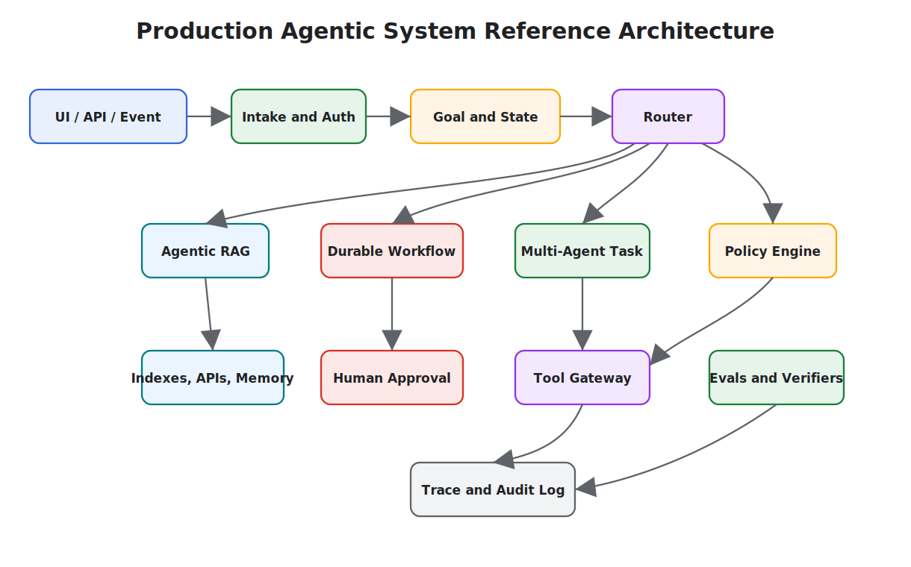

# Reference Architecture

This reference architecture combines the core patterns in the book into a production-ready agentic system. It is intentionally conservative: deterministic software owns state, policy, and side effects; model calls propose decisions inside bounded loops.

Use this chapter as the bridge from pattern selection to system design. The diagram is not a framework prescription; it shows the ownership boundaries a production system needs before agents handle private data, external actions, or long-running work.

## Architecture

## Request Flow

1. Authenticate the user or event source.
2. Create a goal record with constraints, user scope, and requested outcome.
3. Route the task to a direct answer, Agentic RAG, durable workflow, or multi-agent process.
4. Run policy checks before retrieval, tool use, or side effects.
5. Persist observations, decisions, tool calls, and outputs.
6. Verify evidence, output quality, and policy compliance.
7. Return an answer, request approval, refuse, or escalate.
8. Store traces for debugging and eval dataset improvement.

## Control Points

- **Before retrieval:** enforce access control and source eligibility.
- **Before tool use:** validate schema, permission, budget, and approval needs.
- **Before final answer:** verify claims, citations, and policy.
- **Before memory write:** classify what kind of memory is being stored.
- **Before release:** run evals and regression checks.

## Runtime Components

- Identity and tenant boundary
- Goal and state store
- Prompt and instruction registry
- Tool gateway
- Retrieval router
- Memory service
- Policy engine
- Approval service
- Workflow engine
- Evals service
- Trace and audit store

## Minimum Production Checklist

- Explicit owner for goal and state
- Tool schemas and validation
- Human approval for high-risk actions
- Access-controlled retrieval
- Citation validation for grounded answers
- Evals for core tasks
- Traces for every run
- Budget, timeout, and cancellation controls
- Incident review path
- Rollback or disable switch

## Scaling Path

Start small:

1. Single agent with tool validation.
2. Add goals and state.
3. Add retrieval and citation checks.
4. Add durable workflow for long-running tasks.
5. Add human approval gates.
6. Add eval datasets and observability.
7. Add multi-agent decomposition only when one agent becomes a bottleneck.

## Related Chapters

- [Agentic System Architecture](./agentic-system-architecture)
- [Agentic RAG Systems](./agentic-rag-systems)
- [MCP-first Tool Use](../tools-skills-protocols/mcp-first-tool-use)
- [Production Runtime Overview](../production-runtime/overview)
- [Durable Workflows](../production-runtime/durable-workflows)
- [Policy Enforcement](../production-runtime/policy-enforcement)
- [Observability and Evals](../production-runtime/observability-and-evals)
