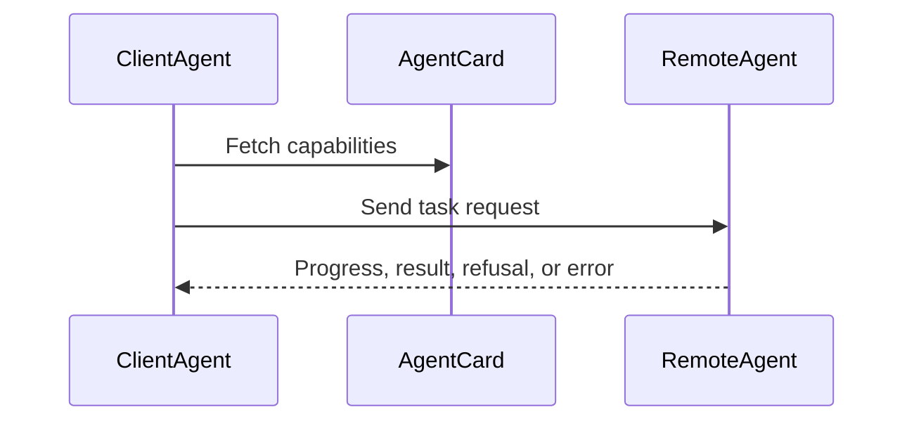

# A2A Agent Interoperability

A2A lets agents collaborate across process, runtime, team, or vendor boundaries.

The core idea is that a remote agent should be discoverable and callable through a protocol contract, not embedded as local implementation detail.

Use A2A when agents need interoperability, asynchronous progress, refusals, cancellation, and task identity.

Source: [`agent-to-agent-communication-pattern`](https://github.com/GTuritto/Agentic-Systems-Patterns/tree/main/agent-to-agent-communication-pattern)
