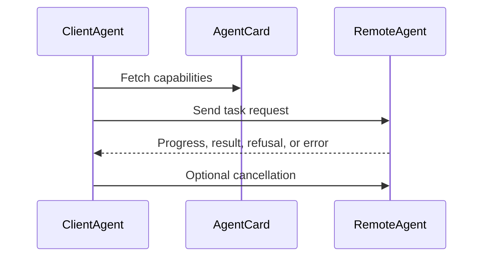

# A2A Agent Interoperability

A2A makes agents discoverable and callable across process, team, runtime, and vendor boundaries.

> Source and downloads
>
> - [Repository source](https://github.com/GTuritto/Agentic-Systems-Patterns/tree/main/agent-to-agent-communication-pattern)
> - [Download code bundle](/downloads/a2a-agent-interoperability.zip)

## Intent

Use this pattern when one agent needs to call another agent as a remote collaborator. The protocol boundary should make capability discovery, task submission, progress, refusal, cancellation, and results explicit.

## Use When

- Agents are owned by different services, teams, runtimes, or vendors.
- A caller must discover what a remote agent can do before sending work.
- Task state must survive asynchronous progress, refusal, error, or cancellation.

## Avoid When

- Both agents are simple functions inside one process.
- The interaction is only a local tool call with a typed input and output.
- You cannot authenticate callers or validate messages.

## Architecture



## System Shape

- **Pattern boundary:** the agent discovers or selects a capability, submits a typed request, and receives a typed result across a policy boundary.
- **State owner:** the protocol or capability boundary owns schemas, permissions, invocation records, and response validation.
- **Primary artifact:** `agent-to-agent-communication-pattern/` contains the runnable reference implementation and examples.
- **Operational promise:** A2A makes agents discoverable and callable across process, team, runtime, and vendor boundaries.
- **Runnable path:** start with `npm run a2a:test` before adapting the pattern to a larger system.

## Core Protocol

1. Discover the capability, schema, permissions, and operating constraints.
2. Prepare a typed request from the current goal and state.
3. Authorize the request before invocation.
4. Invoke the tool, skill, or remote agent and validate the result.
5. Return structured output, refusal, progress, or error without losing correlation IDs.

## Implementation Notes

- Messages validated against schemas before delivery.
- Bus is in-memory; swap to a real transport without changing messages.
- Treat refusals as valid protocol outcomes, not exceptions.
- Include idempotency keys or task IDs so retries do not duplicate work.
- Add authentication and authorization before crossing a trust boundary.

## Failure Modes

- Treating a remote agent like a local tool and ignoring latency, refusal, or cancellation.
- Sending unvalidated natural language blobs instead of typed task messages.
- Missing capability discovery, causing callers to rely on stale assumptions.
- No correlation ID across progress, result, and error messages.

## Evaluation Strategy

- Test valid calls, invalid arguments, unauthorized calls, timeouts, refusals, and malformed responses.
- Assert that dangerous actions require approval or are blocked before execution.
- Measure tool-selection accuracy, schema validity, authorization failures, and recovery behavior.
- Include cases that prove each "Use When" condition is true for this pattern.
- Include negative cases from "Avoid When" so the system chooses a simpler or safer pattern when appropriate.

## Production Checklist

- Use typed schemas for inputs and outputs.
- Separate model intent from actual execution permissions.
- Add timeouts, retries, idempotency keys, and audit records.
- Treat refusal and cancellation as first-class outcomes.
- Define human escalation for ambiguous, high-risk, or policy-blocked work.
- Keep the source bundle, generated chapter, tests, and deployment artifact in the same release.

## Run the Example

```sh
npm run a2a:test
npm run a2a:run
```

## Code Walkthrough

Read the excerpt as the smallest executable expression of the pattern. The surrounding chapter explains the design constraints; the code shows where those constraints become concrete interfaces, state, validation, or control flow.

## Source Code

These excerpts show the implementation shape. The complete code is available in the download bundle and repository source.

### `agent-to-agent-communication-pattern/src/run_demo.ts`

[Open full source](https://github.com/GTuritto/Agentic-Systems-Patterns/blob/main/agent-to-agent-communication-pattern/src/run_demo.ts)

```ts
import { BusMemory } from './bus_memory.ts';
import { AgentA } from './agent_a.ts';
import { AgentB } from './agent_b.ts';

async function run() {
  const bus = new BusMemory();
  const a = new AgentA(bus);
  const b = new AgentB(bus);
  a.start();
  b.start();
  a.handshake();
  a.requestTask('t1', 'sum', { a: 2, b: 5 });
}

run();
```

### `agent-to-agent-communication-pattern/src/agent_a.ts`

[Open full source](https://github.com/GTuritto/Agentic-Systems-Patterns/blob/main/agent-to-agent-communication-pattern/src/agent_a.ts)

```ts
import { BusMemory, A2A_SCHEMA } from './bus_memory.ts';
import type { Msg } from './bus_memory.ts';
import Ajv from 'ajv';
const ajv = new Ajv({ allErrors: true, strict: true });
const validateResponse = ajv.compile((A2A_SCHEMA as any).properties.TaskResponse);

export class AgentA {
  private bus: BusMemory;
  constructor(bus: BusMemory) { this.bus = bus; }
  start() {
    // listen for responses
    this.bus.subscribe('TaskResponse', (m: Msg) => {
      if (!validateResponse(m.payload)) {
        console.error('Invalid TaskResponse', validateResponse.errors);
        return;
      }
      console.log('AgentA received response:', m.payload);
    });
  }
  handshake() {
    this.bus.publish({ type: 'Handshake', payload: { version: '1.0', capabilities: ['tasks', 'cancel'] } });
  }
  requestTask(id: string, task_type: string, input: any) {
    this.bus.publish({ type: 'TaskRequest', payload: { id, task_type, input, meta: { ts: Date.now() } } });
  }
  cancel(id: string, reason: string) {
    this.bus.publish({ type: 'Cancel', payload: { id, reason } });
  }
}
```

### `agent-to-agent-communication-pattern/src/agent_b.ts`

[Open full source](https://github.com/GTuritto/Agentic-Systems-Patterns/blob/main/agent-to-agent-communication-pattern/src/agent_b.ts)

```ts
import { BusMemory, A2A_SCHEMA } from './bus_memory.ts';
import type { Msg } from './bus_memory.ts';
import Ajv from 'ajv';
const ajv = new Ajv({ allErrors: true, strict: true });
const validateReq = ajv.compile((A2A_SCHEMA as any).properties.TaskRequest);

export class AgentB {
  private bus: BusMemory;
  private handshakeAckSent = false;
  constructor(bus: BusMemory) { this.bus = bus; }
  start() {
    this.bus.subscribe('Handshake', () => {
      if (this.handshakeAckSent) return;
      this.handshakeAckSent = true;
      this.bus.publish({ type: 'Handshake', payload: { version: '1.0', capabilities: ['tasks'] } });
    });
    this.bus.subscribe('TaskRequest', (m: Msg) => {
      if (!validateReq(m.payload)) return;
      const payload = m.payload as any;
      const { id, task_type, input } = payload;
      if (task_type !== 'sum') {
        this.bus.publish({ type: 'TaskResponse', payload: { id, status: 'refused', error: 'unsupported_task' } });
        return;
      }
      // progress
      this.bus.publish({ type: 'Progress', payload: { id, stage: 'start', pct: 10, message: 'starting' } });
      const a = input?.a;
      const b = input?.b;
      if (typeof a !== 'number' || typeof b !== 'number') {
        this.bus.publish({ type: 'TaskResponse', payload: { id, status: 'error', error: 'invalid_input' } });
        return;
      }
      // compute safely
      const sum = a + b;
      this.bus.publish({ type: 'Progress', payload: { id, stage: 'compute', pct: 60 } });
      this.bus.publish({ type: 'TaskResponse', payload: { id, status: 'success', output: { sum } } });
    });
    this.bus.subscribe('Cancel', (m: Msg) => {
      console.log('AgentB cancel received:', m.payload);
    });
  }
}
```

## Download

- [Download source bundle](/downloads/a2a-agent-interoperability.zip)
- [Open source folder](https://github.com/GTuritto/Agentic-Systems-Patterns/tree/main/agent-to-agent-communication-pattern)

The download bundle contains the current `agent-to-agent-communication-pattern/` folder from this repository.

## Related Patterns

- [Skills](/tools-skills-protocols/skills)
- [MCP-first Tool Use](/tools-skills-protocols/mcp-first-tool-use)
- [Secure Agent Communication](/tools-skills-protocols/secure-agent-communication)
- [Choosing the Right Pattern](/pattern-selection/choosing-the-right-pattern)
- [Resource-Aware Agent Design](/pattern-selection/resource-aware-agent-design)
