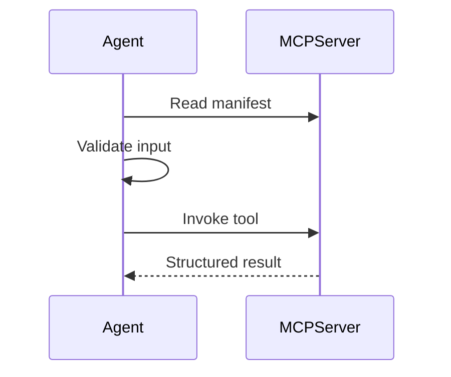

# MCP-first Tool Use

MCP-first tool use separates tool capability from agent logic.

Agents discover manifests, validate inputs, invoke tools, and handle structured outputs through a stable boundary.

Use this pattern when tools evolve independently from agents or must be shared across runtimes.

Source: [`modern-tool-use-pattern`](https://github.com/GTuritto/Agentic-Systems-Patterns/tree/main/modern-tool-use-pattern)
