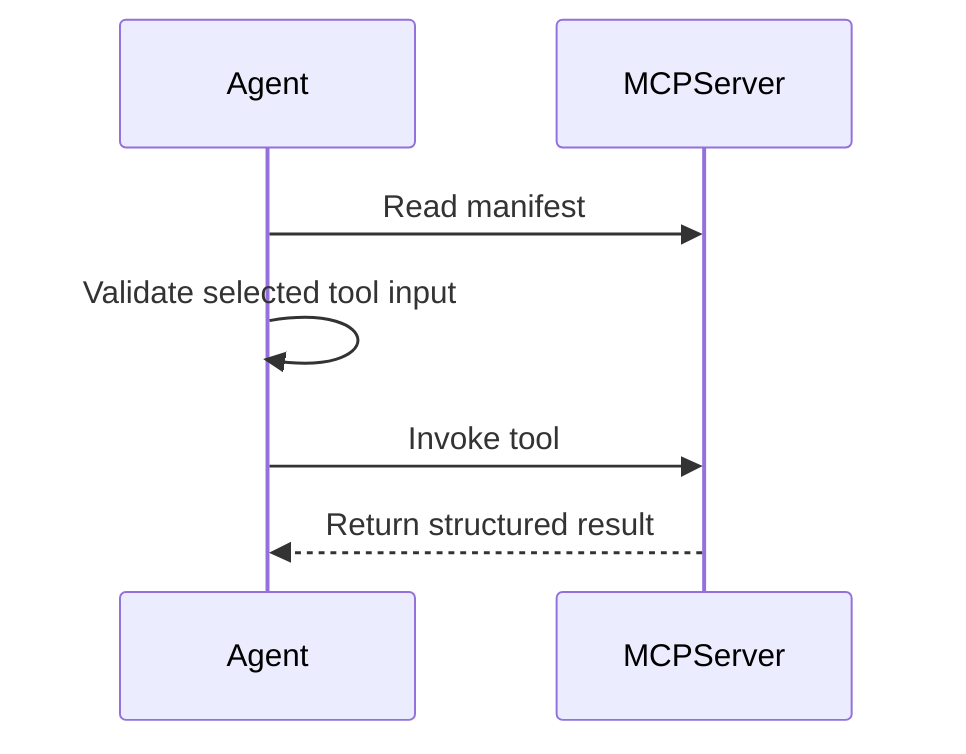

# MCP-first Tool Use

MCP-first tool use separates tool capability from agent logic through manifests, validation, invocation, and structured results.

> Source and downloads
>
> - [Repository source](https://github.com/GTuritto/Agentic-Systems-Patterns/tree/main/modern-tool-use-pattern)
> - [Download code bundle](/downloads/mcp-first-tool-use.zip)

## Intent

Use this pattern when the set of tools may evolve independently from the agent. MCP gives tools a manifest boundary so the agent can inspect capabilities instead of relying on hard-coded assumptions.

## Use When

- Tools are shared across agents or applications.
- Tool schemas, context, and permissions need to be discoverable.
- You want to test tool invocation separately from model reasoning.

## Avoid When

- A local function call is enough and no discovery boundary is needed.
- Tool inputs cannot be validated.
- The agent has permission to call too many tools without policy checks.

## Architecture



## Implementation Notes

- Validate tool input before every invocation.
- Keep tool results structured and observable.
- Put policy checks between model intent and tool execution.
- Prefer small tools with clear contracts over broad tools with vague descriptions.

## Failure Modes

- Tool manifests that describe capabilities too vaguely.
- Model-generated tool inputs used without schema validation.
- Hidden side effects that are not visible in the tool contract.
- No trace linking model decision, tool input, and tool result.

## Run the Example

```sh
npm run mcp:search
npm run mcp:cloud
npm run mcp:agent
npm run mcp:test
```

## Code Walkthrough

Read the excerpt as the smallest executable expression of the pattern. The surrounding chapter explains the design constraints; the code shows where those constraints become concrete interfaces, state, validation, or control flow.

## Source Code

These excerpts show the implementation shape. The complete code is available in the download bundle and repository source.

### `modern-tool-use-pattern/typescript/src/agent.ts`

[Open full source](https://github.com/GTuritto/Agentic-Systems-Patterns/blob/main/modern-tool-use-pattern/typescript/src/agent.ts)

```ts
import axios from 'axios';
import Ajv from 'ajv';
import { pathToFileURL } from 'node:url';

const ajv = new Ajv({ allErrors: true, strict: true });

async function getManifest(base: string) {
  const { data } = await axios.get(`${base}/manifest`);
  return data;
}

async function invoke(base: string, tool: string, input: any) {
  const { data } = await axios.post(`${base}/invoke`, { tool, input });
  if (!data?.ok) throw new Error(data?.error || 'invoke_failed');
  return data.output;
}

export async function runScenario() {
  // Discover tools via MCP manifests
  const search = await getManifest('http://localhost:3031');
  const cloud = await getManifest('http://localhost:3032');
  // Validate inputs before invoking
  const searchSchema = search.tools.find((t: any) => t.name === 'search.query')?.input_schema;
  const cloudStoreSchema = cloud.tools.find((t: any) => t.name === 'cloud.store')?.input_schema;
  const vSearch = ajv.compile(searchSchema);
  const vCloudStore = ajv.compile(cloudStoreSchema);
  // Plan (deterministic): search for a topic, then store results in cloud
  const q = 'agents';
  const inputSearch = { q, limit: 2 };
  if (!vSearch(inputSearch)) throw new Error('bad search input');
  const { items } = await invoke('http://localhost:3031', 'search.query', inputSearch);
  const doc = { topic: q, titles: items.map((i: any) => i.title) };
  const inputStore = { key: `topic:${q}`, value: doc };
  if (!vCloudStore(inputStore)) throw new Error('bad cloud.store input');
  await invoke('http://localhost:3032', 'cloud.store', inputStore);
  return doc;
}

async function main() {
  const out = await runScenario();
  console.log('Stored doc:', out);
}

if (process.argv[1] && import.meta.url === pathToFileURL(process.argv[1]).href) {
  main().catch(err => { console.error(err); process.exit(1); });
}
```

### `modern-tool-use-pattern/typescript/src/mcp_search_server.ts`

[Open full source](https://github.com/GTuritto/Agentic-Systems-Patterns/blob/main/modern-tool-use-pattern/typescript/src/mcp_search_server.ts)

```ts
import express from 'express';
import type { Request, Response } from 'express-serve-static-core';

const app = express();
app.use(express.json());

const manifest = {
  name: 'search-tools',
  version: '1.0.0',
  tools: [
    {
      name: 'search.query',
      description: 'Mock web search returning titles for a query',
      input_schema: {
        type: 'object',
        required: ['q'],
        properties: {
          q: { type: 'string' },
          limit: { type: 'number', minimum: 1, maximum: 5 }
        },
        additionalProperties: false
      }
    }
  ]
};

app.get('/manifest', (_req: Request, res: Response) => res.json(manifest));

app.post('/invoke', (req: Request, res: Response) => {
  const { tool, input } = req.body || {};
  if (tool === 'search.query') {
    const q = String(input?.q || '').trim();
    const limit = Math.max(1, Math.min(5, Number(input?.limit ?? 3)));
    const items = Array.from({ length: limit }, (_, i) => ({ title: `${q} result ${i + 1}` }));
    return res.json({ ok: true, output: { items } });
  }
  return res.status(400).json({ ok: false, error: 'unknown_tool' });
});

app.listen(3031, () => console.log('MCP search server on 3031'));
```

### `modern-tool-use-pattern/typescript/src/mcp_cloud_server.ts`

[Open full source](https://github.com/GTuritto/Agentic-Systems-Patterns/blob/main/modern-tool-use-pattern/typescript/src/mcp_cloud_server.ts)

```ts
import express from 'express';
import type { Request, Response } from 'express-serve-static-core';

const app = express();
app.use(express.json());

const store = new Map<string, any>();

const manifest = {
  name: 'cloud-store',
  version: '1.0.0',
  tools: [
    {
      name: 'cloud.store',
      description: 'Store a JSON document under a key',
      input_schema: {
        type: 'object',
        required: ['key', 'value'],
        properties: { key: { type: 'string' }, value: { type: 'object' } },
        additionalProperties: false
      }
    },
    {
      name: 'cloud.fetch',
      description: 'Fetch a document by key',
      input_schema: {
        type: 'object',
        required: ['key'],
        properties: { key: { type: 'string' } },
        additionalProperties: false
      }
    }
  ]
};

app.get('/manifest', (_req: Request, res: Response) => res.json(manifest));

app.post('/invoke', (req: Request, res: Response) => {
  const { tool, input } = req.body || {};
  if (tool === 'cloud.store') {
    store.set(String(input.key), input.value);
    return res.json({ ok: true });
  }
  if (tool === 'cloud.fetch') {
    return res.json({ ok: true, output: { value: store.get(String(input.key)) ?? null } });
  }
  return res.status(400).json({ ok: false, error: 'unknown_tool' });
});

app.listen(3032, () => console.log('MCP cloud server on 3032'));
```

## Download

- [Download source bundle](/downloads/mcp-first-tool-use.zip)
- [Open source folder](https://github.com/GTuritto/Agentic-Systems-Patterns/tree/main/modern-tool-use-pattern)

The download bundle contains the current `modern-tool-use-pattern/` folder from this repository.
