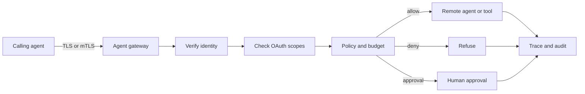

# Secure Agent Communication

Secure communication protects messages between agents with authentication, integrity, confidentiality, and policy checks.

> Source and downloads
>
> - [Repository source](https://github.com/GTuritto/Agentic-Systems-Patterns/tree/main/secure-agent-communication-pattern)
> - [Download code bundle](/downloads/secure-agent-communication.zip)

## Intent

Secure agent communication protects messages between agents, tools, runtimes, and services with identity, authorization, confidentiality, integrity, replay protection, and observability.

This pattern matters because agent-to-agent communication is not just chat between models. Messages can carry private data, tool instructions, delegated goals, approval requests, workflow commands, and side-effect proposals. If the communication layer is weak, the model can be correct and the system can still be unsafe.

The practical rule is simple: every cross-boundary agent message needs a transport boundary, an identity boundary, an authorization boundary, and an audit boundary.

## Use When

- Agents, tools, skills, or runtimes communicate across processes, services, teams, tenants, or networks.
- Messages contain private data, business state, credentials, delegated tasks, or side-effect instructions.
- Remote agents can invoke tools, workflows, APIs, browsers, shells, or data stores.
- The system needs TLS, mTLS, OAuth or OIDC, scoped credentials, replay protection, and trace correlation.
- Operators must explain who requested what, which policy allowed it, what executed, and which trace proves it.

## Avoid When

- All communication is local, in-process, and already covered by the same trusted execution boundary.
- The system cannot identify caller, tenant, audience, capability, and trace ID.
- Authorization happens only in the prompt or only after the remote action executes.
- Messages cannot be redacted, retained, traced, or replayed safely.
- Token and certificate lifecycle cannot be operated by the team.

## Architecture



## System Shape

- **Transport boundary:** use TLS for service communication and mTLS where both sides need certificate-backed service identity.
- **Identity boundary:** identify caller, subject, tenant, audience, issuer, and service identity before processing the request.
- **Authorization boundary:** check OAuth or OIDC token claims, scopes, audience, tenant, tool capability, risk class, and approval requirements.
- **Message boundary:** validate schemas, idempotency keys, timestamps, nonces, and content size before the message enters the agent loop.
- **Data boundary:** encrypt sensitive payloads when needed, redact traces, and avoid placing secrets in prompts, memory, logs, or eval fixtures.
- **Observability boundary:** emit trace events for identity verification, authorization decision, policy result, tool invocation, refusal, approval, and response validation.

## Core Protocol

1. Receive a message over TLS or mTLS.
2. Verify service identity and token issuer, audience, expiry, subject, tenant, and scopes.
3. Validate message schema, idempotency key, timestamp, nonce, trace ID, and correlation IDs.
4. Build policy context from trusted runtime data, not only message text.
5. Check tool capability, data scope, risk class, budget state, and approval requirement.
6. Decrypt or unwrap sensitive payloads only after authorization succeeds.
7. Execute the bounded remote action, or deny, escalate, or wait for approval.
8. Validate the response schema and redact sensitive fields before returning.
9. Record trace events, policy decision, token subject, service identity, scopes, latency, cost, and stop reason.

## Implementation Notes

TLS protects the transport. OAuth and OIDC identify and authorize the caller. Policy decides whether the requested capability is allowed. Observability proves what happened.

Do not treat these as interchangeable:

| Control | What It Answers |
| --- | --- |
| TLS | Is the connection encrypted and protected in transit? |
| mTLS | Which service identity is on the other side of this connection? |
| OAuth or OIDC | Who or what is the caller, and what scopes or claims does it have? |
| Policy engine | Is this caller allowed to perform this action on this resource now? |
| Message signing | Has this message been tampered with or replayed outside the transport session? |
| Trace correlation | Can operators reconstruct the request path across agents and tools? |

Use scoped, short-lived credentials. A remote agent should receive the minimum scope required for the delegated task, not the user's full authority and not a platform-wide service token.

### Observability

Secure communication without observability is difficult to operate. Record enough to audit behavior without leaking secrets.

Trace these events:

- inbound message accepted or rejected;
- TLS or mTLS service identity;
- token issuer, audience, subject, tenant, and scopes after redaction;
- policy decision and reason;
- idempotency key and replay detection result;
- approval request, approval grant, or approval denial;
- remote agent or tool invoked;
- response validation result;
- latency, cost, timeout, retry, and stop reason.

Do not log raw access tokens, refresh tokens, private keys, decrypted secrets, or unredacted private data. Observability should explain authority and behavior, not become a second data leak.

### Secure Message Envelope

```ts
type SecureAgentEnvelope = {
  traceId: string;
  messageId: string;
  idempotencyKey: string;
  issuedAt: string;
  expiresAt: string;
  caller: {
    subject: string;
    tenantId: string;
    serviceId: string;
  };
  auth: {
    issuer: string;
    audience: string;
    scopes: string[];
  };
  capability: 'read' | 'delegate' | 'tool_call' | 'workflow_command';
  payloadRef?: string;
  encryptedPayload?: string;
};
```

### Authorization Check

```ts
function authorizeEnvelope(input: {
  envelope: SecureAgentEnvelope;
  requiredAudience: string;
  requiredScope: string;
  now: Date;
}) {
  const { envelope, requiredAudience, requiredScope, now } = input;

  if (envelope.auth.audience !== requiredAudience) {
    return { decision: 'deny', reason: 'wrong_audience' };
  }

  if (!envelope.auth.scopes.includes(requiredScope)) {
    return { decision: 'deny', reason: 'missing_scope' };
  }

  if (new Date(envelope.expiresAt).getTime() <= now.getTime()) {
    return { decision: 'deny', reason: 'expired_message' };
  }

  if (!envelope.traceId || !envelope.idempotencyKey) {
    return { decision: 'deny', reason: 'missing_trace_or_idempotency' };
  }

  return { decision: 'allow', reason: 'authorized' };
}
```

The real implementation should validate signed tokens and certificates with trusted libraries and platform identity providers. The important architectural point is where the check lives: before the remote agent or tool receives authority.

## Failure Modes

- TLS is present, but any authenticated service can call every agent capability.
- OAuth scopes are broad, long-lived, or not checked against the specific capability.
- The token audience is ignored, so a token minted for one service works against another.
- Tenant, subject, or service identity is taken from model text instead of trusted runtime claims.
- Messages have no idempotency key, nonce, timestamp, or replay detection.
- Remote agents receive ambient credentials instead of scoped delegated authority.
- Sensitive payloads, tokens, or decrypted data appear in prompts, memory, logs, or traces.
- Denied calls are not traced, so attempted abuse is invisible.
- Observability records final outputs but not identity, scope, policy, or transport decisions.

## Evaluation Strategy

Test communication security as behavior, not as configuration.

- Test valid messages with correct issuer, audience, scopes, tenant, and schema.
- Test wrong audience, missing scope, expired token, wrong tenant, missing trace ID, and repeated idempotency key.
- Test attempts to call tools outside the delegated capability.
- Test replay of an old message.
- Test redaction of tokens and private data from traces.
- Test approval-required capabilities before side effects.
- Test that denied calls are visible in audit and observability.
- Test that fallback paths do not bypass identity or authorization.

Measure authorization false allows, false denials, replay detection, missing trace fields, policy-decision coverage, redaction failures, and mean time to investigate a cross-agent incident.

## Production Checklist

- Enforce TLS for all remote agent communication.
- Use mTLS for service-to-service identity where the infrastructure supports it.
- Validate OAuth or OIDC issuer, audience, expiry, subject, tenant, and scopes.
- Keep tokens scoped, short-lived, rotated, and never visible to the model unless absolutely required.
- Validate message schema, idempotency key, timestamp, nonce, and trace ID.
- Authorize before decrypting sensitive payloads or invoking remote capabilities.
- Apply policy checks to delegated tool calls, workflow commands, and final responses.
- Redact tokens, secrets, private data, and sensitive payloads from traces.
- Emit observability events for identity, authorization, policy, approval, invocation, and response validation.
- Convert security incidents and denied dangerous calls into regression evals.

## Run the Example

```sh
npm run secure-agent
```

## Code Walkthrough

Read the excerpt as the smallest executable expression of the pattern. The surrounding chapter explains the design constraints; the code shows where those constraints become concrete interfaces, state, validation, or control flow.

## Source Code

These excerpts show the implementation shape. The complete code is available in the download bundle and repository source.

### `secure-agent-communication-pattern/autogen_typescript_example/secure_agent.ts`

[Open full source](https://github.com/GTuritto/Agentic-Systems-Patterns/blob/main/secure-agent-communication-pattern/autogen_typescript_example/secure_agent.ts)

```ts
import crypto from 'crypto';

type SecureAgentEnvelope = {
  traceId: string;
  messageId: string;
  idempotencyKey: string;
  issuedAt: string;
  expiresAt: string;
  caller: {
    subject: string;
    tenantId: string;
    serviceId: string;
  };
  auth: {
    issuer: string;
    audience: string;
    scopes: string[];
  };
  capability: 'read' | 'delegate' | 'tool_call' | 'workflow_command';
  encryptedPayload: string;
};

type TraceEvent = {
  traceId: string;
  event: string;
  decision?: 'allow' | 'deny';
  reason?: string;
  subject?: string;
  scopes?: string[];
};

const key = crypto.randomBytes(32);

function encryptPayload(payload: object): string {
  const iv = crypto.randomBytes(12);
  const cipher = crypto.createCipheriv('aes-256-gcm', key, iv);
  const ciphertext = Buffer.concat([
    cipher.update(JSON.stringify(payload), 'utf8'),
    cipher.final()
  ]);
  const tag = cipher.getAuthTag();

  return Buffer.concat([iv, tag, ciphertext]).toString('base64url');
}

function decryptPayload(token: string): unknown {
  const data = Buffer.from(token, 'base64url');
  const iv = data.subarray(0, 12);
  const tag = data.subarray(12, 28);
  const ciphertext = data.subarray(28);
  const decipher = crypto.createDecipheriv('aes-256-gcm', key, iv);
  decipher.setAuthTag(tag);

  const plaintext = Buffer.concat([
    decipher.update(ciphertext),
    decipher.final()
  ]).toString('utf8');

  return JSON.parse(plaintext);
}

function authorizeEnvelope(input: {
  envelope: SecureAgentEnvelope;
  requiredAudience: string;
  requiredScope: string;
  now: Date;
}) {
  const { envelope, requiredAudience, requiredScope, now } = input;

  if (envelope.auth.audience !== requiredAudience) {
    return { decision: 'deny' as const, reason: 'wrong_audience' };
  }

  if (!envelope.auth.scopes.includes(requiredScope)) {
    return { decision: 'deny' as const, reason: 'missing_scope' };
  }

  if (new Date(envelope.expiresAt).getTime() <= now.getTime()) {
    return { decision: 'deny' as const, reason: 'expired_message' };
  }

  return { decision: 'allow' as const, reason: 'authorized' };
}

function trace(event: TraceEvent) {
  console.log(JSON.stringify(event));
}

function main() {
  const traceId = crypto.randomUUID();
```

_Excerpt truncated for readability. Download the bundle or open the source file for the complete implementation._

### `secure-agent-communication-pattern/langgraph_python_example/secure_agent.py`

[Open full source](https://github.com/GTuritto/Agentic-Systems-Patterns/blob/main/secure-agent-communication-pattern/langgraph_python_example/secure_agent.py)

```py
import json
import time
import uuid
from cryptography.fernet import Fernet

key = Fernet.generate_key()
fernet = Fernet(key)

def encrypt_payload(payload):
    return fernet.encrypt(json.dumps(payload).encode()).decode()

def decrypt_payload(token):
    return json.loads(fernet.decrypt(token.encode()).decode())

def authorize_envelope(envelope, required_audience, required_scope, now):
    if envelope['auth']['audience'] != required_audience:
        return {'decision': 'deny', 'reason': 'wrong_audience'}

    if required_scope not in envelope['auth']['scopes']:
        return {'decision': 'deny', 'reason': 'missing_scope'}

    if envelope['expires_at'] <= now:
        return {'decision': 'deny', 'reason': 'expired_message'}

    return {'decision': 'allow', 'reason': 'authorized'}

def trace(event):
    print(json.dumps(event))

def main():
    trace_id = str(uuid.uuid4())
    envelope = {
        'trace_id': trace_id,
        'message_id': str(uuid.uuid4()),
        'idempotency_key': f'agent-message:{uuid.uuid4()}',
        'issued_at': int(time.time()),
        'expires_at': int(time.time()) + 60,
        'caller': {
            'subject': 'agent:customer-support',
            'tenant_id': 'tenant_a',
            'service_id': 'support-agent-runtime',
        },
        'auth': {
            'issuer': 'https://identity.example.test',
            'audience': 'billing-agent',
            'scopes': ['agent:delegate', 'refund:draft'],
        },
        'capability': 'tool_call',
        'encrypted_payload': encrypt_payload({
            'tool': 'refunds.draft_refund',
            'order_id': 'ord_redacted',
            'amount_cents': 2500,
        }),
    }

    trace({
        'trace_id': trace_id,
        'event': 'secure_message_received',
        'subject': envelope['caller']['subject'],
        'scopes': envelope['auth']['scopes'],
    })

    authorization = authorize_envelope(
        envelope,
        required_audience='billing-agent',
        required_scope='refund:draft',
        now=int(time.time()),
    )

    trace({
        'trace_id': trace_id,
        'event': 'authorization_decision',
        'decision': authorization['decision'],
        'reason': authorization['reason'],
    })

    if authorization['decision'] == 'deny':
        return

    payload = decrypt_payload(envelope['encrypted_payload'])
    trace({'trace_id': trace_id, 'event': 'payload_decrypted_after_authorization'})
    print(json.dumps(payload))
```

_Excerpt truncated for readability. Download the bundle or open the source file for the complete implementation._

## Download

- [Download source bundle](/downloads/secure-agent-communication.zip)
- [Open source folder](https://github.com/GTuritto/Agentic-Systems-Patterns/tree/main/secure-agent-communication-pattern)

The download bundle contains the current `secure-agent-communication-pattern/` folder from this repository.

## Related Patterns

- [Production Runtime Overview](/production-runtime/overview)
- [Policy Enforcement](/production-runtime/policy-enforcement)
- [Observability and Evals](/production-runtime/observability-and-evals)
- [A2A Agent Interoperability](/tools-skills-protocols/a2a-agent-interoperability)
- [MCP-first Tool Use](/tools-skills-protocols/mcp-first-tool-use)
- [Tool Capability Design](/tools-skills-protocols/tool-capability-design)
- [Agent Threat Model](/agent-engineering-practice/agent-threat-model)
- [Agent Security and Sandboxing](/agent-engineering-practice/agent-security-and-sandboxing)
