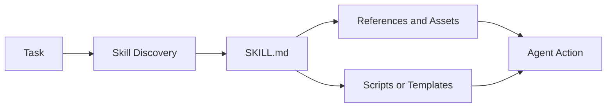

# Skills

Skills package procedural knowledge as discoverable folders of instructions, references, scripts, templates, and assets.

> Source and downloads
>
> - [Repository source](https://github.com/GTuritto/Agentic-Systems-Patterns/tree/main/skills-pattern)
> - [Download code bundle](/downloads/skills.zip)

## Intent

The Skills Pattern packages procedural knowledge as discoverable folders: concise instructions, references, scripts, templates, and tests that an agent loads only when relevant.

## Use When

- A capability requires repeatable domain procedure rather than only a tool API.
- You want reusable know-how across agents, teams, or projects.
- The agent benefits from progressive disclosure: short instructions first, deeper references only when needed.

## Avoid When

- A simple tool schema fully describes the capability.
- The skill would embed secrets, credentials, or unsafe scripts.
- The instructions are too vague to test with real tasks.

## Architecture

## Implementation Notes

- Keep `SKILL.md` short and route to deeper files only when needed.
- Bundle scripts and templates instead of asking the model to recreate fragile artifacts.
- Treat skills as supply-chain inputs: review, version, test, and restrict execution.
- Include examples of successful and unsuccessful use.

## Failure Modes

- Skill descriptions that are too broad, causing irrelevant activation.
- Long instruction files that consume context before the task is understood.
- Hidden dependencies that only work on one machine.
- Malicious or outdated bundled scripts.

## Code Walkthrough

Read the excerpt as the smallest executable expression of the pattern. The surrounding chapter explains the design constraints; the code shows where those constraints become concrete interfaces, state, validation, or control flow.

## Source Code

This pattern currently has no dedicated code excerpt. Use the source and download links below for the full pattern folder.

## Download

- [Download source bundle](/downloads/skills.zip)
- [Open source folder](https://github.com/GTuritto/Agentic-Systems-Patterns/tree/main/skills-pattern)

The download bundle contains the current `skills-pattern/` folder from this repository.

## Related Patterns

- [MCP-first Tool Use](https://github.com/GTuritto/Agentic-Systems-Patterns/blob/main/modern-tool-use-pattern/README.md)
- [Context Engineering](https://github.com/GTuritto/Agentic-Systems-Patterns/blob/main/context-engineering-pattern/README.md)
- [Human-in-the-Loop Approval](https://github.com/GTuritto/Agentic-Systems-Patterns/blob/main/human-in-the-loop-approval-agent/README.md)
