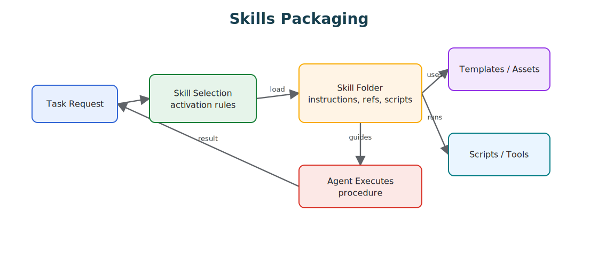
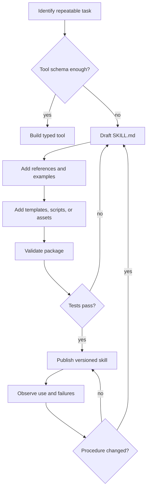

# Skills

Skills package procedural knowledge as discoverable, versioned folders of instructions, references, scripts, templates, assets, and tests.

> Source and downloads
>
> - [Repository source](https://github.com/GTuritto/Agentic-Systems-Patterns/tree/main/skills-pattern)
> - [Download code bundle](/downloads/skills.zip)

## Intent

The Skills Pattern packages procedural knowledge as discoverable folders: concise instructions, references, scripts, templates, and tests that an agent loads only when relevant.

This folder includes a small release-notes skill package. It shows the shape a production skill should have: `SKILL.md` for activation and procedure, references for policy, templates for stable output, fixtures for repeatable examples, and a TypeScript runner/test that a human or agent can execute.

## Scenario

A platform team wants coding agents to prepare release notes, update a changelog, and collect verification evidence. A tool schema can describe "write release notes", but it cannot carry the team's release rubric, examples, required commands, source-link policy, and final checklist.

A skill is the better boundary. `SKILL.md` gives the activation rule and the short procedure. Reference files hold release policy and examples. Scripts collect version, diff, and test evidence. Templates keep the output shape stable. The agent loads deeper files only when the release task appears, so normal coding work does not pay the context cost.

The important question is whether the folder contains a repeatable procedure another engineer can review, run, version, and test.

## Use When

- A capability requires repeatable domain procedure rather than only a tool API.
- You want reusable know-how across agents, teams, or projects.
- The agent benefits from progressive disclosure: short instructions first, deeper references only when needed.

## Avoid When

- A simple tool schema fully describes the capability.
- The skill would embed secrets, credentials, or unsafe scripts.
- The instructions are too vague to test with real tasks.

## Architecture

Use this diagram to read Skills as a system boundary, not only a code shape. The key ownership question is: the protocol or capability boundary owns schemas, permissions, invocation records, and response validation.



## Decision Rules

Use a skill when the model needs procedural judgment around a capability. Use a tool when the model only needs to call a typed operation.

| Need | Prefer | Reason |
| --- | --- | --- |
| Call a stable API with typed input and output. | Tool | The schema and authorization rule carry the whole contract. |
| Follow a multi-step team procedure. | Skill | The agent needs instructions, examples, templates, and checks. |
| Produce a repeated artifact such as a PR note, ADR, report, or release packet. | Skill | Templates and examples reduce drift. |
| Execute a dangerous action. | Tool behind policy, not skill alone. | Skills may explain the procedure, but permissions must live outside prose. |
| Share capability across agents or teams. | Skill plus tested scripts. | Humans and agents need the same runnable contract. |



## System Shape

- **Pattern boundary:** the agent discovers or selects a capability, submits a typed request, and receives a typed result across a policy boundary.
- **State owner:** the protocol or capability boundary owns schemas, permissions, invocation records, and response validation.
- **Primary artifact:** `skills-pattern/` contains a reviewable release-notes skill package with activation instructions, policy reference, template, fixture, TypeScript runner, and tests.
- **Operational promise:** Skills package procedural knowledge as discoverable, versioned folders of instructions, references, scripts, templates, assets, and tests.
- **Runnable path:** start with `npm run skills:demo` before adapting the pattern to a larger system.

## Contract

A production skill should have a small, reviewable anatomy.

| Part | Owns | A++ Test |
| --- | --- | --- |
| `SKILL.md` | Activation rule, short procedure, and routing to deeper material. | A new agent can decide when to use the skill without loading every reference. |
| `references/` | Domain policy, examples, rubrics, and edge cases. | References are scoped, current, and cited by the skill. |
| `scripts/` | Repeatable collection, validation, generation, or formatting. | A human can run the scripts outside the agent loop. |
| `templates/` | Stable output shape for common artifacts. | Outputs stay consistent across runs and agents. |
| `tests/` or fixtures | Positive and negative cases. | Bad activation, missing inputs, unsafe outputs, and malformed artifacts fail. |
| Manifest or metadata | Version, owner, dependencies, permissions, and environment. | Reviewers can audit supply-chain and permission risk. |

### Bad Skill vs Production Skill

| Weak Skill | Production Skill |
| --- | --- |
| "Use this for writing." | "Use this for release notes from verified engineering evidence." |
| One long instruction file. | Short `SKILL.md` plus routed references. |
| Vague advice and examples copied into context. | Templates, fixtures, and scripts with deterministic output. |
| Hidden shell assumptions. | Explicit commands, dependencies, inputs, outputs, and failure modes. |
| No negative cases. | Wrong-task activation, missing evidence, unsafe request, and malformed output tests. |
| Skill text implies permission. | Policy and execution authority live outside prose. |

## Core Protocol

1. Discover the capability, schema, permissions, and operating constraints.
2. Prepare a typed request from the current goal and state.
3. Authorize the request before invocation.
4. Invoke the tool, skill, or remote agent and validate the result.
5. Return structured output, refusal, progress, or error without losing correlation IDs.

## Implementation Notes

- Keep `SKILL.md` short and route to deeper files only when needed.
- Bundle scripts and templates instead of asking the model to recreate fragile artifacts.
- Treat skills as supply-chain inputs: review, version, test, and restrict execution.
- Include examples of successful and unsuccessful use.
- Record owner, version, dependencies, and rollback path before distributing a skill.
- Prefer runnable scripts for fragile formatting, evidence collection, or validation.
- Keep credentials in platform stores or environment bindings, never inside skill files.

### CLI-First Skills

A useful skill should be callable by both a human and an agent. A command-line interface is often the simplest shared contract:

- one command per capability;
- predictable subcommands such as `list`, `get`, `create`, and `run`;
- structured output for agents and readable output for humans;
- non-interactive defaults with explicit `--yes` or `--force` flags;
- credentials from environment or platform stores, not prompts hidden inside the command.

This keeps the skill testable outside the agent loop. If a human cannot run the skill directly and inspect the output, the agent will be harder to debug when the skill fails.

## Failure Modes

- Skill descriptions that are too broad, causing irrelevant activation.
- Long instruction files that consume context before the task is understood.
- Hidden dependencies that only work on one machine.
- Malicious or outdated bundled scripts.
- Prompt text that silently expands tool or filesystem authority.
- References that conflict with `SKILL.md` or with each other.
- Templates that drift because no fixture proves the final artifact.
- Missing rollback path after a bad skill version ships.

## Review Checklist

Before adding a skill to an agent environment, check:

- The description is narrow enough that the skill activates only for the right tasks.
- The first screen of instructions tells the agent what to do, what not to do, and which files to load next.
- Any script is deterministic, non-interactive by default, and safe to run with least privilege.
- Secrets come from platform stores or environment bindings, never from copied prose.
- The skill has at least one success example and one refusal or misuse example.
- The skill records enough evidence that a reviewer can reproduce the result.
- The skill can be disabled, versioned, or rolled back independently of the agent prompt.

## Evaluation Strategy

- Test happy-path use, wrong-task activation, missing inputs, malformed artifacts, unsafe requests, and missing dependencies.
- Assert that the skill loads only the references required for the task.
- Verify generated artifacts against templates instead of only checking prose quality.
- Run scripts outside the agent loop so humans can reproduce failures.
- Track activation accuracy, evidence completeness, script failure rate, artifact validity, and rollback success.

## Production Checklist

- Name the owner, version, dependency set, and supported runtime.
- Keep `SKILL.md` short enough for first-load use.
- Gate dangerous scripts behind external policy and approval.
- Validate inputs, outputs, template placeholders, and required evidence.
- Log skill name, version, loaded references, scripts run, artifacts written, and final status.
- Pin or roll back the skill independently of the agent prompt.

Use the online book's downloadable skill review checklist when reviewing a production skill package.

## Run the Example

```sh
npm run skills:demo
npm run skills:test
```

## Code Walkthrough

Read the excerpt as the smallest executable expression of the pattern. The surrounding chapter explains the design constraints; the code shows where those constraints become concrete interfaces, state, validation, or control flow.

## Source Code

These excerpts show the implementation shape. The complete code is available in the download bundle and repository source.

### `skills-pattern/release-notes-skill/SKILL.md`

[Open full source](https://github.com/GTuritto/Agentic-Systems-Patterns/blob/main/skills-pattern/release-notes-skill/SKILL.md)

```md
# Release Notes Skill

Use this skill when the task is to prepare release notes from verified engineering evidence.

## Activation

Use this skill for release notes, changelog entries, launch summaries, or publish-ready update notes. Do not use it for product marketing copy, speculative roadmap notes, or incident reports.

## Procedure

1. Read `references/release-policy.md` before drafting.
2. Load the evidence record from the caller or from `fixtures/release-evidence.json` for the demo.
3. Render the notes with `templates/release-notes.md`.
4. Include only shipped changes, verification evidence, known limits, and artifact links.
5. Refuse or return `needs_evidence` when verification, owner, version, or artifact data is missing.

## Do Not

- Invent test results, artifact links, owners, dates, or version numbers.
- Convert unresolved risks into shipped features.
- Use promotional language.
- Hide failed or skipped verification.

## Expected Output

Return concise release notes with these sections: summary, shipped changes, verification, artifacts, known limits, and owner.
```

### `skills-pattern/typescript/src/skill_package.ts`

[Open full source](https://github.com/GTuritto/Agentic-Systems-Patterns/blob/main/skills-pattern/typescript/src/skill_package.ts)

```ts
import fs from "node:fs/promises";
import path from "node:path";
import { fileURLToPath } from "node:url";

export type ReleaseEvidence = {
  version?: string;
  owner?: string;
  summary?: string;
  changes?: string[];
  verification?: string[];
  artifacts?: string[];
  knownLimits?: string[];
};

export type SkillPackage = {
  root: string;
  skillMarkdown: string;
  policyMarkdown: string;
  templateMarkdown: string;
};

export type SkillValidation = {
  status: "pass" | "fail";
  reasons: string[];
};

export type SkillRunResult = {
  status: "rendered" | "needs_evidence" | "blocked";
  validation: SkillValidation;
  output: string;
};

const requiredTemplateFields = [
  "version",
  "owner",
  "summary",
  "changes",
  "verification",
  "artifacts",
  "knownLimits",
];

const requiredEvidenceFields: Array<keyof ReleaseEvidence> = [
  "version",
  "owner",
  "summary",
  "changes",
  "verification",
  "artifacts",
];

export function defaultSkillRoot() {
  const current = path.dirname(fileURLToPath(import.meta.url));
  return path.resolve(current, "..", "..", "release-notes-skill");
}

export async function readSkillPackage(root = defaultSkillRoot()): Promise<SkillPackage> {
  const [skillMarkdown, policyMarkdown, templateMarkdown] = await Promise.all([
    fs.readFile(path.join(root, "SKILL.md"), "utf8"),
    fs.readFile(path.join(root, "references", "release-policy.md"), "utf8"),
    fs.readFile(path.join(root, "templates", "release-notes.md"), "utf8"),
  ]);

  return {
    root,
    skillMarkdown,
    policyMarkdown,
    templateMarkdown,
  };
}

export async function readEvidence(evidencePath: string): Promise<ReleaseEvidence> {
  return JSON.parse(await fs.readFile(evidencePath, "utf8")) as ReleaseEvidence;
}

export function validateSkillPackage(skillPackage: SkillPackage): SkillValidation {
  const reasons: string[] = [];
  const skillWordCount = skillPackage.skillMarkdown.split(/\s+/).filter(Boolean).length;

  if (!/^# Release Notes Skill/m.test(skillPackage.skillMarkdown)) reasons.push("missing skill title");
  if (!/## Activation/.test(skillPackage.skillMarkdown)) reasons.push("missing activation section");
  if (!/## Procedure/.test(skillPackage.skillMarkdown)) reasons.push("missing procedure section");
  if (!/## Do Not/.test(skillPackage.skillMarkdown)) reasons.push("missing negative constraints");
  if (skillWordCount > 260) reasons.push("SKILL.md is too long for first-load instructions");
  if (!/Required Evidence/.test(skillPackage.policyMarkdown)) reasons.push("policy missing required evidence");

  for (const field of requiredTemplateFields) {
    if (!skillPackage.templateMarkdown.includes(`{{${field}}}`)) {
      reasons.push(`template missing placeholder: ${field}`);
    }
```

_Excerpt truncated for readability. Download the bundle or open the source file for the complete implementation._

### `skills-pattern/typescript/test/skill_package.spec.ts`

[Open full source](https://github.com/GTuritto/Agentic-Systems-Patterns/blob/main/skills-pattern/typescript/test/skill_package.spec.ts)

```ts
import path from "node:path";
import {
  defaultSkillRoot,
  readSkillPackage,
  renderReleaseNotes,
  runReleaseNotesSkill,
  validateEvidence,
  validateSkillPackage,
  type ReleaseEvidence,
} from "../src/skill_package.ts";

function assert(condition: unknown, message: string): asserts condition {
  if (!condition) throw new Error(message);
}

const skillRoot = defaultSkillRoot();
const skillPackage = await readSkillPackage(skillRoot);
const validation = validateSkillPackage(skillPackage);

assert(validation.status === "pass", `Expected valid skill package: ${validation.reasons.join(", ")}`);
assert(skillPackage.skillMarkdown.includes("## Activation"), "Expected activation section");
assert(skillPackage.policyMarkdown.includes("Required Evidence"), "Expected policy required evidence");

const evidencePath = path.join(skillRoot, "fixtures", "release-evidence.json");
const result = await runReleaseNotesSkill({ skillRoot, evidencePath });
assert(result.status === "rendered", "Expected rendered release notes");
assert(result.output.includes("# Release Notes: 2026-06-21-skills-reference"), "Expected release title");
assert(result.output.includes("npm run skills:test"), "Expected verification evidence");
assert(!result.output.includes("{{"), "Expected all placeholders replaced");

const missingEvidence: ReleaseEvidence = {
  version: "missing-fields",
  changes: [],
};
const evidenceIssues = validateEvidence(missingEvidence);
assert(evidenceIssues.includes("missing evidence: owner"), "Expected owner evidence issue");
assert(evidenceIssues.includes("missing evidence: verification"), "Expected verification evidence issue");

const unsafeTemplate = "# Release Notes: {{version}}\n\n{{summary}}";
const rendered = renderReleaseNotes(unsafeTemplate, {
  version: "v1",
  owner: "maintainer",
  summary: "Shipped source-backed skill package.",
  changes: ["Added skill package."],
  verification: ["npm run skills:test"],
  artifacts: ["skills-pattern/release-notes-skill/SKILL.md"],
});
assert(rendered.includes("v1"), "Expected template replacement");
assert(!rendered.includes("{{summary}}"), "Expected summary replacement");

console.log("Skills package tests OK");
```

## Download

- [Download source bundle](/downloads/skills.zip)
- [Open source folder](https://github.com/GTuritto/Agentic-Systems-Patterns/tree/main/skills-pattern)

The download bundle contains the current `skills-pattern/` folder from this repository.

## Related Patterns

- [MCP-first Tool Use](https://github.com/GTuritto/Agentic-Systems-Patterns/blob/main/modern-tool-use-pattern/README.md)
- [Context Engineering](https://github.com/GTuritto/Agentic-Systems-Patterns/blob/main/context-engineering-pattern/README.md)
- [Human-in-the-Loop Approval](https://github.com/GTuritto/Agentic-Systems-Patterns/blob/main/human-in-the-loop-approval-agent/README.md)
