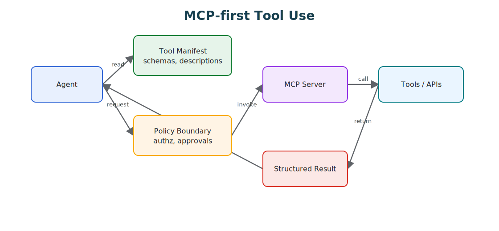

# Tool Capability Design

Tools are where agentic systems become real. Before tools, the model can only produce text. After tools, it can read systems, write systems, spend money, send messages, change state, and trigger workflows. That is why tool design is not an implementation detail. It is architecture.

A strong agent does not need a large tool list. It needs the right tools, with clear contracts, narrow authority, useful errors, and observable results.



## The Tool Surface Is A Control Plane

The tool surface decides what the agent can do, so do not treat tools as helper functions you happen to expose to a model. Treat the surface as a control plane with security, reliability, and product semantics.

Every tool should be able to answer what capability it exposes, who is allowed to call it, what inputs are valid, what state it can read, what state it can change, what side effects it can produce, what policy checks apply, what result shape it returns, and how it is traced, replayed, or audited. When those answers are not explicit, the system is leaning on prompt discipline to stay safe, which is the weakest place to put a boundary.

## Narrow Tools Beat Broad Tools

Broad tools look convenient and are usually dangerous. The ones to avoid are the open-ended primitives:

- `run_sql(query)`;
- `execute_shell(command)`;
- `send_http_request(method, url, body)`;
- `update_customer_record(fields)`;
- `manage_ticket(action, payload)`.

These force the model to invent the safety boundary at runtime, which is exactly the wrong place for it. Prefer tools that encode the workflow instead:

- `lookup_customer_by_id(customer_id)`;
- `get_refund_eligibility(order_id)`;
- `draft_refund_request(order_id, reason)`;
- `submit_refund_for_approval(request_id)`;
- `create_ticket_reply_draft(ticket_id, body)`;
- `post_approved_ticket_reply(ticket_id, draft_id)`.

Narrow tools reduce prompt burden, improve evaluation, and make policy enforcement far easier, because the workflow lives in the tool surface rather than in the model's discretion.

## Capability Classes

Classify every tool by capability.

| Capability Class | Example | Risk |
| --- | --- | --- |
| Read public data | search docs, fetch public page. | stale or untrusted information. |
| Read private data | customer lookup, internal database query. | privacy leak, tenant boundary failure. |
| Read untrusted content | email, webpage, user document, ticket comment. | prompt injection and hostile instructions. |
| Write internal state | update CRM, create ticket, save memory. | corrupted records or durable bad state. |
| External communication | send email, post message, submit form, webhook. | data exfiltration or unwanted communication. |
| Code or shell execution | run tests, execute script, modify files. | arbitrary side effects. |
| Money or entitlement change | refund, purchase, credit, permission grant. | financial or access-control impact. |

This classification belongs in the tool manifest or registry, not only in prose.

## Tool Risk Matrix

Capability classes are useful, but production systems also need an operational risk view. A tool may look harmless in isolation and become dangerous when combined with private data, untrusted content, external communication, or durable memory.

| Tool Type | Primary Risk | Required Control |
| --- | --- | --- |
| Read public data | stale, low-quality, or hostile content. | source metadata, freshness signal, and untrusted-content handling. |
| Read private data | privacy leak or tenant boundary failure. | scoped authorization, audit log, and output redaction. |
| Read untrusted content | prompt injection. | content isolation, instruction stripping, and policy checks before action. |
| Write business state | corrupted records or unintended workflow progress. | strict schema, idempotency key, policy decision, and trace. |
| External communication | data exfiltration or unwanted message delivery. | approval gate, recipient validation, and message audit. |
| Browser or code execution | arbitrary side effects and hidden network access. | sandbox, egress policy, timeout, and filesystem/network limits. |
| Memory write | durable poisoning or privacy retention failure. | memory policy, source attribution, retention class, and deletion path. |
| Credential use | confused deputy or privilege escalation. | short-lived credentials, scope binding, audience checks, and secret redaction. |

The point is not to make every tool heavy. The point is to make the runtime know which tools are heavy. A public documentation search tool and a payment tool should not live behind the same policy, trace, retry, and approval rules.

## Tool Manifest

A useful tool manifest is more than a name and a description.

| Field | Purpose |
| --- | --- |
| Name | Stable identifier used in traces, evals, and policy. |
| Description | What the tool does, written for correct selection. |
| Input schema | Required fields, types, limits, enums, and validation rules. |
| Output schema | Structured result, refusal, partial result, or error. |
| Capability class | Read, write, communication, code execution, private data, untrusted content. |
| Side effects | What can change if the tool succeeds. |
| Idempotency | Whether repeated calls are safe and how duplicates are handled. |
| Permissions | Which roles, agents, routes, or tenants may call it. |
| Approval rule | When the call must be reviewed by a human or workflow. |
| Trace fields | Correlation ID, actor, resource, policy decision, and result. |
| Data handling | Redaction, retention, privacy class, and logging constraints. |

If a tool is missing these fields, the runtime should treat it as high risk by default.

A compact manifest can make those boundaries explicit:

```yaml
name: draft_refund_request
description: Drafts a refund request for human approval. It does not issue money.
capabilities:
  - read_private_data
  - write_internal_state
side_effects:
  - creates_refund_draft
permissions:
  roles:
    - support_agent
approval:
  required_for:
    - submit_refund
input_schema:
  type: object
  required:
    - order_id
    - reason
  properties:
    order_id:
      type: string
    reason:
      type: string
      maxLength: 500
output_schema:
  type: object
  required:
    - draft_id
    - status
  properties:
    draft_id:
      type: string
    status:
      enum:
        - created
        - refused
        - needs_more_context
trace:
  fields:
    - run_id
    - actor_id
    - policy_version
    - approval_id
```

The tool name says what the tool does and what it does not do. A separate tool should submit the refund after approval.

For strongly typed systems, the same contract can be represented as code and registered with the tool runtime:

```ts
type CapabilityClass =
  | "read_public"
  | "read_private"
  | "read_untrusted"
  | "write_side_effect"
  | "external_communication"
  | "browser_or_code"
  | "memory_write"
  | "credential_use";

type ToolCapabilityManifest = {
  name: string;
  owner: string;
  version: string;
  description: string;
  inputSchemaRef: string;
  outputSchemaRef: string;
  risk: "low" | "medium" | "high" | "critical";
  capabilityClasses: CapabilityClass[];
  requiredScopes: string[];
  sideEffects: "none" | "draft" | "external_write" | "money_movement" | "message_send";
  idempotencyRequired: boolean;
  approvalRequired: boolean;
  timeoutMs: number;
  egress: {
    allowedDomains: string[];
    allowPrivateNetwork: boolean;
  };
  observability: {
    requiredTraceFields: string[];
    redactFields: string[];
  };
};

const refundDraftTool: ToolCapabilityManifest = {
  name: "draft_refund_request",
  owner: "support-platform",
  version: "2026-06-17",
  description: "Creates a refund draft for human approval. It does not issue money.",
  inputSchemaRef: "schemas/refund-draft-input.json",
  outputSchemaRef: "schemas/refund-draft-output.json",
  risk: "high",
  capabilityClasses: ["read_private", "write_side_effect"],
  requiredScopes: ["orders:read", "refunds:draft"],
  sideEffects: "draft",
  idempotencyRequired: true,
  approvalRequired: false,
  timeoutMs: 5000,
  egress: {
    allowedDomains: [],
    allowPrivateNetwork: false,
  },
  observability: {
    requiredTraceFields: ["run_id", "actor_id", "order_id", "policy_version"],
    redactFields: ["customer_email", "payment_token"],
  },
};
```

This looks bureaucratic only until the first incident. After that, it becomes the map of what the agent was allowed to do, which policy version was active, which data crossed the boundary, and which team owns the fix.

## Agent-Friendly Interfaces

A tool designed for humans is not always a tool designed for agents. Agent-friendly tools have explicit schemas, short and specific descriptions, stable names, examples of valid and invalid calls, clear errors, structured outputs, bounded result sizes, correlation IDs, and machine-readable status values, with no hidden global state and no surprise side effects.

Error messages carry more weight than people expect. A vague `failed` makes the model guess. A useful error says what failed, whether retry is safe, and which field needs correction, which is the difference between a clean recovery and a confused retry loop.

## Agent-First Tool Interface Checklist

Design every tool call so the agent can decide, execute, and recover without guessing:

- name the capability, not the implementation detail;
- declare required inputs, optional inputs, limits, and side effects;
- return machine-readable status, result data, and recoverable error codes;
- log the request id, actor, policy decision, and affected resource;
- provide dry-run or preview mode for destructive operations;
- document fallback behavior when the tool is denied, unavailable, or rate-limited.

The interface should make the safe path the shortest path.

## Tool Results Are Data

Tool results should not become new instructions. A search result, web page, email, ticket, document, or log line may contain malicious or irrelevant text. The model can inspect it as evidence, but the runtime must not let it override system goals, tool permissions, approval rules, or memory policy.

Good tool results keep their pieces separate: trusted metadata, the untrusted content itself, the source, timestamp, confidence, permissions, and redaction status. That separation makes context construction safer and evaluation easier.

## Credentials And Egress Boundaries

An agent should not hold broad credentials. The runtime should exchange the agent's identity, task, tenant, and approved capability for a narrow credential at the moment of tool invocation. That credential should have a short lifetime, a scoped audience, and only the permissions needed for the specific call.

The same idea applies to network egress. A tool that reads an internal order service should not also be able to send arbitrary HTTP requests to the internet. A browser tool should not reach private networks unless the run explicitly needs that access. A code execution tool should not inherit the developer machine's environment by default.

At minimum, high-risk tools need:

- scoped OAuth or OIDC claims checked by the tool server;
- TLS for service-to-service transport;
- per-tool egress allowlists;
- no ambient secrets in prompts, logs, or tool results;
- tenant and actor binding on every request;
- redaction before traces, eval fixtures, and memory writes;
- revocation and kill-switch support.

This is where tool design connects to service architecture. The model selects an action. The runtime authorizes the action. The tool performs the action. Those responsibilities should not collapse into one prompt.

## Observability Requirements

Tool calls need traces that explain both what happened and why the runtime allowed it to happen. A useful tool trace includes the run ID, agent ID, actor or service principal, tool name and version, input shape, redacted input summary, policy decision, approval ID when present, idempotency key, timeout, retry count, result status, error class, latency, token context reference, and redaction status.

Do not log raw sensitive payloads just because debugging is easier that way. The production trace should be good enough to reconstruct the decision path without turning observability into a second data leak.

For incident review, the trace should answer:

- Which tool was called?
- Which capability classes were active?
- Which policy allowed or blocked the call?
- Was untrusted content in context before the call?
- Was private data returned?
- Did private data leave through an external channel?
- Was approval required, and was it attached to the exact action?
- Was the call replayed, retried, or deduplicated?

## Progressive Tool Disclosure

Do not show every tool to every agent on every step. Expose them progressively:

1. Start with the route or task type.
2. Load the smallest useful tool set.
3. Add tools only after the state justifies them.
4. Remove tools when the phase changes.
5. Require approval or policy checks for cross-capability chains.

A support agent, for example, might start with read-only policy and order-lookup tools. Refund creation appears only after eligibility is established, refund submission only after a draft exists, and external customer messaging only after approval. Disclosing tools this way reduces selection errors and limits the blast radius of prompt injection.

## Tool Composition

The danger often lives in the chain, not in any single tool. A read-only private-data tool is fine on its own. An external messaging tool is fine on its own. A browser tool is fine on its own. The chain turns unsafe when one run combines private data, untrusted content, and external communication, so evaluate tool chains, not only individual calls.

For each run, ask what capabilities are present, whether untrusted content entered the context, whether private data can leave through any output channel, whether the write action is justified by trusted evidence, whether the approval record is attached to the exact action, and whether a safer deterministic workflow could do the same thing. This is where tool design connects directly to threat modeling.

## Evaluation Guidance

Tool evals should test both selection and restraint. Build cases where the correct behavior is to call the right tool, but also cases where the correct behavior is to call no tool, ask for missing input, refuse an unsupported action, route to approval, use a read-only tool instead of a write tool, avoid external communication, stop after a tool returns untrusted instructions, recover from a malformed response, or retry only when retry is safe.

Then measure tool-selection accuracy, invalid-argument rate, unauthorized-call rate, approval-routing accuracy, unsafe-chain prevention, tool-result grounding, latency and cost per tool path, and recovery from tool errors. A final answer can look correct while the tool trajectory was unsafe, so evaluate the trajectory.

Good tool evals are vertical slices. Do not only test `call_tool(input)`. Test the full path from user request to context construction, tool disclosure, policy decision, tool invocation, result handling, memory behavior, final answer, trace, and replay. That is where the real bugs hide.

Useful eval scenarios include:

- a normal successful path;
- missing required input;
- malformed but recoverable input;
- untrusted content that tries to override instructions;
- private data followed by an external communication request;
- duplicate submit or retry after timeout;
- approval required but missing;
- stale tool result;
- tool returns partial data;
- tool is disabled by policy;
- memory write requested from untrusted evidence.

The evaluation target is not just whether the final answer reads well. It is whether the system used the minimum necessary authority, respected policy, preserved evidence, avoided unsafe chains, and left a useful audit trail.

## Design Checklist

Before exposing a tool to an agent, check:

- Is the tool narrow enough?
- Is the input schema strict?
- Is the output structured?
- Are side effects explicit?
- Is the capability class declared?
- Is the risk class declared?
- Are permissions enforced outside the prompt?
- Are credentials short lived and scoped?
- Is egress restricted to what the tool needs?
- Does the tool support idempotency where needed?
- Are retries safe and bounded?
- Are approvals bound to the exact action?
- Are errors actionable?
- Are traces complete and redacted?
- Are private data and untrusted content marked separately?
- Can the tool be mocked in evals?
- Can the tool be replayed without repeating unsafe side effects?
- Can the tool be disabled quickly?
- Does the tool return untrusted content as data, not instructions?

The test is simple: if the model calls this tool incorrectly, can the architecture catch it before harm happens?

## Related Chapters

- [Tool Use](../foundations/tool-use)
- [MCP-first Tool Use](./mcp-first-tool-use)
- [Skills](./skills)
- [Human Approval Gates](./human-approval-gates)
- [Agent Threat Model](../agent-engineering-practice/agent-threat-model)
- [Agent Security and Sandboxing](../agent-engineering-practice/agent-security-and-sandboxing)
- [Secure Agent Communication](./secure-agent-communication)
- [Policy Enforcement](../production-runtime/policy-enforcement)
- [Observability and Evals](../production-runtime/observability-and-evals)
- [Production Runtime Overview](../production-runtime/overview)
- [Evaluation-Driven Agent Development](../agent-engineering-practice/evaluation-driven-agent-development)
