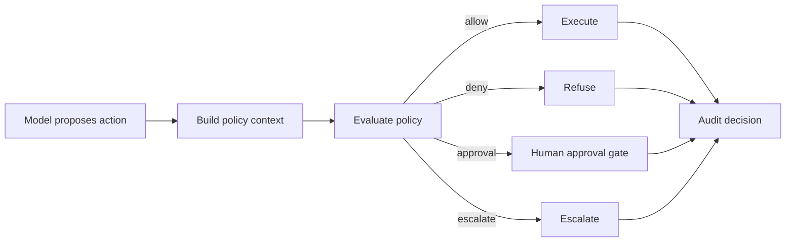

# Policy Enforcement Pattern

## Intent

Policy enforcement is the software-owned boundary that decides whether a model-proposed answer, tool call, data access, memory write, or side effect is allowed. The model can propose an action. The runtime decides whether to allow, deny, require approval, escalate, or audit it.

Policy should not live only in prompt text. Prompts can explain policy to the model, but enforcement belongs in code, workflow, tool manifests, access-control systems, and auditable decision records.

Knowledge-bound agents use the same idea for answers: the model should answer only from approved sources, cite the evidence, and refuse or escalate when the required source is missing, stale, forbidden, or conflicting.

## Use When

- Actions must be checked before execution.
- The agent handles private, regulated, security-sensitive, or business-critical data.
- The system needs approved sources, citations, or compliance constraints.
- Policy decisions must be auditable and replayable.
- The runtime can identify actor, resource, action, capability, risk, and context.

## Avoid When

- Policy is only written as prompt guidance with no runtime check.
- The system cannot identify the actor, resource, action, and context.
- Policy checks happen after irreversible actions.
- Exceptions are silent, unreviewed, or missing from traces.
- Approved knowledge sources cannot be identified, updated, or cited.

## Architecture



## System Shape

- **Pattern boundary:** the policy boundary evaluates proposed actions, data access, answers, and memory writes before they take effect.
- **State owner:** the runtime owns policy context, decision records, policy version, trace ID, and enforcement outcome.
- **Model role:** the model proposes an action or answer and may explain risk, but it does not grant itself permission.
- **Knowledge boundary:** approved sources, freshness, citations, and refusal rules define what the agent may claim.
- **Operational promise:** policy decisions happen before execution and are visible after the run.

## Core Protocol

1. Receive a proposed action, answer, tool call, retrieval result, or memory write.
2. Build policy context: actor, caller, tenant, resource, capability, risk, evidence, and trace ID.
3. Evaluate policy before the action executes or the answer is returned.
4. Return a decision: allow, deny, require approval, escalate, or audit-only.
5. If approval is required, pause through the approval gate.
6. Execute only decisions that are allowed or approved.
7. Record decision, reason, policy version, actor, resource, action, and trace ID.
8. Feed serious denials, misses, and overrides into regression evals.

## Implementation Notes

A policy decision should be a typed runtime object.

```ts
type PolicyDecision = {
  actionId: string;
  actor: {
    id: string;
    role: string;
    tenantId?: string;
  };
  resource: {
    type: 'customer_record' | 'refund' | 'email' | 'memory' | 'document';
    id: string;
    tenantId?: string;
  };
  capability: 'read' | 'write' | 'send' | 'refund' | 'remember' | 'answer';
  riskLevel: 'low' | 'medium' | 'high' | 'critical';
  decision: 'allow' | 'deny' | 'require_approval' | 'escalate' | 'audit';
  reason: string;
  requiredApproval?: {
    approverRole: string;
    approvalPolicy: string;
  };
  policyVersion: string;
  traceId: string;
};
```

The enforcement function should run before the tool call or side effect:

```ts
function enforcePolicy(input: {
  actorRole: string;
  actorTenant?: string;
  resourceTenant?: string;
  capability: PolicyDecision['capability'];
  riskLevel: PolicyDecision['riskLevel'];
}): Pick<PolicyDecision, 'decision' | 'reason'> {
  if (input.actorTenant && input.resourceTenant && input.actorTenant !== input.resourceTenant) {
    return { decision: 'deny', reason: 'tenant_boundary' };
  }

  if (input.capability === 'refund' && input.riskLevel === 'high') {
    return { decision: 'require_approval', reason: 'high_risk_refund' };
  }

  if (input.capability === 'send' && input.actorRole !== 'support_agent') {
    return { decision: 'deny', reason: 'role_not_allowed' };
  }

  return { decision: 'allow', reason: 'policy_passed' };
}
```

For knowledge-bound answers, policy also decides whether the evidence is allowed:

```ts
type SourcePolicy = {
  sourceId: string;
  approved: boolean;
  freshness: 'current' | 'stale' | 'unknown';
  citationRequired: boolean;
  allowedTenant?: string;
};
```

The model can explain why an action looks safe. The runtime still makes the decision.

## Failure Modes

- Policy exists only in the system prompt.
- Policy runs after a tool has already executed.
- The decision lacks actor, resource, tenant, or capability context.
- A retry bypasses policy because the first attempt was checked.
- Policy versions change but traces do not record which version applied.
- Denials are not logged, so operators cannot see attempted unsafe actions.
- Approval-required actions are treated as allowed.
- Knowledge answers cite unapproved, stale, or inaccessible sources.
- Exceptions become permanent undocumented policy holes.

## Evaluation Strategy

Policy evals should test allowed, denied, approval-required, and escalation paths.

- Test allowed low-risk actions.
- Test denied actions across role, tenant, resource, and capability boundaries.
- Test approval-required actions before side effects.
- Test stale or unapproved sources in knowledge-bound answers.
- Test retries and resumed workflows to ensure policy is applied every time.
- Test missing actor, resource, or tenant context.
- Test policy version changes and audit completeness.
- Test production incidents as replayable policy fixtures.

A compact policy eval can look like this:

```json
{
  "case_id": "cross_tenant_customer_record_read",
  "proposed_action": {
    "actor_tenant": "tenant_a",
    "resource_tenant": "tenant_b",
    "capability": "read",
    "resource_type": "customer_record"
  },
  "expected": {
    "decision": "deny",
    "reason": "tenant_boundary",
    "must_not_execute": true,
    "required_trace_fields": ["actor", "resource", "policy_version", "trace_id"]
  }
}
```

Measure policy decision accuracy, false allow rate, false denial rate, approval-routing accuracy, tenant-boundary violations, stale-policy use, denial logging completeness, and recurrence of known policy failures.

## Production Checklist

- Enforce policy before execution, answer return, memory write, or external communication.
- Build policy context from trusted runtime data, not only model text.
- Return explicit allow, deny, require-approval, escalate, or audit decisions.
- Record actor, resource, capability, reason, policy version, and trace ID.
- Apply policy on retries and resumed workflows.
- Keep policy versions, tool manifests, source rules, and approval rules versioned.
- Treat missing policy context as deny or escalate.
- Add dashboards for denials, approvals, overrides, and false allows.
- Convert policy misses into regression evals.
- Review exceptions and expire them intentionally.

## Related Patterns

- [Human Approval Gates](/tools-skills-protocols/human-approval-gates)
- [Tool Capability Design](/tools-skills-protocols/tool-capability-design)
- [Agent Threat Model](/agent-engineering-practice/agent-threat-model)
- [Semantic Recall and RAG](/memory-knowledge/semantic-recall-rag)
- [Production Evaluation Feedback Loops](/production-runtime/production-evaluation-feedback-loops)
- [Pattern Evaluation Checklist](/pattern-selection/pattern-evaluation-checklist)
