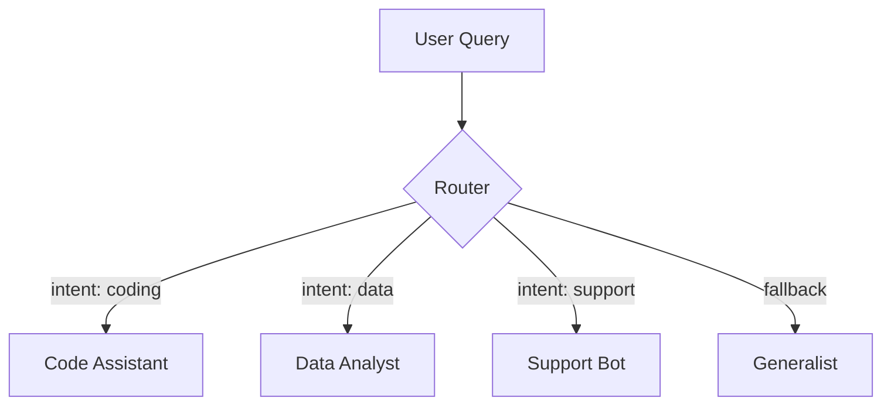

# Context-Aware Routing Agent Pattern

Description: Orchestrator that dynamically routes incoming queries to the most suitable specialist agent based on intent classification or semantic similarity.

Value: Efficiently handles multi-domain requests without overloading a single agent.

## Deliverables

- Mermaid diagram of routing logic
- TypeScript + Python examples using Mistral over raw HTTP
- Intent classification and embeddings retrieval how-to

## Diagram (Mermaid)

## Examples

- autogen_typescript_example/
- langgraph_python_example/

Notes:

- Use HuggingFace embeddings (all-MiniLM-L6-v2) for semantic routing.
- Mistral chat API: POST <https://api.mistral.ai/v1/chat/completions> with `Authorization: Bearer <MISTRAL_API_KEY>`.
