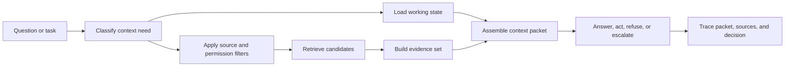

# Context Engineering Pattern

## Intent

Context engineering decides what the model sees before it answers or acts. It assembles instructions, user input, working memory, retrieved evidence, tool results, policies, examples, budgets, and exclusions into a controlled working set.

RAG is not "put search results in the prompt." It is an evidence pipeline. Context engineering is the larger discipline around that pipeline. The system must decide which sources are eligible, what counts as fresh enough, what the caller may see, how retrieved content is cited, what gets omitted, what gets pinned, and what the agent should do when evidence is missing or conflicting.

The rule is simple: context is assembled, not dumped. The model should see a deliberate packet, not a pile of chat history, retrieved text, tool output, and memory fragments.

## Use When

- The answer depends on a large, changing, or private knowledge base.
- Relevant sources can be chunked, embedded, filtered, cited, and inspected.
- The retrieval layer can enforce tenant, role, source, and freshness constraints.
- The agent can refuse or escalate when evidence is missing.
- The system can evaluate retrieval quality separately from final-answer quality.
- The agent needs working memory, tool results, policy, and retrieved evidence in one coherent packet.

## Avoid When

- The required knowledge is already in the task input or deterministic system state.
- The corpus is too noisy, stale, or untrusted to retrieve safely.
- The system cannot distinguish trusted metadata from untrusted document content.
- The answer needs exact database state that should come from a typed tool, not semantic search.
- Citations, source IDs, or retrieval traces cannot be stored for review.
- The system would rely on raw transcript stuffing instead of a controlled context builder.

## Architecture



## System Shape

- **Pattern boundary:** the context builder decides what may enter the model working set and how each part is labeled.
- **State owner:** the runtime owns working state, policies, budgets, retrieval traces, tool results, memory records, and context assembly records.
- **Model role:** the model uses the assembled packet to answer, act, ask for missing evidence, or explain why it cannot proceed.
- **Policy boundary:** source eligibility, tenant access, redaction, freshness, tool-result handling, memory writes, and instruction hierarchy run before generation.
- **Operational promise:** the model works from a small, labeled, policy-checked packet rather than vague memory or unfiltered context.

## Core Protocol

1. Classify the context need: policy, task instructions, working state, tool result, user memory, event history, private record, public source, or example.
2. Load current goal, working memory, budget state, approval state, and stop conditions.
3. Apply caller, tenant, role, source, freshness, and data-handling filters before retrieval or inclusion.
4. Retrieve candidate chunks with metadata, not naked text.
5. Rank and trim candidates by relevance, freshness, diversity, trust, and token budget.
6. Build an evidence set with source IDs, citations, confidence, and known gaps.
7. Assemble context with instructions, policy, state, evidence, tool results, memory, examples, and exclusions separated.
8. Generate an answer, action, refusal, or escalation using only eligible context.
9. Record query, filters, source IDs, packet sections, omitted material, citations, and stop reason.

## Implementation Notes

Treat retrieved material as evidence, not authority. A web page, email, ticket, PDF, or document can contain useful facts and malicious instructions at the same time.

### Context Packet

A context packet is the runtime artifact that explains what the model was allowed to see.

```ts
type ContextSectionKind =
  | "system_instruction"
  | "policy"
  | "user_request"
  | "working_memory"
  | "retrieved_evidence"
  | "tool_result"
  | "episodic_memory"
  | "semantic_memory"
  | "example"
  | "exclusion";

type ContextSection = {
  kind: ContextSectionKind;
  title: string;
  content: string;
  sourceRefs: string[];
  trustLevel: "trusted" | "internal" | "user_supplied" | "public" | "untrusted";
  freshness?: {
    observedAt?: string;
    expiresAt?: string;
  };
  tokenEstimate: number;
};

type ContextPacket = {
  packetId: string;
  runId: string;
  goalId?: string;
  actorId: string;
  tenantId: string;
  task: string;
  sections: ContextSection[];
  budget: {
    maxTokens: number;
    usedTokens: number;
    reservedOutputTokens: number;
  };
  omittedRefs: Array<{
    ref: string;
    reason: "not_relevant" | "stale" | "not_allowed" | "duplicate" | "over_budget";
  }>;
  policyVersion: string;
};
```

This packet should be traceable. If a run fails, you should be able to inspect what was included, what was omitted, and why.

### Ordering And Trust Rules

Ordering is part of the control plane. A practical order is:

1. system instructions;
2. policy and safety constraints;
3. current user or workflow request;
4. goal and working memory;
5. approved tool results;
6. retrieved evidence;
7. retrieved memories;
8. examples;
9. explicit exclusions and known gaps.

The point is not only token order. The point is separation. Retrieved text, tool output, memory, and user documents should never be allowed to rewrite the system instructions, policy, tool permissions, approval rules, or memory write rules.

### Evidence Contract

```ts
type EvidenceChunk = {
  sourceId: string;
  sourceType: 'policy' | 'docs' | 'ticket' | 'email' | 'memory' | 'web';
  tenantId?: string;
  trustLevel: 'trusted' | 'internal' | 'user_supplied' | 'public' | 'unknown';
  freshness: {
    retrievedAt: string;
    sourceUpdatedAt?: string;
    maxAgeDays?: number;
  };
  permissions: {
    allowedRoles: string[];
    redaction: 'none' | 'pii' | 'secret' | 'tenant_scoped';
  };
  score: number;
  excerpt: string;
  citation: string;
};
```

### Answer Contract

The evidence contract should travel with the answer:

```ts
type RagAnswer = {
  status: 'answered' | 'missing_evidence' | 'conflicting_evidence' | 'refused';
  answer?: string;
  citations: string[];
  evidenceRefs: string[];
  missingEvidence?: string[];
};
```

### Eligibility Check

A small eligibility check catches many production failures:

```ts
function isEligibleEvidence(chunk: EvidenceChunk, callerRole: string, now: Date) {
  if (!chunk.permissions.allowedRoles.includes(callerRole)) return false;
  if (chunk.permissions.redaction === 'secret') return false;

  if (chunk.freshness.sourceUpdatedAt && chunk.freshness.maxAgeDays) {
    const updatedAt = new Date(chunk.freshness.sourceUpdatedAt).getTime();
    const ageDays = (now.getTime() - updatedAt) / 86_400_000;
    if (ageDays > chunk.freshness.maxAgeDays) return false;
  }

  return chunk.trustLevel !== 'unknown';
}
```

Do not let the model decide whether a source is allowed. The model can summarize evidence quality. Software should enforce eligibility.

### Context Budgeting

Context budgeting is not just truncation. It is deciding what the model must see, what can be summarized, what can be retrieved again, what can be omitted, and what must be pinned.

Pin small, high-authority items: system instructions, policy constraints, active goal, stop condition, approval state, and the user request. Summarize bulky but low-risk history. Retrieve source evidence instead of carrying old copied excerpts. Drop duplicate chunks. Omit stale, unauthorized, or low-confidence material. Reserve output tokens before filling the input context.

When the budget is tight, the runtime should degrade explicitly:

- answer from fewer cited sources;
- ask a clarifying question;
- retrieve again with narrower filters;
- summarize intermediate state;
- refuse when required evidence cannot fit safely;
- escalate when policy requires complete evidence.

## Failure Modes

- Stale but plausible evidence is retrieved and treated as current.
- Retrieved text contains instructions that override the system goal.
- Tool output is treated as a new instruction rather than as data.
- Memory overrides the current user request.
- Working state is stale but still included as current.
- Chunks from the wrong tenant, role, or customer enter the context.
- The retriever returns semantically similar but operationally wrong sources.
- Citations point to broad documents instead of the exact supporting chunk.
- The agent answers when the evidence is missing or conflicting.
- Memory writes store an unverified summary as if it were durable fact.
- Retrieval scores are logged, but filters, source IDs, and freshness are not.
- The final answer is evaluated, but retrieval quality is not.
- The context packet cannot be reconstructed after an incident.
- Important policy or approval state is omitted under token pressure.

## Evaluation Strategy

Context evals should test retrieval, assembly, and answer behavior separately.

- Test known-answer questions where the correct source is present.
- Test missing-evidence cases where the agent should refuse or ask for help.
- Test stale-source cases where an older source conflicts with a newer one.
- Test conflicting-source cases where the answer must explain uncertainty.
- Test prompt injection inside retrieved documents.
- Test prompt injection inside tool results and memory records.
- Test tenant and permission boundaries.
- Test context budget pressure and verify policy, goal, and citations are not dropped.
- Test omitted-source behavior and verify the trace explains why material was excluded.
- Test citation coverage: every factual claim should map to source evidence.
- Test retrieval precision and recall before testing final prose quality.

A compact eval fixture can make the evidence requirement explicit:

```json
{
  "case_id": "stale_refund_policy",
  "question": "Can a damaged item be refunded after 45 days?",
  "retrieved_sources": [
    { "source_id": "refund_policy_2024", "freshness": "stale" },
    { "source_id": "refund_policy_2026", "freshness": "current" }
  ],
  "expected": {
    "must_cite": ["refund_policy_2026"],
    "must_not_cite": ["refund_policy_2024"],
    "status": "answered",
    "checks": ["freshness", "citation_coverage", "no_untrusted_instructions"]
  }
}
```

Measure retrieval recall, retrieval precision, source freshness, packet completeness, context-token efficiency, citation faithfulness, missing-evidence refusal rate, prompt-injection resistance, tenant-boundary violations, and answer quality grounded in cited evidence.

## Production Checklist

- Define eligible sources by tenant, role, source type, freshness, and data class.
- Keep source metadata with every retrieved chunk.
- Build a traceable context packet for each run.
- Separate instructions from retrieved facts in the assembled context.
- Keep tool results, memory, retrieved evidence, examples, and user content labeled separately.
- Redact or exclude sources before generation, not after.
- Pin policy, active goal, stop condition, and approval state before filling optional context.
- Require citations for factual claims.
- Refuse or escalate when evidence is missing, stale, or conflicting.
- Trace query, filters, source IDs, scores, packet sections, omitted refs, and final citations.
- Evaluate retrieval quality separately from answer quality.
- Review memory writes before storing retrieved summaries as durable facts.
- Version chunking, embedding model, retrieval filters, rerankers, prompts, and citation rules.
- Add regression evals for context poisoning, stale context, omitted policy, and token pressure.

## How to run (Python RAG)

This example uses Hugging Face embeddings (`all-MiniLM-L6-v2`), FAISS, and `requests` to call Mistral chat completions.

1. Create a virtual environment and install dependencies:

```bash
python3 -m venv .venv
source .venv/bin/activate
pip install -r context-engineering-pattern/langgraph_python_example/requirements.txt
```

2. Export your Mistral key and run the example:

```bash
export MISTRAL_API_KEY=your_key_here
python context-engineering-pattern/langgraph_python_example/rag_example.py
```

Notes:

- First run will download the sentence-transformers model; allow time and network access.
- Endpoint: https://api.mistral.ai/v1/chat/completions
- No OpenAI or vendor SDKs are used.

## References

- [Retrieval-Augmented Generation paper](https://arxiv.org/abs/2005.11401)

## Related Patterns

- [Context Budgets and Working Sets](/foundations/context-budgets-and-working-sets)
- [Working Memory](/memory-knowledge/working-memory)
- [Memory-Augmented Agent](/memory-knowledge/memory-augmented-agent)
- [Knowledge-Bound Agents](/memory-knowledge/knowledge-bound-agents)
- [Agentic RAG Systems](/systems-architecture/agentic-rag-systems)
- [Pattern Evaluation Checklist](/pattern-selection/pattern-evaluation-checklist)
