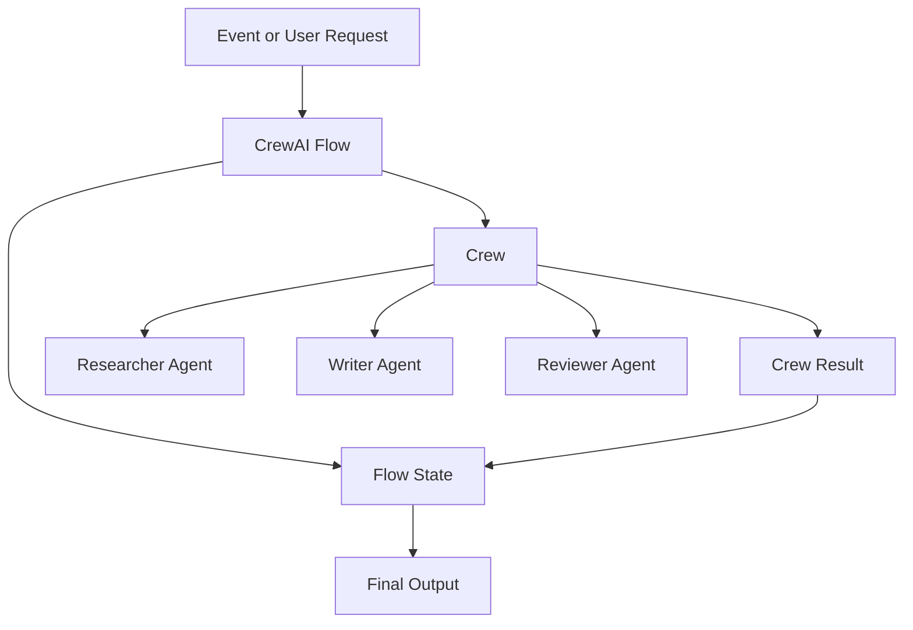

# CrewAI Flows and Crews Pattern

## Intent

The CrewAI Flows and Crews Pattern separates production workflow control from collaborative agent work. Flows own state and execution order; crews group specialized agents that perform delegated tasks inside the flow.

## Use When

- You are building Python-first agent automations.
- The system needs explicit state and event-driven control flow.
- Multiple specialist agents need to collaborate on bounded tasks.

## Avoid When

- A single deterministic workflow step is enough.
- Agents have unclear roles or overlapping responsibilities.
- You cannot define where flow state begins and crew-local context ends.

## Architecture

## Implementation Notes

- Let flows manage state, branching, persistence, and execution order.
- Give each crew a bounded task with clear expected output.
- Give each agent a role that changes behavior, not just a different name.
- Test flow state transitions separately from crew output quality.

## Failure Modes

- Crews used as a substitute for workflow design.
- Too many agents with vague roles.
- Flow state mutated implicitly through chat history.
- No evaluator for whether the crew result satisfies the flow step.

## Related Patterns

- [Task Delegation](../task-delegation-pattern/README.md)
- [Consensus-Seeking Multi-Agent System](../consensus-seeking-multi-agent-system-pattern/README.md)
- [Durable Workflow](../durable-workflow-pattern/README.md)
