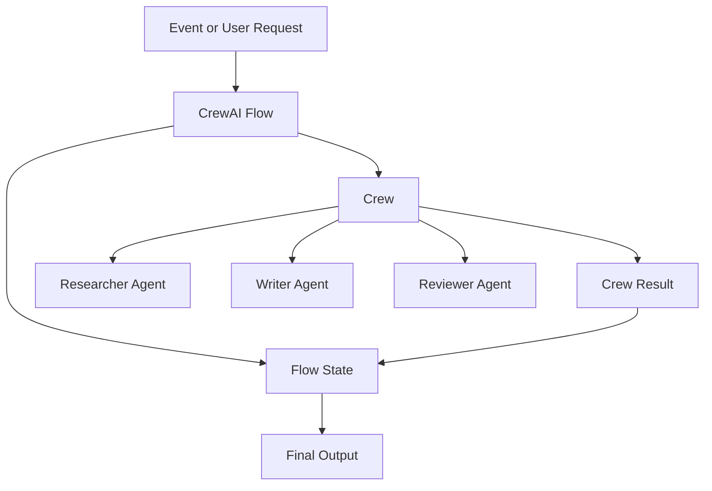

# CrewAI Flows and Crews Pattern

## Intent

The CrewAI Flows and Crews Pattern separates production workflow control from collaborative agent work. Flows own state and execution order; crews group specialized agents that perform delegated tasks inside the flow.

## Use When

- You are building Python-first agent automations.
- The system needs explicit state and event-driven control flow.
- Multiple specialist agents need to collaborate on bounded tasks.

## Avoid When

- A single deterministic workflow step is enough.
- Agents have unclear roles or overlapping responsibilities.
- You cannot define where flow state begins and crew-local context ends.

## Architecture

## System Shape

- **Flow boundary:** the Flow owns durable state, ordering, branching, checkpoints, acceptance, and final output.
- **Crew boundary:** a Crew performs bounded specialist work inside a Flow step and returns structured outputs.
- **Agent boundary:** each agent has a role, goal, tools, permissions, and expected output shape that differ from the other roles.
- **Policy boundary:** the Flow checks authority before crew kickoff, tool use, memory writes, and final acceptance.
- **Evaluation boundary:** flow state transitions and crew outputs are tested separately, then tested together as one trajectory.
- **Operational boundary:** traces record flow events, crew kickoff, role outputs, validation, acceptance, rejection, and escalation.

## Core Protocol

1. Accept an event or request with actor, tenant, goal, release version, and idempotency key.
2. Initialize Flow state and decide whether the work needs a Crew or a deterministic function.
3. Create tasks with scoped inputs, expected outputs, allowed tools, and acceptance criteria.
4. Run the Crew and collect role outputs, errors, refusals, and evidence.
5. Validate each role output before it can mutate Flow state.
6. Let the Flow accept, reject, retry, escalate, or request human review.
7. Emit trace events for flow steps, crew kickoff, role outputs, policy decisions, and final acceptance.
8. Convert rejected outputs, role disagreements, and incidents into eval fixtures.

## Implementation Notes

- Let flows manage state, branching, persistence, and execution order.
- Give each crew a bounded task with clear expected output.
- Give each agent a role that changes behavior, not just a different name.
- Test flow state transitions separately from crew output quality.
- Prefer deterministic Flow logic for ordering, retry, checkpointing, approval, and rollback.
- Keep Crew-local conversation from becoming the only source of truth for workflow state.
- Validate role outputs with schemas or explicit acceptance functions before using them.
- Record why the Flow accepted or rejected the Crew result.

## Failure Modes

- Crews used as a substitute for workflow design.
- Too many agents with vague roles.
- Flow state mutated implicitly through chat history.
- No evaluator for whether the crew result satisfies the flow step.
- Role outputs accepted without schema, evidence, or policy checks.
- Crew failure hidden as a weak final answer instead of a typed failed state.
- Human escalation missing for ambiguous, high-risk, or conflicting outputs.

## Evaluation Strategy

- Test Flow transitions with deterministic fixtures before involving Crew behavior.
- Test each role's expected output shape, tool permissions, and refusal behavior.
- Test worker disagreement, missing evidence, tool timeout, and rejected Crew output.
- Compare Crew output against a single-agent or deterministic baseline to prove the Crew adds value.
- Gate releases on final answer quality and trajectory quality: role behavior, policy decisions, and Flow acceptance.

## Production Checklist

- Document install, local run, test, eval, and cleanup commands.
- Define Flow state, checkpoint strategy, role permissions, and task schemas.
- Validate Crew outputs before they modify Flow state or produce user-visible output.
- Export redacted flow, task, role, policy, and evaluator traces.
- Add evals for accepted output, rejected output, role disagreement, tool failure, and escalation.
- Define rollback for disabling one role, one tool, one Flow path, or the whole Crew route.

## Related Patterns

- [Task Delegation](../task-delegation-pattern/README.md)
- [Consensus-Seeking Multi-Agent System](../consensus-seeking-multi-agent-system-pattern/README.md)
- [Durable Workflow](../durable-workflow-pattern/README.md)
