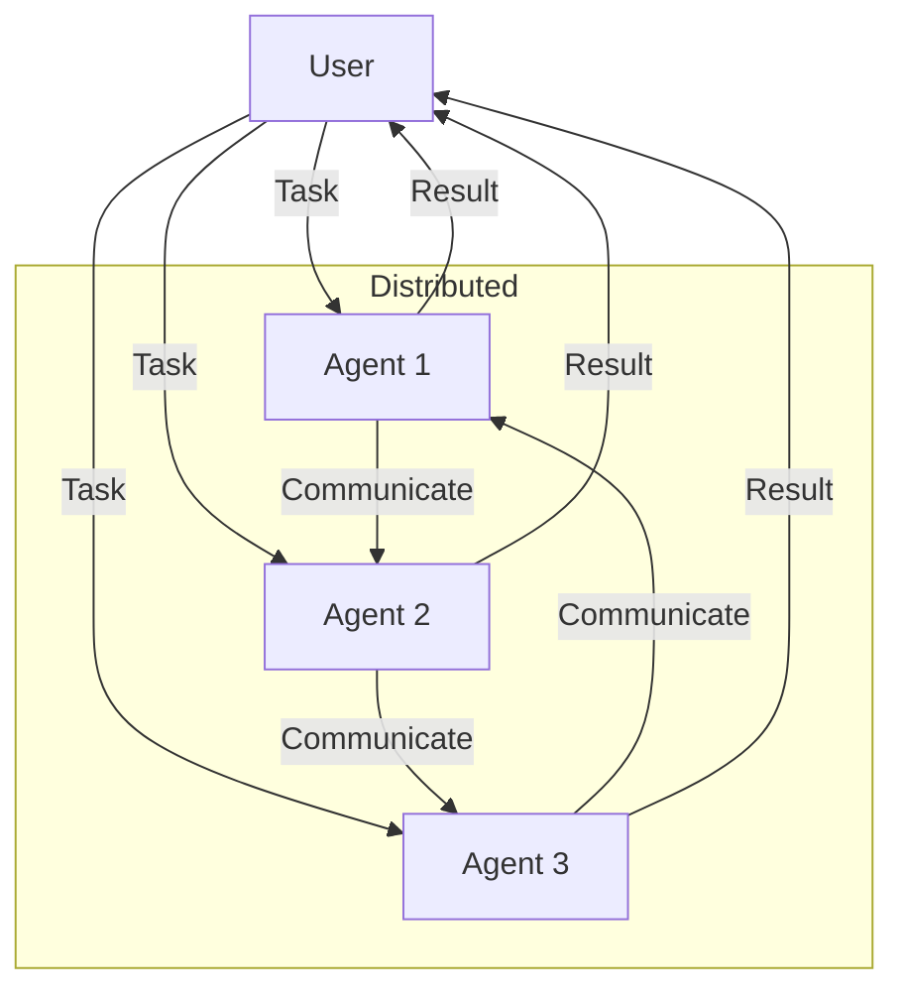

# Distributed Agent Pattern

## Description

The Distributed Agent Pattern involves multiple agents operating across different locations, systems, or nodes, collaborating to achieve shared or individual goals. These agents communicate over a network, coordinate actions, and may share or partition tasks. This pattern is foundational for scalable, robust, and fault-tolerant agentic systems in large or decentralized environments.

### Key Characteristics

- **Decentralization:** Agents are distributed across different nodes or systems.
- **Coordination:** Agents communicate and coordinate to achieve goals.
- **Scalability:** System can grow by adding more agents/nodes.
- **Fault Tolerance:** System can continue operating if some agents fail.

### Use Cases

- Multi-agent systems in cloud or edge computing
- Distributed problem solving
- Swarm robotics
- Decentralized data processing

### Advantages

- High scalability and robustness
- No single point of failure
- Can handle large, complex tasks

### Limitations

- Requires robust communication protocols
- Coordination overhead
- Potential for inconsistent state or conflicts

---

## Mermaid Diagram

