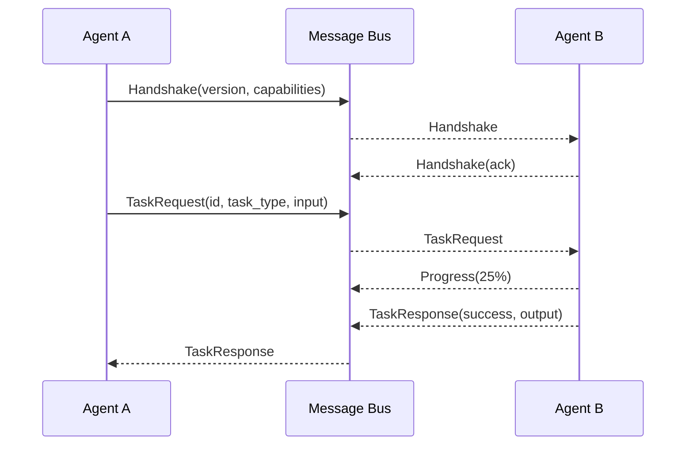

# A2A Sequence Diagram

```mermaid
sequenceDiagram
  participant A as Agent A
  participant BUS as Message Bus
  participant B as Agent B
  A->>BUS: Handshake(version, capabilities)
  BUS-->>B: Handshake
  B-->>BUS: Handshake(ack)
  A->>BUS: TaskRequest(id, task_type, input)
  BUS-->>B: TaskRequest
  B-->>BUS: Progress(25%)
  B-->>BUS: TaskResponse(success, output)
  BUS-->>A: TaskResponse
```
