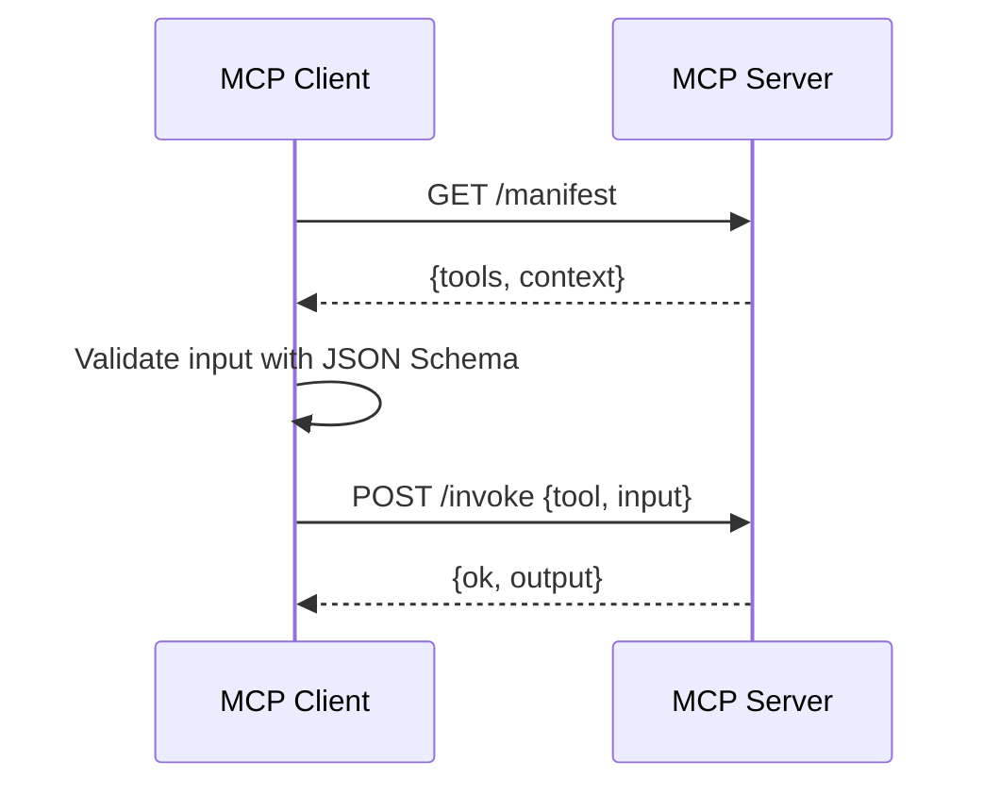

# MCP Context Exchange Pattern

A minimal Model Context Protocol showcasing discovery, validation, invocation, and result exchange.

## Sequence

## Notes

- Tools expose JSON Schemas for inputs.
- Client validates before invoking.
- No external web IO; Mistral can be used for planning text only if needed.
