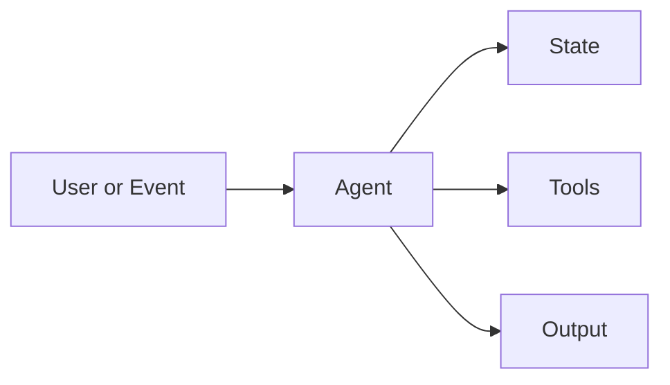
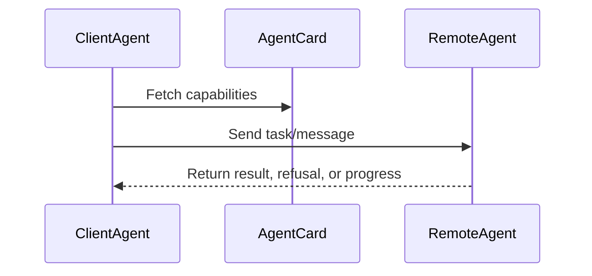
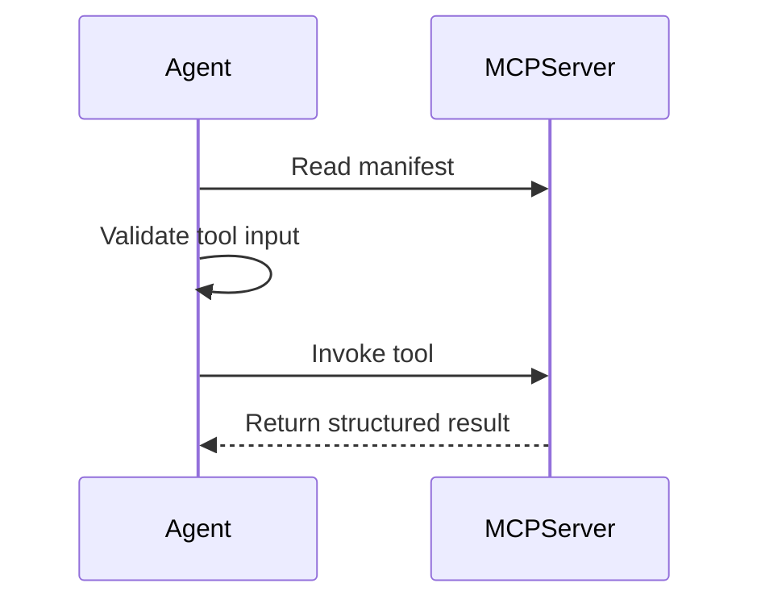

# Agentic Patterns Book Modernization Implementation Plan

> **For agentic workers:** REQUIRED SUB-SKILL: Use superpowers:subagent-driven-development (recommended) or superpowers:executing-plans to implement this plan task-by-task. Steps use checkbox (`- [ ]`) syntax for tracking.

**Goal:** Refactor the repository into a modern agentic patterns book/reference with deprecated archives, updated pattern chapters, Docusaurus publishing, GitHub Pages deployment, and a repo-local PDF release path.

**Architecture:** Keep runnable pattern examples at the repository root, but add `book/` as the publishable Docusaurus source. Move weak or obsolete pattern folders into `deprecated/`, then rebuild `Agentic_Patterns.md` and `book/docs/` as the active canonical catalog.

**Tech Stack:** Markdown, TypeScript, Python, npm scripts, Docusaurus, GitHub Actions, GitHub Pages, Mermaid diagrams, Creative Commons Attribution-ShareAlike 4.0 International (`CC-BY-SA-4.0`).

---

## File Structure

- `Agentic_Patterns.md`: canonical active/deprecated pattern index.
- `README.md`: repository entry point with book, site, PDF, and test instructions.
- `deprecated/`: archived pattern folders removed from the active learning path.
- `book/`: Docusaurus publishing app.
- `book/docs/`: book chapters generated from the modern catalog.
- `book/releases/`: checked-in release artifacts such as `Agentic-Systems-Patterns.pdf`.
- `.github/workflows/publish-book.yml`: GitHub Pages deployment workflow.
- `LICENSE`: repository license notice pointing to CC BY-SA 4.0.
- New pattern folders: active chapters for missing modern patterns.
- Existing protocol folders: deepen A2A and MCP rather than duplicate them.

## Task 1: Create Publishing Skeleton

**Files:**
- Create: `book/package.json`
- Create: `book/docusaurus.config.ts`
- Create: `book/sidebars.ts`
- Create: `book/docs/intro.md`
- Create: `book/releases/README.md`
- Create: `book/releases/.gitkeep`
- Create: `.github/workflows/publish-book.yml`
- Modify: `package.json`
- Modify: `README.md`
- Modify: `LICENSE`

- [ ] **Step 1: Add the Docusaurus package manifest**

Create `book/package.json`:

```json
{
  "name": "agentic-systems-patterns-book",
  "private": true,
  "type": "module",
  "scripts": {
    "start": "docusaurus start",
    "build": "docusaurus build",
    "serve": "docusaurus serve",
    "clear": "docusaurus clear"
  },
  "dependencies": {
    "@docusaurus/core": "^3.8.1",
    "@docusaurus/preset-classic": "^3.8.1",
    "clsx": "^2.1.1",
    "prism-react-renderer": "^2.4.1",
    "react": "^19.1.0",
    "react-dom": "^19.1.0"
  },
  "devDependencies": {
    "typescript": "^5.0.0"
  }
}
```

- [ ] **Step 2: Add Docusaurus config**

Create `book/docusaurus.config.ts`:

```ts
import type { Config } from '@docusaurus/types';
import type { Preset } from '@docusaurus/preset-classic';

const config: Config = {
  title: 'Agentic Systems Patterns',
  tagline: 'A practical reference for modern agent architecture',
  favicon: 'img/favicon.ico',
  url: 'https://giuseppe-coco.github.io',
  baseUrl: '/Agentic-Systems-Patterns/',
  organizationName: 'giuseppe-coco',
  projectName: 'Agentic-Systems-Patterns',
  onBrokenLinks: 'throw',
  onBrokenMarkdownLinks: 'warn',
  trailingSlash: false,
  presets: [
    [
      'classic',
      {
        docs: {
          sidebarPath: './sidebars.ts',
          routeBasePath: '/'
        },
        blog: false,
        theme: {
          customCss: './src/css/custom.css'
        }
      } satisfies Preset.Options
    ]
  ],
  themeConfig: {
    navbar: {
      title: 'Agentic Systems Patterns',
      items: [
        { type: 'docSidebar', sidebarId: 'bookSidebar', position: 'left', label: 'Book' },
        { href: 'https://github.com/giuseppe-coco/Agentic-Systems-Patterns', label: 'GitHub', position: 'right' }
      ]
    },
    prism: {
      additionalLanguages: ['python', 'typescript', 'bash', 'json']
    },
    footer: {
      style: 'dark',
      copyright:
        'Licensed under Creative Commons Attribution-ShareAlike 4.0 International (CC BY-SA 4.0).'
    }
  }
};

export default config;
```

- [ ] **Step 3: Add initial sidebar**

Create `book/sidebars.ts`:

```ts
import type { SidebarsConfig } from '@docusaurus/plugin-content-docs';

const sidebars: SidebarsConfig = {
  bookSidebar: [
    'intro',
    {
      type: 'category',
      label: 'Foundations',
      items: []
    },
    {
      type: 'category',
      label: 'Control Loops',
      items: []
    },
    {
      type: 'category',
      label: 'Memory and Knowledge',
      items: []
    },
    {
      type: 'category',
      label: 'Tools, Skills, and Protocols',
      items: []
    },
    {
      type: 'category',
      label: 'Multi-Agent Systems',
      items: []
    },
    {
      type: 'category',
      label: 'Production Runtime',
      items: []
    },
    {
      type: 'category',
      label: 'Deprecated',
      items: []
    }
  ]
};

export default sidebars;
```

- [ ] **Step 4: Add intro page**

Create `book/docs/intro.md`:

```md
---
title: Agentic Systems Patterns
slug: /
---

# Agentic Systems Patterns

This book is a practical reference for designing, testing, and operating agentic systems.

The catalog favors patterns that help engineers build real systems: control loops, goals, state, tools, skills, protocols, memory, multi-agent coordination, runtime observability, and evaluation.

Runnable examples live in the repository root. Each chapter links back to the relevant source folder when code is available.
```

- [ ] **Step 5: Add release artifact notes**

Create `book/releases/README.md`:

```md
# Book Releases

Generated offline artifacts live here.

- `Agentic-Systems-Patterns.pdf`: printable snapshot of the current book.

The PDF is checked into the repository for easy offline reading. It is licensed under Creative Commons Attribution-ShareAlike 4.0 International (`CC-BY-SA-4.0`). If it grows too large, move future PDFs to GitHub Releases and keep this file as the pointer.
```

Create an empty `book/releases/.gitkeep`.

- [ ] **Step 6: Add GitHub Pages workflow**

Create `.github/workflows/publish-book.yml`:

```yaml
name: Publish Book

on:
  push:
    branches:
      - main
  workflow_dispatch:

permissions:
  contents: read
  pages: write
  id-token: write

concurrency:
  group: pages
  cancel-in-progress: false

jobs:
  build:
    runs-on: ubuntu-latest
    steps:
      - uses: actions/checkout@v4
      - uses: actions/setup-node@v4
        with:
          node-version: 22
          cache: npm
          cache-dependency-path: |
            package-lock.json
            book/package-lock.json
      - run: npm ci
      - run: npm install
        working-directory: book
      - run: npm run build
        working-directory: book
      - uses: actions/configure-pages@v5
      - uses: actions/upload-pages-artifact@v3
        with:
          path: book/build
  deploy:
    environment:
      name: github-pages
      url: ${{ steps.deployment.outputs.page_url }}
    runs-on: ubuntu-latest
    needs: build
    steps:
      - id: deployment
        uses: actions/deploy-pages@v4
```

- [ ] **Step 7: Add root npm scripts**

Modify the root `package.json` scripts with:

```json
"book:install": "npm install --prefix book",
"book:start": "npm run start --prefix book",
"book:build": "npm run build --prefix book",
"book:serve": "npm run serve --prefix book"
```

- [ ] **Step 8: Set repository license metadata**

Replace `LICENSE` with:

```text
Creative Commons Attribution-ShareAlike 4.0 International

SPDX-License-Identifier: CC-BY-SA-4.0

Copyright (c) 2025-2026 Giuseppe Turitto

This work is licensed under the Creative Commons Attribution-ShareAlike 4.0
International License.

Canonical license URL:
https://creativecommons.org/licenses/by-sa/4.0/

You may share and adapt this work, including for commercial purposes, as long
as you provide attribution, indicate changes, and distribute adaptations under
the same license.
```

Add this field to root `package.json`:

```json
"license": "CC-BY-SA-4.0"
```

Add this section to `README.md`:

```md
## License

This book/reference and its examples are licensed under the [Creative Commons Attribution-ShareAlike 4.0 International License](https://creativecommons.org/licenses/by-sa/4.0/) (`CC-BY-SA-4.0`).
```

- [ ] **Step 9: Verify publishing skeleton**

Run:

```bash
npm run book:install
npm run book:build
```

Expected: Docusaurus builds `book/build` without broken links.

## Task 2: Archive Deprecated Patterns

**Files:**
- Create: `deprecated/README.md`
- Move: obsolete pattern folders into `deprecated/`
- Modify: `Agentic_Patterns.md`
- Modify: `book/docs/intro.md`

- [ ] **Step 1: Create archive README**

Create `deprecated/README.md`:

```md
# Deprecated Patterns

This folder preserves older patterns that no longer belong in the active catalog.

Deprecated does not mean useless. It means the pattern is speculative, too broad, duplicated by a stronger pattern, or better explained as part of another chapter.
```

- [ ] **Step 2: Move speculative or merged folders**

Move these folders into `deprecated/`:

```bash
mkdir -p deprecated
git mv agent-marketplace-pattern deprecated/agent-marketplace-pattern
git mv agent-swarm-pattern deprecated/agent-swarm-pattern
git mv hybrid-agent-pattern deprecated/hybrid-agent-pattern
git mv meta-cognitive-agent-pattern deprecated/meta-cognitive-agent-pattern
git mv recursive-agent-pattern deprecated/recursive-agent-pattern
git mv distributed-agent-pattern deprecated/distributed-agent-pattern
```

- [ ] **Step 3: Move placeholder-only applied examples**

Move these folders if they still contain only README and `.gitkeep` example placeholders:

```bash
git mv api-integration-copilot deprecated/api-integration-copilot
git mv data-pipeline-orchestrator-agent deprecated/data-pipeline-orchestrator-agent
git mv multi-modal-tool-using-agent deprecated/multi-modal-tool-using-agent
```

- [ ] **Step 4: Verify no root scripts point to moved folders**

Run:

```bash
rg -n "agent-marketplace-pattern|agent-swarm-pattern|hybrid-agent-pattern|meta-cognitive-agent-pattern|recursive-agent-pattern|distributed-agent-pattern|api-integration-copilot|data-pipeline-orchestrator-agent|multi-modal-tool-using-agent" package.json README.md Agentic_Patterns.md
```

Expected: matches only in deprecated sections or no matches in runnable npm scripts.

## Task 3: Add New Pattern Chapters

**Files:**
- Create pattern folder READMEs for new active chapters.
- Modify: `Agentic_Patterns.md`
- Modify: `book/sidebars.ts`
- Create: matching `book/docs/**.md` pages.

- [ ] **Step 1: Create modern pattern folders**

Create these folders:

```bash
mkdir -p agent-loop-pattern goals-and-state-pattern skills-pattern evaluator-optimizer-pattern durable-workflow-pattern observability-and-evals-pattern mastra-runtime-pattern crewai-flows-and-crews-pattern structured-output-pattern
```

- [ ] **Step 2: Add chapter template to each README**

Each new `README.md` should use this structure:

```md
# Pattern Name

## Intent

One paragraph explaining the design pressure this pattern solves.

## Use When

- Concrete condition 1
- Concrete condition 2
- Concrete condition 3

## Avoid When

- Concrete condition 1
- Concrete condition 2

## Architecture



## Implementation Notes

- State what the engineer must persist.
- State what must be deterministic.
- State where model calls are allowed.

## Failure Modes

- Failure mode 1
- Failure mode 2
- Failure mode 3

## Related Patterns

- Link to related active pattern.
```

- [ ] **Step 3: Add book pages for each new chapter**

For each new folder, create a corresponding page under `book/docs/` using the same content, with frontmatter:

```md
---
title: Pattern Name
---
```

- [ ] **Step 4: Update sidebar**

Update `book/sidebars.ts` so each category lists the new pages.

- [ ] **Step 5: Verify Markdown links**

Run:

```bash
npm run book:build
```

Expected: build succeeds with no broken links.

## Task 4: Deepen A2A and MCP Chapters

**Files:**
- Modify: `agent-to-agent-communication-pattern/README.md`
- Modify: `modern-tool-use-pattern/README.md`
- Create: `book/docs/tools-skills-protocols/a2a-agent-interoperability.md`
- Create: `book/docs/tools-skills-protocols/mcp-first-tool-use.md`

- [ ] **Step 1: Expand A2A README**

Add sections covering:

```md
## What A2A Adds

A2A makes agents discoverable and callable across process, team, and vendor boundaries. The important design artifact is the agent card: it tells other agents what this agent can do, where to call it, and what interaction modes it supports.

## Core Flow


```

- [ ] **Step 2: Expand MCP README**

Add sections covering:

```md
## What MCP Adds

MCP separates tool capability from agent logic. Agents discover tool manifests, validate inputs, call tools, and handle tool results through a consistent boundary.

## Core Flow


```

- [ ] **Step 3: Mirror content into book pages**

Create the two `book/docs/tools-skills-protocols/*.md` pages with frontmatter and links back to source folders.

- [ ] **Step 4: Run tests**

Run:

```bash
npm test
npm run book:build
```

Expected: both commands pass.

## Task 5: Add Framework Chapters

**Files:**
- Modify: `mastra-runtime-pattern/README.md`
- Modify: `crewai-flows-and-crews-pattern/README.md`
- Create: `book/docs/production-runtime/mastra-runtime.md`
- Create: `book/docs/multi-agent-systems/crewai-flows-and-crews.md`
- Modify: `package.json`

- [ ] **Step 1: Write Mastra runtime chapter**

Include:

```md
## Intent

Use Mastra when a TypeScript agent system needs a runtime with agents, workflows, tools, memory, evals, and observability as first-class concerns.

## Boundary

Mastra is a runtime pattern in this book, not a replacement for every pattern. Use it to host patterns such as tools, workflows, memory, evals, and tracing.
```

- [ ] **Step 2: Write CrewAI chapter**

Include:

```md
## Intent

Use CrewAI when Python agents need explicit workflow state and collaborative crews. Flows own state and execution order. Crews perform delegated work inside the flow.
```

- [ ] **Step 3: Add placeholder runnable scripts only if examples exist**

Do not add npm scripts for Mastra or CrewAI until runnable examples are added. The first pass should keep these as framework chapters.

- [ ] **Step 4: Verify no dead scripts**

Run:

```bash
npm run typecheck
npm test
```

Expected: both pass.

## Task 6: Update Canonical Index

**Files:**
- Rewrite: `Agentic_Patterns.md`
- Modify: `README.md`

- [ ] **Step 1: Rewrite active index by sections**

Replace the flat numbered list with sectioned headings:

```md
## Foundations
## Control Loops
## Memory and Knowledge
## Tools, Skills, and Protocols
## Multi-Agent Systems
## Production Runtime
## Deprecated / Historical Patterns
```

- [ ] **Step 2: Add deprecation reasons**

For each deprecated folder, add:

```md
- [Pattern Name](./deprecated/folder-name/README.md): Deprecated because ...
```

- [ ] **Step 3: Update root README publishing section**

Add:

```md
## Digital Publishing

- Source manuscript: `book/docs/`
- Local preview: `npm run book:start`
- Static build: `npm run book:build`
- GitHub Pages workflow: `.github/workflows/publish-book.yml`
- Offline PDF: `book/releases/Agentic-Systems-Patterns.pdf`
- License: `CC-BY-SA-4.0`
```

- [ ] **Step 4: Verify stale links**

Run:

```bash
rg -n "\\./(agent-marketplace-pattern|agent-swarm-pattern|hybrid-agent-pattern|meta-cognitive-agent-pattern|recursive-agent-pattern|distributed-agent-pattern)/" README.md Agentic_Patterns.md book/docs
```

Expected: no matches.

## Task 7: Final Verification

**Files:**
- All changed files.

- [ ] **Step 1: Run repository tests**

Run:

```bash
npm test
```

Expected: all existing test scripts pass.

- [ ] **Step 2: Run TypeScript typecheck**

Run:

```bash
npm run typecheck
```

Expected: TypeScript exits with code 0.

- [ ] **Step 3: Run dependency audit**

Run:

```bash
npm audit --omit=dev
```

Expected: `found 0 vulnerabilities`.

- [ ] **Step 4: Build the book**

Run:

```bash
npm run book:build
```

Expected: Docusaurus builds the static site into `book/build`.

- [ ] **Step 5: Verify license metadata**

Run:

```bash
rg -n "CC-BY-SA-4.0|creativecommons.org/licenses/by-sa/4.0" LICENSE README.md package.json docs/superpowers book 2>/dev/null
```

Expected: matches in license, README, package metadata, design/plan docs, and book files after the publishing skeleton exists.

- [ ] **Step 6: Confirm Git status**

Run:

```bash
git status --short
```

Expected: only intentional changes are listed.

## Self-Review

- Spec coverage: The tasks cover deprecation, new active chapters, A2A/MCP deepening, framework chapters, Docusaurus, GitHub Pages, and PDF release path.
- License coverage: The tasks cover `LICENSE`, package metadata, README, Docusaurus footer, and PDF release notes.
- Placeholder scan: The plan includes no `TBD` or unspecified implementation steps.
- Type consistency: npm scripts, Docusaurus paths, and book paths use consistent names.
