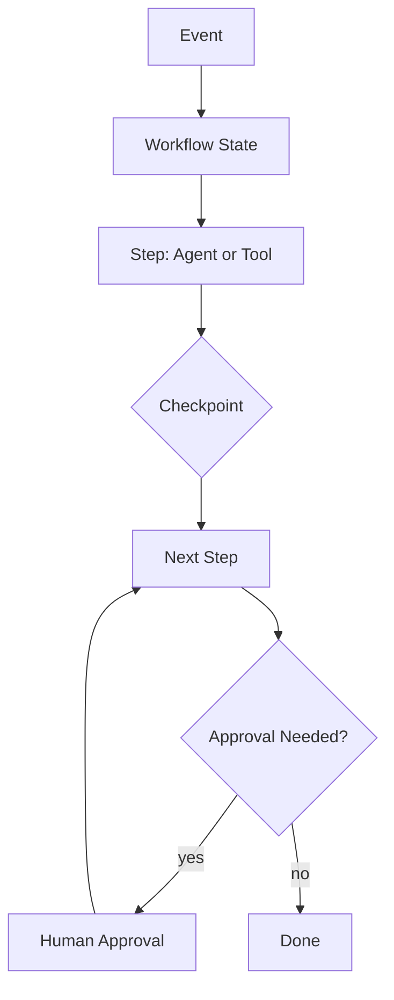

# Durable Workflow Pattern

## Intent

The Durable Workflow Pattern wraps agent steps in a resumable execution model. The workflow owns ordering, retries, persisted state, approvals, and compensation; agents perform bounded work inside workflow steps.

## Use When

- Work spans minutes, hours, or external approvals.
- Tool calls may fail and must be retried safely.
- You need auditability, resumability, and operational control.

## Avoid When

- The task is a short interactive chat response.
- State does not need to survive process restarts.
- The workflow engine would add more complexity than the task deserves.

## Architecture

## Implementation Notes

- Persist state after every externally visible action.
- Make steps idempotent or attach idempotency keys to tool calls.
- Separate orchestration state from model conversation state.
- Model calls should be retryable only when repeating them cannot duplicate side effects.

## Failure Modes

- Retrying side-effectful steps without idempotency.
- Losing human approval state after deployment or restart.
- Workflows that hide agent uncertainty behind a successful task status.
- No compensation path for partially completed external actions.

## Related Patterns

- [Goals and State](../goals-and-state-pattern/README.md)
- [Self-Healing Workflow](../self-healing-workflow-agent-pattern/README.md)
- [Human-in-the-Loop Approval](../human-in-the-loop-approval-agent/README.md)
