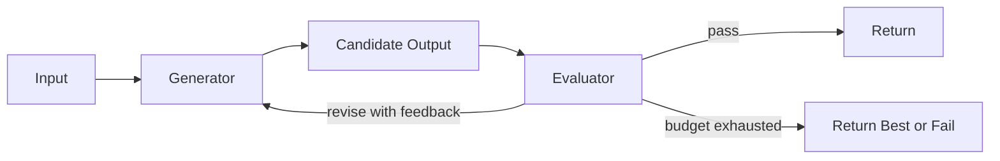

# Evaluator-Optimizer Pattern

## Intent

The Evaluator-Optimizer Pattern pairs a generator with an evaluator. The generator proposes work; the evaluator scores it against explicit criteria; the optimizer revises until the output passes or the budget ends.

## Use When

- Quality can be judged more reliably than it can be produced in one pass.
- You have explicit rubrics, tests, policies, or examples.
- Iterative improvement is worth the extra cost and latency.

## Avoid When

- The evaluator is just another vague opinion prompt.
- The task must respond with very low latency.
- You cannot define pass/fail or ranking criteria.

## Architecture

## Implementation Notes

- Separate generation prompts from evaluation prompts.
- Use deterministic tests when possible, then model-based critique for subjective gaps.
- Persist evaluator feedback so regressions can be analyzed.
- Define max revision count and a fallback behavior before running the loop.

## Failure Modes

- Evaluator drift: the evaluator rewards style over correctness.
- Generator overfits to the evaluator and hides flaws.
- Revision loops that make output longer but not better.
- No retained evidence for why a candidate passed.

## Related Patterns

- [Reflection and Self-Improvement](../reflection-and-self-improvement-pattern/README.md)
- [Observability and Evals](../observability-and-evals-pattern/README.md)
- [Agent Loop](../agent-loop-pattern/README.md)
