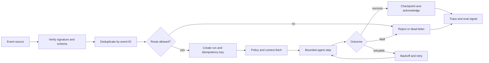
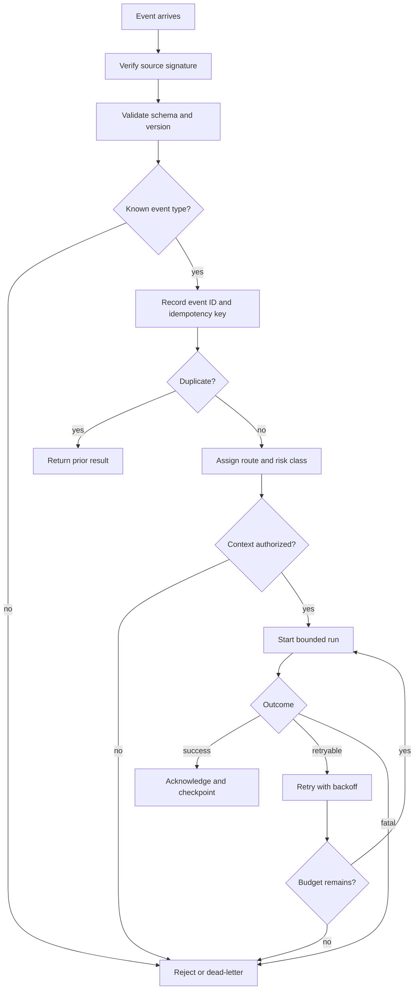

# Event-Triggered Agent Pattern

## Intent

Event-triggered agents run in response to webhooks, queues, schedules, or domain events.

Use this pattern when the system must react to work that arrives without a live user watching the screen. The event runtime, not the model, owns admission, deduplication, idempotency, retries, dead letters, replay, and storm controls.

## Scenario

A support platform emits `refund.requested` when a customer opens a refund case. The agent should inspect policy, summarize the order history, draft a recommendation, and notify a reviewer. It must not process the same refund twice if the queue redelivers the event. It must not act on a stale or unauthorized event. It must stop safely if the policy source is unavailable.

This is the difference between an event-triggered agent and a chat agent. The agent may run at 03:00 with no user present. The runtime must decide whether to accept, delay, reject, retry, or dead-letter the event before the model proposes anything.

## Use When

- A domain event, webhook, queue message, schedule, or file arrival should start bounded agent work.
- The task can be described as one event type mapped to one task class.
- Duplicate delivery, retries, and late events can be handled safely.
- The event can carry or fetch enough authorized context.
- The system can trace event ID, run ID, idempotency key, policy decision, tool calls, and stop reason.

## Avoid When

- The event payload lacks enough identity, tenant, resource, or version data to act safely.
- Duplicate delivery could repeat irreversible side effects.
- Ordering requirements are unclear.
- Failures cannot be retried, compensated, or dead-lettered.
- A human must inspect context before the first action.

## Architecture

Read this as an unattended runtime boundary. Event identity, idempotency, policy, checkpoints, retries, dead letters, and replay evidence protect every side effect.

## Decision Rules

| Question | Required Answer | Failure If Missing |
| --- | --- | --- |
| What event type starts the work? | Stable event name and version. | One route handles incompatible payloads. |
| What resource is affected? | Resource ID, tenant, actor, and correlation ID. | Cross-tenant or wrong-resource action. |
| What makes the event unique? | Event ID plus source, tenant, or resource scope. | Duplicate delivery repeats work. |
| What ordering matters? | None, per resource, per tenant, or global. | Late events overwrite newer state. |
| What side effects can happen? | Read, draft, notify, write, or execute. | Retry duplicates irreversible actions. |
| What is retryable? | Error classes, max attempts, backoff, and dead-letter rule. | The system either drops work or retries forever. |
| Who reviews failures? | Dead-letter owner and review cadence. | Broken events become invisible backlog. |

### Event Admission Flow

## System Shape

- **Pattern boundary:** a production service or framework hosts the agent behind durable workflow, policy, observability, and deployment boundaries.
- **State owner:** the runtime owns event receipt, deduplication, run state, retries, dead letters, replay, traces, deployment configuration, and operational controls.
- **Primary artifact:** `event-triggered-agent-pattern/` documents the reviewable event-to-agent boundary and runtime controls.
- **Operational promise:** one accepted event creates at most one authorized, traceable run for the affected resource.

## Contract

An event-triggered agent needs an event envelope before it needs a prompt.

| Field | Purpose |
| --- | --- |
| `eventId` | Deduplication and replay identity. |
| `eventType` | Routes the event to one bounded task class. |
| `eventVersion` | Protects incompatible payload changes. |
| `source` | Names webhook, queue, schedule, or service origin. |
| `actorId` | Records who or what caused the event when known. |
| `tenantId` | Enforces tenant boundary before retrieval or tools. |
| `resourceId` | Identifies the order, ticket, account, file, or record being affected. |
| `occurredAt` and `receivedAt` | Supports late-event and ordering decisions. |
| `correlationId` | Connects upstream request, event, run, tools, and traces. |
| `idempotencyKey` | Prevents duplicate side effects across retries. |
| `payload` | Carries validated task data, not trusted instructions. |

## Core Protocol

1. Verify event source, schema, version, identity, tenant, and resource scope.
2. Record event ID, correlation ID, and idempotency key before side effects.
3. Route the event to one bounded task class with a risk level and policy context.
4. Fetch required context through authorized tools instead of trusting payload text.
5. Execute one bounded agent or workflow step.
6. Checkpoint result, trace data, cost, and error state.
7. Acknowledge, retry, compensate, continue, refuse, escalate, or dead-letter according to runtime policy.

## Implementation Notes

- Treat event payloads as untrusted input. A webhook body can describe a task, but it should not override policy, route, tools, or memory rules.
- Record the idempotency key before calling a write-capable tool.
- Define ordering per resource. Most systems need per-ticket, per-order, or per-account ordering, not global ordering.
- Use optimistic version checks or locks when two events can affect the same resource.
- Keep retry budgets separate for model calls, retrieval, tools, and whole-event reprocessing.
- Add a dead-letter review loop. A dead letter that no one reviews is silent data loss.
- Make replay version-aware. Replaying an old event against a new policy, prompt, or tool version should be explicit.

## Failure Modes

- Duplicate side effect: redelivery repeats a refund, email, ticket update, or infrastructure change.
- Event storm: one upstream bug floods the agent and burns model/tool budget.
- Poison event: malformed or hostile payload text reaches model context as instruction.
- Late event overwrite: an old event updates state after a newer decision.
- Context gap: the event lacks identity, tenant, resource, or authorization context.
- Retry loop: an unrecoverable error is treated as retryable.
- Dead-letter neglect: failed events pile up without owner, alert, or replay path.
- Replay drift: a replayed event uses a different policy or prompt without recording the version change.

## Review Checklist

Before production, check:

- Event type, version, source, actor, tenant, resource, and correlation ID are recorded.
- Unsupported event versions fail safely.
- Duplicate delivery returns a prior result or resumes the same run.
- Idempotency key is recorded before external writes.
- Ordering and concurrency rules are explicit.
- Retryable and fatal errors are classified.
- Dead-letter queue has an owner, alert, review cadence, and replay procedure.
- Event storm controls can pause, shed, sample, or route to deterministic fallback.
- Trace links event ID, run ID, policy decision, tool calls, and stop reason.

## Evaluation Strategy

- Test valid event, duplicate event, missing identity, unauthorized tenant, unsupported version, late event, and out-of-order event.
- Test retryable tool outage, fatal schema error, dead-letter replay, and model timeout.
- Test event storms with per-tenant and per-route concurrency limits.
- Test prompt injection embedded in payload text.
- Test idempotency by replaying the same event after a partial write.
- Measure accepted rate, duplicate rate, retry rate, dead-letter rate, processing latency, queue depth, model/tool spend, and replay success.

## Production Checklist

- Event contracts are versioned and reviewed before release.
- Webhooks verify signatures; queues verify source and permissions.
- The runtime stores event ID, run ID, idempotency key, route, risk class, and policy version.
- Side effects are idempotent, compensatable, or approval-gated.
- Retry budgets and backoff are documented per error class.
- Dead-letter replay requires owner approval and version awareness.
- Queue depth, retry rate, dead-letter count, latency, and spend have alerts.
- Operators can pause a route, drain a queue, replay one event, and disable write tools.

Use the online book's event-triggered agent review checklist before a production pilot.

## Run

This pattern currently has documentation and architecture assets. Add a runnable implementation only after the event contract, idempotency policy, and replay rules are clear.
