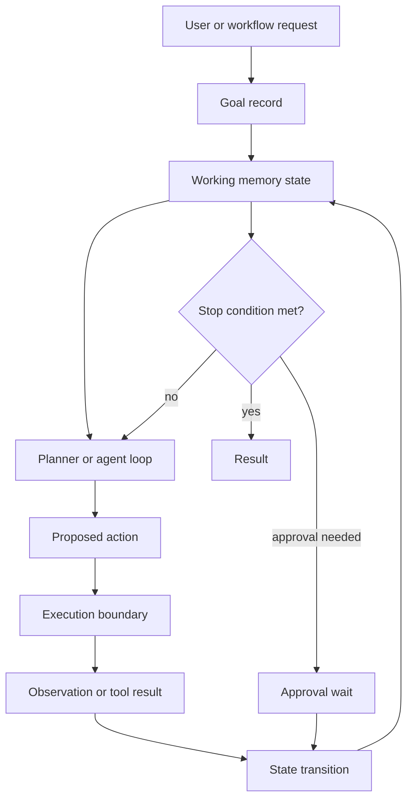

# Goals and State Pattern

## Intent

The Goals and State Pattern separates what the agent is trying to achieve from the mutable state it accumulates while working. Goals define success. State records progress, constraints, evidence, pending work, approvals, budget, and stop reasons.

This is the practical core of working memory. Working memory is not long-term memory. It is run-scoped operational state. It should be compact, typed, inspectable, and disposable unless another policy explicitly promotes part of it into durable memory.

The model can propose a next step, a state update, or a stop reason. The runtime owns the state transition. That boundary keeps the agent from silently rewriting what has happened, what remains, or why it is allowed to continue.

## Use When

- A task spans multiple turns, tools, agents, retries, approvals, or workflow steps.
- You need resumable execution after failure, interruption, timeout, or human approval.
- The agent must explain progress against an explicit objective.
- You need a compact working set instead of raw chat history.
- Evaluation depends on trajectory, not only the final answer.

## Avoid When

- The task is stateless and can be answered in one call.
- The goal cannot be expressed as observable success criteria.
- State would contain sensitive data you cannot store safely.
- The system would use state as an unstructured scratchpad with no owner.
- The runtime cannot replay or inspect state transitions.

## Architecture



## System Shape

- **Pattern boundary:** the state boundary owns the goal, working state, event log, transition rules, stop reason, and replay record.
- **State owner:** the runtime, workflow engine, or application service owns state; the model owns only proposed updates.
- **Model role:** the model may summarize progress, identify gaps, and propose updates, but it should not be the source of truth for state.
- **Policy boundary:** state changes that affect permissions, approvals, memory promotion, or side effects pass through runtime checks.
- **Operational promise:** the system can explain what it is doing, what changed, what evidence caused the change, and why it stopped or continued.

## Core Protocol

1. Create a goal record with success criteria, constraints, owner, risk class, and stop conditions.
2. Initialize working memory with the minimum state needed to start.
3. Execute one bounded step through a planner, model call, tool, worker, evaluator, or approval gate.
4. Convert observations into typed state events.
5. Apply state transitions idempotently.
6. Recompute open questions, pending work, budget state, approval state, and stop reason.
7. Continue, retry, ask for approval, escalate, or stop according to explicit rules.
8. Persist enough state and event history to replay or audit the run.

## Implementation Notes

State should be smaller than the transcript and more structured than a summary. It is the operating model for the current run.

### Goal Record

```ts
type AgentGoal = {
  goalId: string;
  runId: string;
  owner: string;
  description: string;
  successCriteria: string[];
  constraints: string[];
  riskClass: "low" | "medium" | "high" | "critical";
  status: "active" | "blocked" | "waiting_for_approval" | "completed" | "cancelled" | "failed";
  createdAt: string;
  updatedAt: string;
};
```

### Working Memory State

```ts
type WorkingMemoryState = {
  runId: string;
  goalId: string;
  currentStep?: string;
  completedSteps: string[];
  pendingSteps: string[];
  openQuestions: string[];
  constraints: string[];
  evidenceRefs: string[];
  toolResultRefs: string[];
  approvalRefs: string[];
  budgetState: {
    iterationCount: number;
    tokenEstimate: number;
    costCents: number;
    deadlineAt?: string;
  };
  stopReason?: "success" | "blocked" | "approval_required" | "budget_exhausted" | "cancelled" | "failed";
  version: number;
};
```

### State Events

State should change through events, not hidden mutation.

```ts
type StateEvent =
  | { type: "goal_created"; goal: AgentGoal }
  | { type: "step_started"; stepId: string; description: string }
  | { type: "tool_result_recorded"; toolCallId: string; evidenceRef: string }
  | { type: "approval_recorded"; approvalId: string; decision: "approved" | "denied" | "expired" }
  | { type: "question_opened"; question: string }
  | { type: "question_answered"; question: string; evidenceRef: string }
  | { type: "blocked"; reason: string }
  | { type: "completed"; resultRef: string }
  | { type: "cancelled"; reason: string };

function applyStateEvent(state: WorkingMemoryState, event: StateEvent): WorkingMemoryState {
  switch (event.type) {
    case "step_started":
      return { ...state, currentStep: event.stepId, version: state.version + 1 };
    case "tool_result_recorded":
      return {
        ...state,
        evidenceRefs: [...state.evidenceRefs, event.evidenceRef],
        toolResultRefs: [...state.toolResultRefs, event.toolCallId],
        version: state.version + 1,
      };
    case "approval_recorded":
      return {
        ...state,
        approvalRefs: [...state.approvalRefs, event.approvalId],
        stopReason: event.decision === "approved" ? undefined : "blocked",
        version: state.version + 1,
      };
    case "completed":
      return { ...state, stopReason: "success", version: state.version + 1 };
    case "cancelled":
      return { ...state, stopReason: "cancelled", version: state.version + 1 };
    default:
      return { ...state, version: state.version + 1 };
  }
}
```

This is intentionally simple. The important part is the rule: state transitions are explicit, typed, replayable, and tied to observations.

### Promotion Rules

Working memory should not automatically become durable memory. A completed step, tool result, or user correction may be a candidate for long-term memory, but promotion needs a separate policy decision.

Before promoting working memory, ask:

- Is this useful beyond the current run?
- Is the source trustworthy and referenced?
- Does the user or tenant allow it to be stored?
- Is there sensitive data that needs redaction or expiry?
- Is this an event, a fact, a preference, or a policy reference?
- Is there a correction and deletion path?

If the answer is unclear, keep it in the run trace and do not promote it.

## Failure Modes

- The state becomes a transcript dump.
- The model silently rewrites state without an event.
- The goal describes activity, not success.
- Subgoals drift away from the parent goal.
- Tool results are summarized without evidence references.
- Approval, cancellation, or budget state is lost after retry.
- The system cannot resume because state only lived in model context.
- Stale state overrides fresh tool results.
- Sensitive state is persisted without retention or redaction rules.
- Working memory is automatically promoted to long-term memory.

## Evaluation Strategy

Working-memory evals should inspect the trajectory, not only the final answer.

- Test that a multi-step task creates a goal with observable success criteria.
- Test that each tool result becomes a state event with an evidence reference.
- Test retry and verify idempotent state transitions.
- Test resume after interruption.
- Test cancellation and verify the run does not continue.
- Test approval waits and verify approval state survives resume.
- Test budget exhaustion and verify the stop reason is recorded.
- Test stale tool results and verify fresh evidence wins.
- Test blocked runs and verify open questions are preserved.
- Test that working memory is not promoted to durable memory without policy.

Measure state completeness, transition validity, replay success, resume success, stale-state rate, lost-approval rate, stop-reason accuracy, and promotion-policy accuracy.

## Production Checklist

- Define goal schema, state schema, event schema, and stop reasons.
- Keep working memory compact and typed.
- Store state separately from chat history.
- Make state updates event-based, idempotent, and replayable.
- Attach evidence references to tool results, decisions, approvals, and final answers.
- Persist approval, cancellation, budget, retry, and blocked state.
- Treat state promotion to durable memory as a separate policy decision.
- Redact or avoid sensitive data in working memory when possible.
- Trace state reads, writes, transitions, retries, resumes, and stop reasons.
- Convert lost-state and wrong-stop incidents into regression evals.

## Related Patterns

- [Agent Loop](../agent-loop-pattern/README.md)
- [Planning Pattern](../planning-pattern/README.md)
- [Durable Workflow](../durable-workflow-pattern/README.md)
- [Memory-Augmented Agent](../memory-augmented-agent-pattern/README.md)
- [Long-Term Episodic Memory](../long-term-episodic-memory-agent-pattern/README.md)
- [Human Approval Gates](../human-in-the-loop-approval-agent/README.md)
