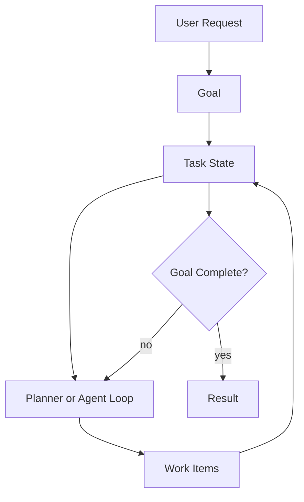

# Goals and State Pattern

## Intent

The Goals and State Pattern separates what the agent is trying to achieve from the mutable state it accumulates while working. Goals define success; state records progress, constraints, evidence, and pending work.

## Use When

- A task spans multiple turns, tools, or agents.
- You need resumable execution after failure or interruption.
- The agent must explain progress against an explicit objective.

## Avoid When

- The task is stateless and can be answered in one call.
- The goal cannot be expressed as observable success criteria.
- State would contain sensitive data you cannot store safely.

## Architecture

## Implementation Notes

- Store goals as structured records with `id`, `description`, `success_criteria`, `constraints`, `owner`, and `status`.
- Store state separately from chat history. Chat is evidence; state is the operational model.
- Update state through typed events such as `step_started`, `tool_result`, `blocked`, `approved`, and `completed`.
- Make state transitions auditable and idempotent so a workflow can retry safely.

## Failure Modes

- Goals that describe activity rather than success.
- State that becomes a transcript dump instead of a compact task model.
- Agents optimizing for local subgoals that no longer serve the parent goal.
- Lost cancellation or approval state after retries.

## Related Patterns

- [Agent Loop](../agent-loop-pattern/README.md)
- [Planning Pattern](../planning-pattern/README.md)
- [Durable Workflow](../durable-workflow-pattern/README.md)
