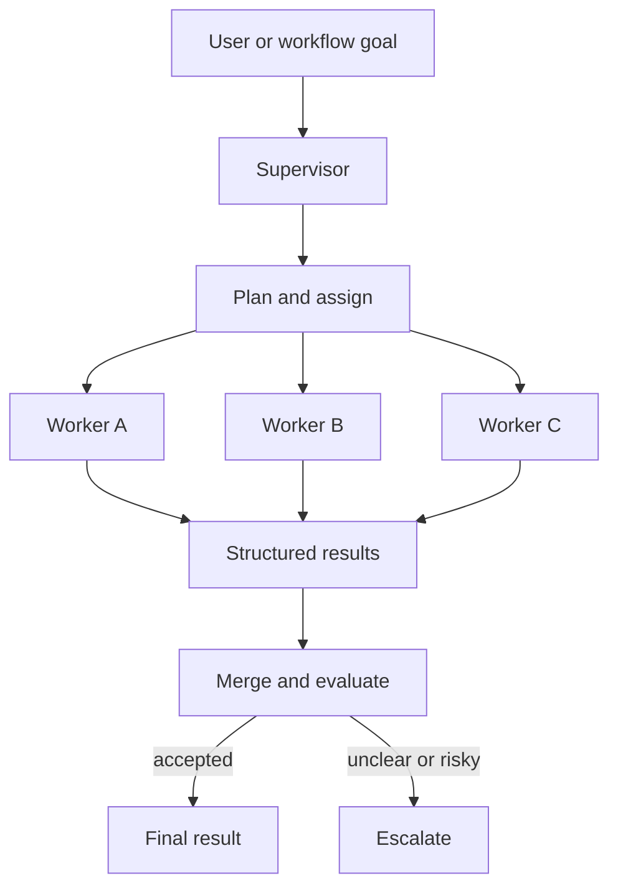

# Supervisor / Worker Pattern

## Intent

Supervisor / Worker is a multi-agent pattern where one coordinator owns the goal, decomposition, worker contracts, merge policy, quality gate, and final accountability. Workers perform bounded specialist tasks and return structured results with evidence, errors, and confidence.

The supervisor is not just a manager-shaped prompt. It is the control point that prevents multi-agent work from becoming a group chat with no owner. It decides what work should be split, what context each worker receives, which tools each worker may use, how results are merged, and when the system must escalate.

## Use When

- The task benefits from separate specialist workstreams.
- Workers can operate with scoped context, scoped tools, and clear outputs.
- The supervisor can evaluate, merge, or reject worker results.
- Parallelism, specialization, or independent review buys more than the extra coordination cost.
- One component can own final acceptance and user-facing accountability.

## Avoid When

- A single agent or deterministic workflow can solve the task clearly.
- Workers would all receive the same context and tool list.
- The supervisor cannot judge whether worker output is correct.
- The merge step is vague or purely stylistic.
- Worker actions can create side effects without supervisor policy or approval.
- Nobody owns the final answer when workers disagree.

## Architecture



## System Shape

- **Pattern boundary:** the supervisor owns the shared goal, decomposition, assignments, merge policy, quality checks, escalation, and final acceptance.
- **Worker boundary:** each worker receives a narrow task, scoped context, allowed tools, expected output schema, timeout, and acceptance criteria.
- **State owner:** the supervisor or workflow engine owns shared state. Workers own only task-local scratch state unless explicitly granted more.
- **Policy boundary:** worker tool use and side effects are constrained by the assignment, not by general worker ability.
- **Operational promise:** the system gets useful specialization without losing one accountable owner for the final result.

## Core Protocol

1. Receive the shared goal, caller, constraints, budget, and trace ID.
2. Decide whether the task should be split or handled by a simpler baseline.
3. Create worker assignments with scoped context, allowed tools, expected outputs, timeout, and acceptance criteria.
4. Dispatch assignments and record per-worker trace IDs.
5. Collect worker results, refusals, errors, timeouts, and evidence.
6. Evaluate each worker result before merging.
7. Merge accepted results using an explicit merge policy.
8. Return, retry, reassign, or escalate with one final owner.

## Implementation Notes

The handoff from supervisor to worker should be a contract, not a paragraph of instructions.

```ts
type WorkerAssignment = {
  taskId: string;
  parentTraceId: string;
  workerRole: 'policy_reviewer' | 'order_investigator' | 'customer_message_drafter';
  objective: string;
  scopedContextRefs: string[];
  allowedTools: string[];
  forbiddenTools: string[];
  timeoutMs: number;
  expectedOutput: {
    schema: 'policy_findings.v1' | 'order_findings.v1' | 'message_draft.v1';
    requiredFields: string[];
  };
  acceptanceCriteria: string[];
};
```

The worker result should be equally structured:

```ts
type WorkerResult = {
  taskId: string;
  workerRole: string;
  status: 'succeeded' | 'refused' | 'needs_human' | 'failed' | 'timed_out';
  output?: unknown;
  evidenceRefs: string[];
  confidence: 'low' | 'medium' | 'high';
  errors: string[];
  traceId: string;
};
```

A small merge gate keeps the supervisor honest:

```ts
function acceptWorkerResult(result: WorkerResult) {
  if (result.status !== 'succeeded') return false;
  if (result.evidenceRefs.length === 0) return false;
  if (result.confidence === 'low') return false;
  return true;
}
```

The supervisor should not rubber-stamp worker output. It should check evidence, schema, confidence, disagreement, and policy before final synthesis.

## Failure Modes

- The supervisor decomposes work that did not need to be split.
- Workers all receive the full context, removing the benefit of isolation.
- Workers share broad tool access, multiplying the blast radius.
- Assignments do not specify expected output, so merge becomes guesswork.
- Workers duplicate work because boundaries are unclear.
- Worker disagreement is hidden inside a smooth final answer.
- The supervisor accepts output without checking evidence or policy.
- A failed or timed-out worker silently disappears from the final answer.
- No trace connects the final result back to worker inputs, outputs, and decisions.
- Nobody owns final accountability after the supervisor has merged results.

## Evaluation Strategy

Supervisor / Worker evals should prove that the topology is better than the simpler baseline and that the coordination boundary works.

- Compare against a single-agent baseline on the same tasks.
- Test a case where the system should choose not to split the task.
- Test worker timeout, worker refusal, worker failure, and malformed worker output.
- Test disagreement between workers and require visible resolution.
- Test context isolation: each worker should receive only what it needs.
- Test permission isolation: workers should not call tools outside their assignment.
- Test merge accuracy: the final result should preserve evidence and not invent consensus.
- Test final accountability: the supervisor must return one status, one owner, and one stop reason.

A compact eval fixture can make those expectations explicit:

```json
{
  "case_id": "refund_policy_and_order_disagree",
  "goal": "Recommend whether a refund request should be approved.",
  "workers": {
    "policy_reviewer": { "status": "succeeded", "confidence": "high" },
    "order_investigator": { "status": "succeeded", "confidence": "medium" },
    "customer_message_drafter": { "status": "blocked_until_decision" }
  },
  "expected": {
    "final_status": "needs_human",
    "must_explain_disagreement": true,
    "forbidden_worker_tools": ["refunds.issue_refund", "support.send_customer_email"],
    "required_trace_events": ["assignment", "worker_result", "merge_decision", "stop"]
  }
}
```

Measure quality lift over baseline, latency cost, token cost, worker failure handling, merge accuracy, disagreement handling, permission isolation, context isolation, and trace completeness.

## Production Checklist

- Keep one owner for the final answer.
- Require a typed worker assignment for every worker call.
- Scope context and tools per worker.
- Give each worker a timeout, cancellation rule, and refusal path.
- Record assignment, worker input, worker output, merge decision, and stop reason.
- Make disagreement visible instead of smoothing it away.
- Define when the supervisor retries, reassigns, escalates, or stops.
- Compare quality and cost against a simpler single-agent baseline.
- Keep worker prompts, tool manifests, and output schemas versioned.
- Add circuit breakers for failing workers or unsafe tool proposals.

## Related Patterns

- [Task Delegation](/multi-agent-systems/task-delegation)
- [Parallel Agents](/multi-agent-systems/parallel-agents)
- [Debate and Consensus](/multi-agent-systems/debate-and-consensus)
- [Agent Loop](/foundations/agent-loop)
- [Tool Use](/foundations/tool-use)
- [Pattern Evaluation Checklist](/pattern-selection/pattern-evaluation-checklist)
