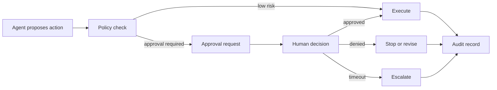

# Human Approval Gates Pattern

## Intent

Human approval gates pause an agentic workflow before a sensitive, expensive, destructive, or externally visible action is executed. The gate is not "ask a human in chat." It is a controlled workflow pause with the proposed action, risk, evidence, policy, approver identity, timeout, decision, and audit record.

Approval is an architecture boundary. The model can propose an action. Software decides whether that action needs approval, packages the approval request, waits durably, records the decision, and resumes or stops the workflow.

## Use When

- The agent may trigger financial, legal, security, data-access, or customer-visible side effects.
- A human must review evidence before the workflow continues.
- The workflow can pause, persist state, and resume safely.
- Approval decisions need an audit trail.
- Policy can define which actions require approval and which can proceed automatically.

## Avoid When

- Every step requires approval and the agent no longer reduces work.
- The approver cannot see enough evidence to make a decision.
- Approval happens in an untracked chat message or side channel.
- The workflow cannot safely resume after waiting.
- The system cannot prevent retries from reusing stale approvals.

## Architecture



## System Shape

- **Pattern boundary:** the approval gate owns the pause, request, decision, timeout, resume token, and audit record.
- **State owner:** the workflow engine or runtime owns durable state while waiting for approval.
- **Model role:** the model explains the proposed action and supporting evidence, but it does not approve its own action.
- **Policy boundary:** software decides whether approval is required before the action runs.
- **Operational promise:** high-risk actions do not execute only because the model asked for them.

## Core Protocol

1. Receive a model-proposed action with caller, trace ID, risk, evidence, and side effects.
2. Run policy to decide whether the action is allowed, denied, or approval-required.
3. If approval is required, create a durable approval request.
4. Present the approver with the proposed action, evidence, policy reason, risk, and consequences.
5. Wait for approve, deny, request-changes, escalation, timeout, or cancellation.
6. Record who decided, when, why, and under which policy version.
7. Resume only the exact approved action, or stop/revise when denied.
8. Store the decision with the trace and action audit log.

## Implementation Notes

Approval requests should be typed. The approver should not have to infer the side effect from vague prose.

```ts
type ApprovalRequest = {
  approvalId: string;
  actionId: string;
  traceId: string;
  requestedBy: 'agent' | 'workflow' | 'operator';
  proposedAction: {
    tool: string;
    args: Record<string, unknown>;
    sideEffects: string[];
  };
  riskLevel: 'low' | 'medium' | 'high' | 'critical';
  evidenceRefs: string[];
  policyRefs: string[];
  approverRole: 'support_lead' | 'security_reviewer' | 'finance_approver';
  expiresAt: string;
  idempotencyKey: string;
};
```

The decision record is just as important as the request:

```ts
type ApprovalDecision = {
  approvalId: string;
  decision: 'approved' | 'denied' | 'changes_requested' | 'expired';
  decidedBy: string;
  decidedAt: string;
  reason: string;
  approvedActionId?: string;
  policyVersion: string;
  traceId: string;
};
```

Never treat approval as blanket permission. Bind it to the exact action:

```ts
function canResumeWithApproval(request: ApprovalRequest, decision: ApprovalDecision, actionId: string) {
  if (decision.decision !== 'approved') return false;
  if (decision.approvalId !== request.approvalId) return false;
  if (decision.approvedActionId !== actionId) return false;
  if (new Date(request.expiresAt).getTime() < Date.now()) return false;
  return true;
}
```

The approval approves one action, under one policy version, with one trace. If the agent changes the action, the workflow needs a new approval.

## Failure Modes

- Approval request lacks evidence, so the human rubber-stamps or guesses.
- Approval text hides the actual side effect.
- The system asks for approval after the tool already executed.
- A retry reuses approval for a different action.
- Approval expires but the workflow resumes anyway.
- Approver identity and reason are not recorded.
- Approval fatigue causes humans to approve everything.
- Denied approvals are converted into softer prompts and retried until they pass.
- The audit trail records the final answer but not the proposed action and decision.

## Evaluation Strategy

Approval evals should prove that risky actions pause and safe actions do not create unnecessary friction.

- Test high-risk actions that must require approval.
- Test low-risk read-only actions that should not require approval.
- Test denied approval and verify the side effect does not execute.
- Test expired approval and verify the workflow does not resume.
- Test changed action after approval and require a new approval.
- Test missing evidence and require `changes_requested` or escalation.
- Test retry behavior with idempotency keys.
- Test audit completeness: request, decision, approver, policy version, and trace ID.

A compact eval fixture can make the approval boundary explicit:

```json
{
  "case_id": "refund_requires_finance_approval",
  "proposed_action": {
    "tool": "refunds.issue_refund",
    "amount_cents": 12500
  },
  "expected": {
    "requires_approval": true,
    "approver_role": "finance_approver",
    "must_include_evidence": ["order", "payment", "refund_policy"],
    "must_not_execute_before_approval": true,
    "required_audit_fields": ["approval_id", "decided_by", "policy_version", "trace_id"]
  }
}
```

Measure approval routing accuracy, unnecessary approval rate, denied-action execution rate, stale-approval reuse, approval latency, audit completeness, and human override rate.

## Production Checklist

- Define which actions require approval by policy, not prompt wording.
- Include proposed action, side effects, evidence, policy reason, and risk in every request.
- Persist workflow state while waiting.
- Bind approval to an exact action ID and idempotency key.
- Set expiration, timeout, cancellation, and escalation behavior.
- Record approver identity, decision, reason, policy version, and trace ID.
- Prevent denied or expired approvals from being retried silently.
- Track approval volume and approval fatigue.
- Keep approval policies, request schemas, and decision records versioned.
- Convert serious approval misses into regression evals.

## Related Patterns

- [Tool Capability Design](/tools-skills-protocols/tool-capability-design)
- [MCP-first Tool Use](/tools-skills-protocols/mcp-first-tool-use)
- [Policy Enforcement](/production-runtime/policy-enforcement)
- [Durable Workflows](/production-runtime/durable-workflows)
- [Agent Threat Model](/agent-engineering-practice/agent-threat-model)
- [Pattern Evaluation Checklist](/pattern-selection/pattern-evaluation-checklist)
