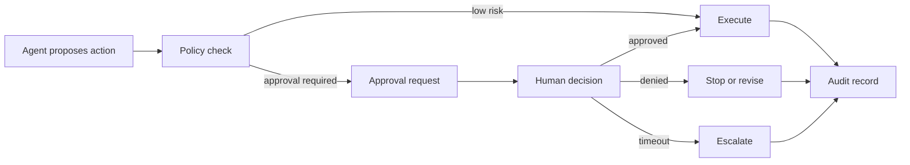

# Human Approval Gates Pattern

## Intent

Human approval gates pause an agentic workflow before a sensitive, expensive, destructive, or externally visible action is executed. The gate is not "ask a human in chat." It is a controlled workflow pause with the proposed action, risk, evidence, policy, approver identity, timeout, decision, and audit record.

Approval is an architecture boundary. The model can propose an action. Software decides whether that action needs approval, packages the approval request, waits durably, records the decision, and resumes or stops the workflow.

The important detail is that approval does not make an agent safe by itself. A vague approval step can become theater. A useful approval gate binds a human decision to one exact action, under one policy version, with enough evidence for the human to make a real decision.

## Use When

- The agent may trigger financial, legal, security, data-access, or customer-visible side effects.
- A human must review evidence before the workflow continues.
- The workflow can pause, persist state, and resume safely.
- Approval decisions need an audit trail.
- Policy can define which actions require approval and which can proceed automatically.

## Avoid When

- Every step requires approval and the agent no longer reduces work.
- The approver cannot see enough evidence to make a decision.
- Approval happens in an untracked chat message or side channel.
- The workflow cannot safely resume after waiting.
- The system cannot prevent retries from reusing stale approvals.

## Architecture



## System Shape

- **Pattern boundary:** the approval gate owns the pause, request, decision, timeout, resume token, and audit record.
- **State owner:** the workflow engine or runtime owns durable state while waiting for approval.
- **Model role:** the model explains the proposed action and supporting evidence, but it does not approve its own action.
- **Policy boundary:** software decides whether approval is required before the action runs.
- **Operational promise:** high-risk actions do not execute only because the model asked for them.

## Core Protocol

1. Receive a model-proposed action with caller, trace ID, risk, evidence, and side effects.
2. Run policy to decide whether the action is allowed, denied, or approval-required.
3. If approval is required, create a durable approval request.
4. Present the approver with the proposed action, evidence, policy reason, risk, and consequences.
5. Wait for approve, deny, request-changes, escalation, timeout, or cancellation.
6. Record who decided, when, why, and under which policy version.
7. Resume only the exact approved action, or stop/revise when denied.
8. Store the decision with the trace and action audit log.

The policy decision should happen before the side effect. If the tool has already sent the email, issued the refund, changed the permission, or wrote durable memory, the approval gate is only an incident note.

## Implementation Notes

Approval requests should be typed. The approver should not have to infer the side effect from vague prose.

### Approval Is Not One Thing

Different risks need different approval shapes. Treating every human checkpoint as the same button creates friction in low-risk flows and weak control in high-risk flows.

| Approval Type | Purpose | Example |
| --- | --- | --- |
| Confirmation | The user confirms intent before a visible action. | "Send this drafted email to these recipients." |
| Review | A qualified person checks evidence and rationale. | Support lead reviews a refund recommendation. |
| Authorization | A role with explicit authority permits an action. | Finance approves a refund above a threshold. |
| Escalation | The workflow cannot decide at the current level. | Security reviews a suspicious access request. |
| Break-glass | A rare emergency override with stronger audit. | Restore access during an outage. |
| Batch approval | One decision covers a bounded set of similar actions. | Approve 25 low-risk ticket replies generated from the same policy. |

Batch approval is the one that needs the most care. It should define the batch membership, maximum count, allowed action type, risk class, expiration, and sampling or review rules. It should not become "approve whatever the agent does next."

### Approval Envelope

An approval request should contain the action envelope, not just a human-readable message. The human-readable part can explain the decision. The machine-readable part is what prevents approval laundering.

| Field | Why It Matters |
| --- | --- |
| Approval ID | Stable identifier for the pause and decision. |
| Action ID | The exact action being approved. |
| Tool name and version | Prevents approval from drifting across tool changes. |
| Arguments hash | Detects hidden changes after approval. |
| Resource IDs | Shows what customer, account, file, ticket, payment, or permission is affected. |
| Risk class | Connects approval to policy and routing. |
| Evidence references | Lets the approver inspect source material. |
| Policy version | Explains why approval was required. |
| Approver role | Prevents the wrong human from approving. |
| Expiration | Prevents old approvals from being reused. |
| Idempotency key | Prevents duplicate execution after retry. |
| Trace ID | Connects approval to the run and audit trail. |

The action ID should be derived from stable fields: tool, version, arguments, resource, tenant, actor, policy version, and idempotency key. If any of those change, the approval should no longer match.

```ts
type ApprovalRequest = {
  approvalId: string;
  actionId: string;
  traceId: string;
  requestedBy: 'agent' | 'workflow' | 'operator';
  tenantId: string;
  actorId: string;
  proposedAction: {
    tool: string;
    toolVersion: string;
    args: Record<string, unknown>;
    argsHash: string;
    resourceIds: string[];
    sideEffects: string[];
  };
  riskLevel: 'low' | 'medium' | 'high' | 'critical';
  evidenceRefs: string[];
  policyRefs: string[];
  policyVersion: string;
  approverRole: 'support_lead' | 'security_reviewer' | 'finance_approver';
  expiresAt: string;
  idempotencyKey: string;
};
```

The decision record is just as important as the request:

```ts
type ApprovalDecision = {
  approvalId: string;
  decision: 'approved' | 'denied' | 'changes_requested' | 'expired';
  decidedBy: string;
  decidedByRole: string;
  decidedAt: string;
  reason: string;
  approvedActionId?: string;
  approvedArgsHash?: string;
  policyVersion: string;
  traceId: string;
};
```

Never treat approval as blanket permission. Bind it to the exact action:

```ts
type ActionToExecute = {
  actionId: string;
  tool: string;
  toolVersion: string;
  argsHash: string;
  idempotencyKey: string;
};

function canResumeWithApproval(
  request: ApprovalRequest,
  decision: ApprovalDecision,
  action: ActionToExecute,
) {
  if (decision.decision !== 'approved') return false;
  if (decision.approvalId !== request.approvalId) return false;
  if (decision.approvedActionId !== action.actionId) return false;
  if (decision.approvedArgsHash !== action.argsHash) return false;
  if (request.proposedAction.tool !== action.tool) return false;
  if (request.proposedAction.toolVersion !== action.toolVersion) return false;
  if (request.idempotencyKey !== action.idempotencyKey) return false;
  if (decision.policyVersion !== request.policyVersion) return false;
  if (new Date(request.expiresAt).getTime() < Date.now()) return false;
  return true;
}
```

The approval approves one action, under one policy version, with one trace. If the agent changes the action, the workflow needs a new approval.

### What The Approver Must See

A good approval UI is not a chat transcript with an approve button. It should show the exact action, the resource being changed, the risk class, the policy reason, the evidence, the diff or payload, the blast radius, the expiration, and the available decisions.

For a customer refund, the approver should see the order, payment, customer message, refund policy, amount, reason, and whether the agent is drafting, submitting for approval, or issuing money. For an outbound email, the approver should see recipients, subject, body, attachments, source evidence, and any private data included. For a memory write, the approver should see the proposed memory, source, tenant, retention class, and deletion path.

The human should be able to approve, deny, request changes, escalate, or cancel. Free-form comments are useful, but the decision itself should be structured.

### Stale Approval And Replay Protection

Approval gates fail when a decision can be replayed outside its original context. The runtime should reject an approval when the action changed, the policy version changed, the approval expired, the approver role no longer matches, the tenant changed, the resource changed, or the idempotency key was already consumed.

This matters for retries. Durable workflows should resume from the approval wait, not rebuild a similar looking action from fresh model output and assume the old approval still applies. If the model re-plans after approval, the new plan must pass policy again.

### Observability

Approvals should appear as first-class spans in traces, not as notes attached to a final answer. A trace should show the policy decision that required approval, the approval request, the wait duration, the approver, the decision, the resume token, and the final side effect or stop reason.

Useful production metrics include approval volume by risk class, approval latency, denial rate, changes-requested rate, expired approval rate, stale-approval rejection rate, rubber-stamp rate, override rate, and missed-approval incidents. These metrics are not just operational. They are feedback on whether the autonomy level is set correctly.

## Failure Modes

- Approval request lacks evidence, so the human rubber-stamps or guesses.
- Approval text hides the actual side effect.
- The system asks for approval after the tool already executed.
- A retry reuses approval for a different action.
- Approval expires but the workflow resumes anyway.
- Approver identity and reason are not recorded.
- Approval fatigue causes humans to approve everything.
- Denied approvals are converted into softer prompts and retried until they pass.
- The audit trail records the final answer but not the proposed action and decision.
- The approval is attached to a conversation, not to an exact tool call.
- A batch approval covers actions that were not visible when the batch was approved.
- The model re-plans after approval and executes a different payload.
- The approver sees polished rationale but not the source evidence.

## Evaluation Strategy

Approval evals should prove that risky actions pause and safe actions do not create unnecessary friction.

- Test high-risk actions that must require approval.
- Test low-risk read-only actions that should not require approval.
- Test denied approval and verify the side effect does not execute.
- Test expired approval and verify the workflow does not resume.
- Test changed action after approval and require a new approval.
- Test missing evidence and require `changes_requested` or escalation.
- Test retry behavior with idempotency keys.
- Test policy-version changes between request and resume.
- Test batch approvals with one out-of-policy item.
- Test prompt injection in evidence that asks the approver to ignore policy.
- Test audit completeness: request, decision, approver, policy version, and trace ID.

A compact eval fixture can make the approval boundary explicit:

```json
{
  "case_id": "refund_requires_finance_approval",
  "proposed_action": {
    "tool": "refunds.issue_refund",
    "tool_version": "2026-06-17",
    "amount_cents": 12500,
    "args_hash": "sha256:7c4b..."
  },
  "expected": {
    "requires_approval": true,
    "approver_role": "finance_approver",
    "must_include_evidence": ["order", "payment", "refund_policy"],
    "must_not_execute_before_approval": true,
    "must_reject_if_args_hash_changes": true,
    "required_audit_fields": ["approval_id", "decided_by", "policy_version", "trace_id"]
  }
}
```

Measure approval routing accuracy, unnecessary approval rate, denied-action execution rate, stale-approval reuse, approval latency, audit completeness, rubber-stamp rate, and human override rate.

## Production Checklist

- Define which actions require approval by policy, not prompt wording.
- Include proposed action, side effects, evidence, policy reason, and risk in every request.
- Keep the action envelope machine-readable.
- Persist workflow state while waiting.
- Bind approval to an exact action ID and idempotency key.
- Bind approval to tool version, arguments hash, tenant, resource, and policy version.
- Set expiration, timeout, cancellation, and escalation behavior.
- Record approver identity, decision, reason, policy version, and trace ID.
- Prevent denied or expired approvals from being retried silently.
- Reject approvals when the action changes after review.
- Treat approvals as trace spans and audit records.
- Track approval volume and approval fatigue.
- Keep approval policies, request schemas, and decision records versioned.
- Convert serious approval misses into regression evals.

## Related Patterns

- [Tool Capability Design](/tools-skills-protocols/tool-capability-design)
- [MCP-first Tool Use](/tools-skills-protocols/mcp-first-tool-use)
- [Policy Enforcement](/production-runtime/policy-enforcement)
- [Durable Workflows](/production-runtime/durable-workflows)
- [Observability and Evals](/production-runtime/observability-and-evals)
- [Cost Controls and Runtime Budgets](/production-runtime/cost-controls-runtime-budgets)
- [Agent Threat Model](/agent-engineering-practice/agent-threat-model)
- [Agent UX and Human Trust](/agent-engineering-practice/agent-ux-and-human-trust)
- [Pattern Evaluation Checklist](/pattern-selection/pattern-evaluation-checklist)
