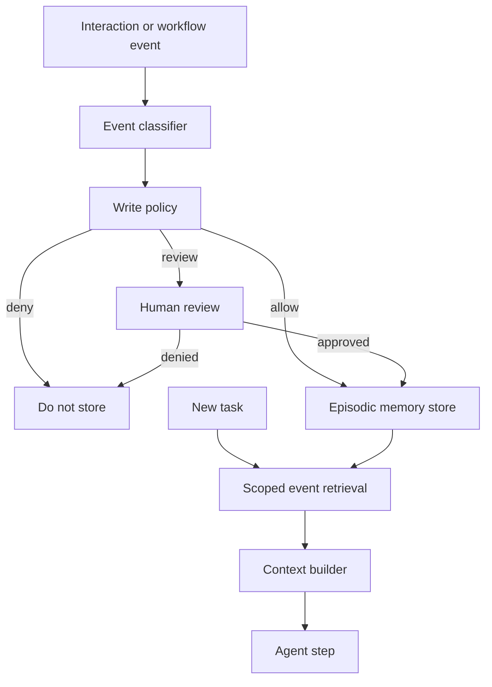

# Long-Term Episodic Memory Agent Pattern

## Intent

Long-term episodic memory stores events: what happened, when it happened, who or what was involved, what evidence supports it, and why it may matter later.

Episodic memory is not the same thing as semantic memory. Semantic memory stores facts or knowledge. Episodic memory stores remembered events. "The customer prefers email" is a preference or semantic claim. "On 2026-06-17 the customer asked to receive renewal notices by email" is an episode. Keeping that distinction clear makes memory easier to audit, correct, expire, and explain.

The goal is not to remember everything. The goal is to preserve useful events with enough provenance that future runs can reason from them without treating old, partial, or private information as universal truth.

## Use When

- The assistant needs continuity across sessions.
- Past events affect current decisions, personalization, support, operations, or project history.
- Events can be retrieved by relevance, recency, actor, tenant, project, and event type.
- The system can enforce retention, privacy, correction, deletion, and tenant isolation.
- You need an inspectable timeline rather than a vague user profile.

## Avoid When

- The task only needs semantic facts, not event history.
- The system cannot explain or delete remembered events.
- The memory would store sensitive events without consent or retention limits.
- The agent would convert every interaction into a durable episode.
- The product cannot tolerate wrong attribution, stale recall, or cross-user leakage.

## Architecture



## System Shape

- **Pattern boundary:** the episodic memory boundary owns event classification, write policy, timeline storage, retrieval scope, retention, correction, deletion, and audit.
- **State owner:** the memory service owns durable event records; the agent owns only proposed event writes and scoped event reads.
- **Model role:** the model can summarize and classify candidate events, but the runtime decides whether the event is worth storing.
- **Policy boundary:** event writes are checked for consent, privacy class, source trust, tenant scope, retention, and review requirements.
- **Operational promise:** future runs can use past events without confusing them with current instructions or permanent facts.

## Core Protocol

1. Observe an interaction, tool result, workflow transition, human decision, correction, or external event.
2. Decide whether the event is worth remembering.
3. Classify the event type, actor, tenant, project, resources, source evidence, privacy class, confidence, and retention rule.
4. Run episodic memory write policy.
5. Store approved events in a timeline and, when useful, an index for semantic retrieval.
6. Retrieve events only after filtering by tenant, actor, permissions, event type, recency, and retention.
7. Inject retrieved events as evidence with timestamps and source references.
8. Allow correction, deletion, expiry, and audit review.

## Implementation Notes

Episodic memory should be event-shaped. If the record does not include time, actor, source, and scope, it is probably not an episode. It is a note.

### Event Types

| Event Type | Example | Notes |
| --- | --- | --- |
| User preference stated | User asked for PDF reports instead of slides. | May require consent depending on sensitivity. |
| Correction received | User corrected a project name or contact role. | Should update or supersede older events. |
| Task milestone | Agent completed a deployment plan review. | Useful for project continuity. |
| Human approval | Finance approved refund request `R-1024`. | Keep approval ID and policy version. |
| Tool-observed event | CRM returned account status changed to active. | Store source and freshness. |
| Incident or failure | Agent failed because a tool timed out. | Useful for reliability and evals. |

### Event Record

A useful episodic record keeps event content separate from evidence and retrieval metadata.

```ts
type EpisodicEventType =
  | "user_preference_stated"
  | "correction_received"
  | "task_milestone"
  | "human_approval"
  | "tool_observed_event"
  | "incident_or_failure";

type EpisodicMemoryEvent = {
  eventId: string;
  eventType: EpisodicEventType;
  occurredAt: string;
  recordedAt: string;
  actorId: string;
  tenantId: string;
  projectId?: string;
  resourceRefs: string[];
  summary: string;
  sourceRefs: string[];
  sourceTrust: "user_provided" | "tool_result" | "approved_source" | "operator_entered" | "untrusted_content";
  confidence: "low" | "medium" | "high";
  privacyClass: "public" | "internal" | "private" | "sensitive";
  retention: {
    expiresAt?: string;
    deleteOnRequest: boolean;
  };
  supersedesEventIds: string[];
  correctionPath: string;
  policyVersion: string;
};
```

### Write Policy

The model should not silently write an event because it sounds useful. The runtime should decide.

```ts
type EpisodicWriteDecision =
  | { decision: "allow"; reason: string }
  | { decision: "deny"; reason: string }
  | { decision: "review"; reason: string; approverRole: string };

function decideEpisodicWrite(event: EpisodicMemoryEvent): EpisodicWriteDecision {
  if (event.sourceTrust === "untrusted_content") {
    return { decision: "review", reason: "untrusted_event_source", approverRole: "memory_reviewer" };
  }

  if (event.privacyClass === "sensitive" && !event.retention.expiresAt) {
    return { decision: "deny", reason: "sensitive_event_requires_expiry" };
  }

  if (event.eventType === "human_approval" && !event.resourceRefs.length) {
    return { decision: "deny", reason: "approval_event_missing_resource" };
  }

  return { decision: "allow", reason: "episodic_write_policy_passed" };
}
```

### Retrieval Rules

Episodic retrieval should start with scope, not similarity. Filter by tenant, actor, project, permissions, event type, retention, and recency before embedding search or ranking. Then rank events by relevance, recency, source trust, and confidence.

Retrieved events should be introduced as events, not facts:

```text
Past event, not current instruction:
- occurred_at: 2026-06-17T09:20:00Z
- event_type: correction_received
- summary: User corrected the deployment target from staging to production.
- confidence: high
- source: support-ticket-1842
```

That framing matters. The event may explain context, but it should not override current user intent, current policy, fresh tool data, or approval rules.

## Failure Modes

- The system stores every interaction as an event and retrieval becomes noisy.
- An old event is treated as a current fact.
- A preference event becomes a permanent user trait.
- A false event is written from a hallucinated summary.
- An event is attributed to the wrong user, tenant, project, or resource.
- Sensitive events are retained indefinitely.
- Corrections create new conflicting events instead of superseding older ones.
- Events from untrusted documents poison future behavior.
- Timeline order is wrong because `recordedAt` is confused with `occurredAt`.
- The system cannot show, correct, delete, or expire event records.

## Evaluation Strategy

Episodic memory evals should test event write quality, retrieval quality, and restraint.

- Test that meaningful events are stored with actor, tenant, time, source, confidence, and retention.
- Test that routine chatter is not stored.
- Test stale event suppression when fresher evidence exists.
- Test correction and supersession of an older event.
- Test deletion and expiry.
- Test cross-tenant and cross-user isolation.
- Test wrong-attribution prevention.
- Test retrieval by recency, relevance, and event type.
- Test untrusted-source review before storage.
- Test that retrieved events do not override current instructions or policy.

Measure event-write precision, event-write recall, attribution accuracy, stale-event recall, correction success, deletion success, tenant-isolation failures, retrieval relevance, and unsafe-write rate.

## Production Checklist

- Define which event types the system is allowed to remember.
- Store `occurredAt` and `recordedAt` separately.
- Keep actor, tenant, project, resource, source, confidence, privacy, and retention metadata on every event.
- Filter by scope before semantic ranking.
- Treat retrieved events as evidence, not instructions.
- Require review for sensitive, untrusted, or policy-significant events.
- Support correction, supersession, deletion, and expiry.
- Trace event reads, writes, denials, reviews, corrections, and deletions.
- Convert false memories and stale recalls into regression evals.
- Give users or operators an inspectable timeline when the product requires trust.

## Related Patterns

- [Memory-Augmented Agent](../memory-augmented-agent-pattern/README.md)
- [Goals and State](../goals-and-state-pattern/README.md)
- [Context Engineering](../context-engineering-pattern/README.md)
- [Human Approval Gates](../human-in-the-loop-approval-agent/README.md)
- [Policy Enforcement](../compliance-policy-enforcer-agent/README.md)
