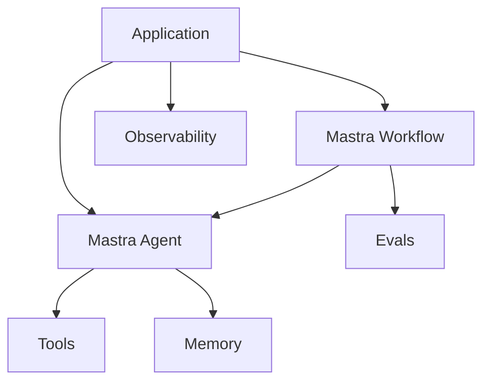

# Mastra Runtime Pattern

## Intent

The Mastra Runtime Pattern uses Mastra as a TypeScript runtime for production agent applications. Mastra gives agents, workflows, tools, memory, evals, and observability a shared application structure.

## Use When

- You are building a TypeScript or Node-based agent product.
- You need agents and deterministic workflows in the same runtime.
- You want memory, tools, evals, and tracing to be first-class concerns.

## Avoid When

- You only need a small script or single model call.
- Your team is committed to a Python-first agent stack.
- You cannot accept framework conventions around project structure and deployment.

## Architecture

## System Shape

- **Application boundary:** the product service owns user identity, tenant scope, request validation, and response delivery.
- **Runtime boundary:** Mastra hosts the agent, workflow, tools, memory, evals, and observability concerns.
- **Workflow boundary:** deterministic state transitions, retries, approval waits, and rollback points belong in workflows, not prompts.
- **Tool boundary:** tools expose typed inputs, typed outputs, side-effect labels, permission requirements, and trace fields.
- **Policy boundary:** product policy runs before tools, memory writes, outbound messages, or external side effects.
- **Portability boundary:** prompts, tool manifests, eval fixtures, trace schema, and policy rules remain readable outside Mastra-specific code.

## Core Protocol

1. Accept a request with actor, tenant, goal, release version, and idempotency key.
2. Load runtime configuration, memory policy, tool registry, and workflow state.
3. Route deterministic steps through the workflow and open-ended decisions through the agent.
4. Check policy before retrieval, memory writes, tool calls, and final answers that require approved evidence.
5. Execute tools through typed wrappers that record status, latency, cost, retry count, and side-effect IDs.
6. Emit trace events for workflow steps, model calls, tool calls, policy decisions, memory access, and eval results.
7. Run post-run evals or CI evals against the trace before promoting the change.
8. Roll back by disabling the risky tool, prompt, model, workflow, or whole agent route.

## Implementation Notes

- Use agents for open-ended decisions where the next step is not known upfront.
- Use workflows for predetermined control flow, state transitions, retries, and production orchestration.
- Keep tools typed and independently testable.
- Capture traces and evals from the beginning rather than adding them after failures.
- Keep provider credentials in environment variables and document them in `.env.example`.
- Keep framework-generated defaults out of product policy. Product policy should be visible in code, tests, ADRs, and eval fixtures.
- Version prompts, tools, policies, memory contracts, eval datasets, and workflow definitions together.
- Treat framework upgrades like runtime changes: run regression evals and inspect traces before promotion.

## Failure Modes

- Treating the framework as the architecture instead of modeling goals, state, and failure modes.
- Putting deterministic workflow logic inside prompts.
- Creating tools with vague descriptions and unvalidated inputs.
- Shipping without eval datasets or trace review.
- Letting memory writes bypass retention, deletion, correction, or consent rules.
- Exporting traces without redaction or without enough fields to replay a failure.
- Hiding rollback inside code deploys instead of feature flags, tool disablement, or policy tightening.

## Evaluation Strategy

- Test the agent path, workflow path, policy denial path, approval path, and tool failure path separately.
- Assert that the trace contains workflow, model, tool, policy, memory, and evaluator events for representative runs.
- Compare prompt, model, tool, and framework changes against the same fixture set before release.
- Include a negative case where the runtime must draft or escalate instead of executing a side effect.

## Production Checklist

- Document install, local run, test, eval, and cleanup commands.
- Commit `.env.example` and keep secret values out of source.
- Define workflow state, memory retention, tool side effects, and policy enforcement points.
- Export redacted traces to the team's observability system.
- Add CI eval gates for prompt, model, tool, policy, memory, and workflow changes.
- Define rollback for model, prompt, tool, workflow, policy, and full agent disablement.

## Related Patterns

- [Durable Workflow](../durable-workflow-pattern/README.md)
- [Observability and Evals](../observability-and-evals-pattern/README.md)
- [Agent Loop](../agent-loop-pattern/README.md)
