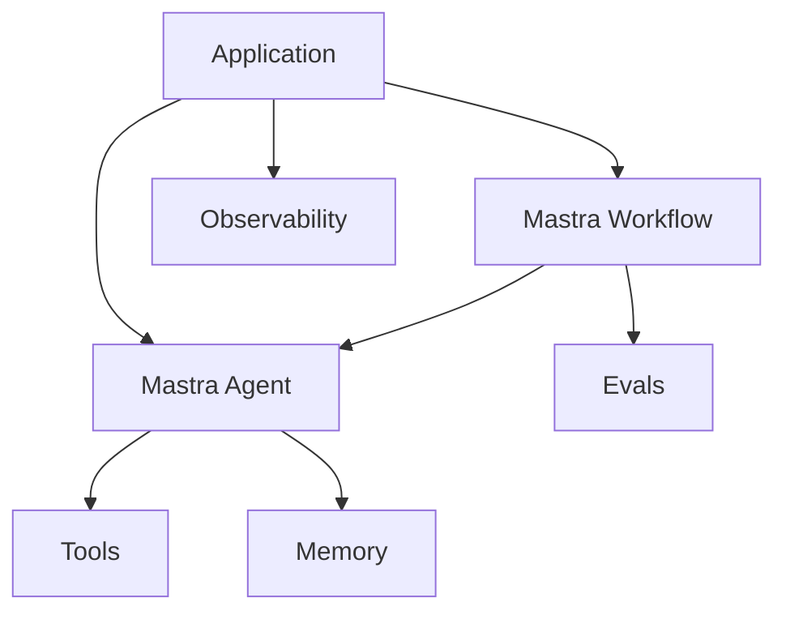

# Mastra Runtime Pattern

## Intent

The Mastra Runtime Pattern uses Mastra as a TypeScript runtime for production agent applications. Mastra gives agents, workflows, tools, memory, evals, and observability a shared application structure.

## Use When

- You are building a TypeScript or Node-based agent product.
- You need agents and deterministic workflows in the same runtime.
- You want memory, tools, evals, and tracing to be first-class concerns.

## Avoid When

- You only need a small script or single model call.
- Your team is committed to a Python-first agent stack.
- You cannot accept framework conventions around project structure and deployment.

## Architecture

## Implementation Notes

- Use agents for open-ended decisions where the next step is not known upfront.
- Use workflows for predetermined control flow, state transitions, retries, and production orchestration.
- Keep tools typed and independently testable.
- Capture traces and evals from the beginning rather than adding them after failures.

## Failure Modes

- Treating the framework as the architecture instead of modeling goals, state, and failure modes.
- Putting deterministic workflow logic inside prompts.
- Creating tools with vague descriptions and unvalidated inputs.
- Shipping without eval datasets or trace review.

## Related Patterns

- [Durable Workflow](../durable-workflow-pattern/README.md)
- [Observability and Evals](../observability-and-evals-pattern/README.md)
- [Agent Loop](../agent-loop-pattern/README.md)
