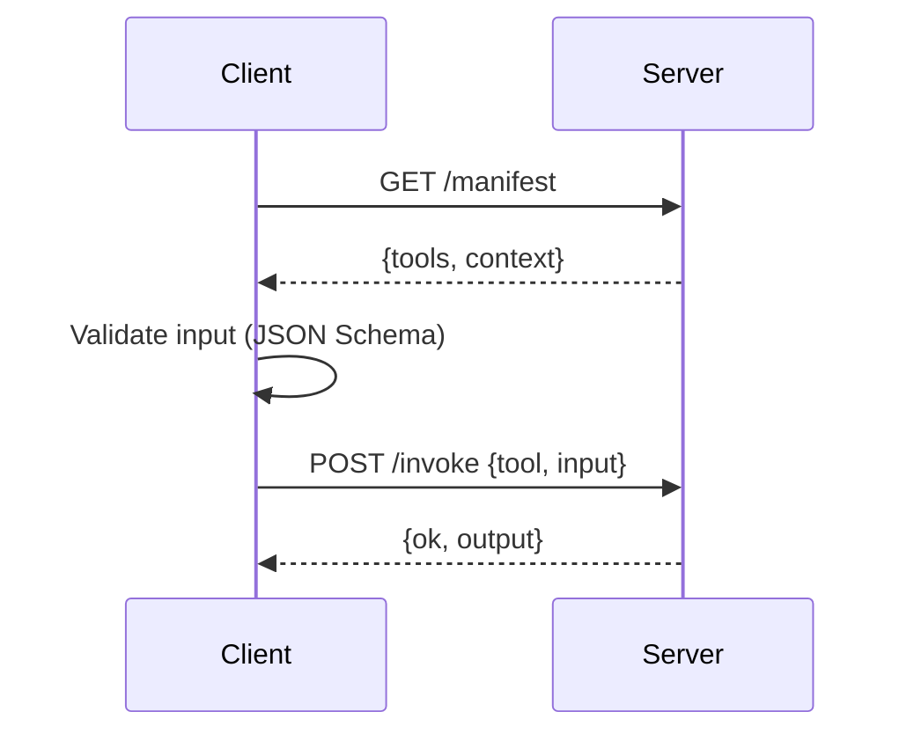

# MCP Context Exchange Pattern

Expose tools and context via a minimal MCP server; consume via an MCP client.

## Diagram

## How to run

- TS Server: `npm run -s mcp:server`
- TS Client: `npm run -s mcp:client`
- Python Server: `uvicorn mcp_server:app --port 8787`
- Python Client: `python mcp_client.py`

Notes:
 
- No external IO in tools; math is safe; web search is mocked.
