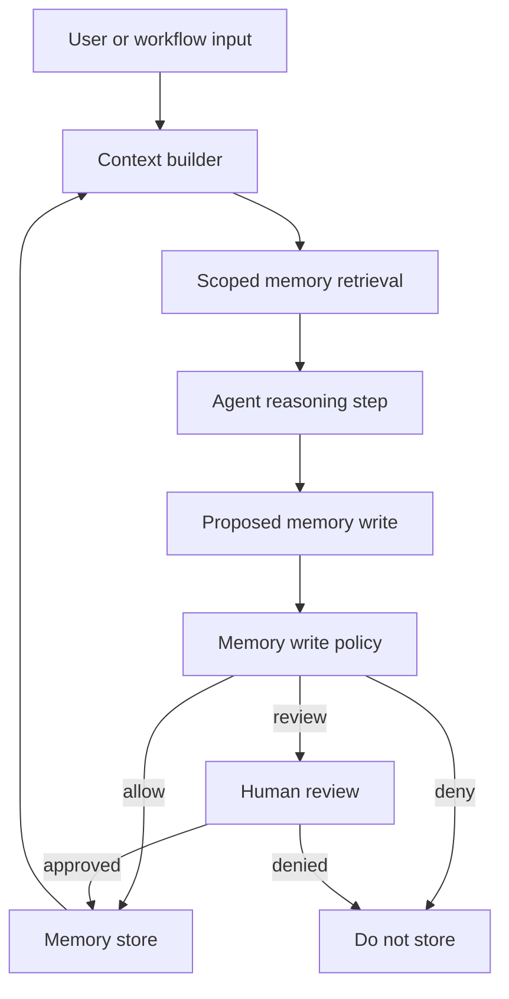

# Memory-Augmented Agent Pattern

## Intent

Memory-augmented agents store and retrieve information across turns, sessions, tasks, or users. Memory gives an agent continuity, but it also creates a durable trust boundary. A bad answer can be corrected in the next turn. A bad memory can keep influencing future runs.

The useful way to think about memory is simple: memory is not truth. It is a record with a source, scope, timestamp, confidence, privacy class, retention rule, and correction path. The model can propose a memory write. The runtime decides whether that write is allowed, how it is stored, how long it lives, and when it can be recalled.

Use this pattern for durable memory policy. For the state of a single run, use [Working Memory](/memory-knowledge/working-memory). For deciding whether a memory enters the prompt, use [Context Engineering](/foundations/context-engineering) and [Context Budgets and Working Sets](/foundations/context-budgets-and-working-sets).

## Use When

- The agent needs continuity beyond one interaction.
- Stored facts can be scoped, updated, corrected, and deleted.
- Retrieval results can be cited, inspected, and excluded when they are stale or unsafe.
- The product has a reason to remember preferences, task state, decisions, events, or user-provided facts.
- You can define consent, retention, privacy, and tenant boundaries.

## Avoid When

- The system would store sensitive data without consent or retention rules.
- Retrieved memories cannot be distinguished from current instructions.
- The memory store is used as an uncurated transcript dump.
- The agent would treat old summaries as authoritative facts.
- You cannot explain, edit, or delete what the agent remembers.

## Architecture



## System Shape

- **Pattern boundary:** the memory boundary owns retrieval scope, write policy, record schema, retention, correction, deletion, and audit.
- **State owner:** the memory service or application store owns durable memory; the agent owns only proposed reads and writes.
- **Model role:** the model can summarize, classify, and propose memory updates, but it does not silently decide what the system will remember.
- **Policy boundary:** memory writes pass through consent, source, privacy, tenant, retention, and safety checks before storage.
- **Operational promise:** memory improves continuity without becoming an unreviewed pile of durable claims.

## Core Protocol

1. Classify the information need: working state, episodic event, semantic fact, user preference, policy source, or tool-result cache.
2. Retrieve only memory records scoped to the current actor, tenant, task, permissions, and freshness window.
3. Inject memory as data with source labels, timestamps, confidence, and trust level.
4. Keep retrieved memory separate from system instructions and policy.
5. Ask the model to propose memory writes only when the task produced a durable fact, preference, event, correction, or decision.
6. Run memory write policy before storage.
7. Store approved memory with provenance, retention, privacy class, and deletion path.
8. Record memory reads, writes, updates, denials, and deletions in the trace.

## Implementation Notes

Do not store raw chat history as memory by default. Chat history is evidence. Memory is a curated operational record. The difference matters because memory is reused by future runs.

### Memory Types

| Memory Type | What It Stores | Typical Risk |
| --- | --- | --- |
| Working memory | Current task state, open questions, active constraints. | stale or inconsistent state inside a run. |
| Episodic memory | Events that happened, with time and participants. | over-retention, privacy leakage, wrong attribution. |
| Semantic memory | Durable facts about a domain, user, project, or system. | treating unverified claims as truth. |
| Preference memory | User choices and habits. | over-personalization or storing sensitive preferences. |
| Policy memory | Approved rules, sources, and constraints. | stale policy or unauthorized edits. |
| Tool-result cache | Prior tool outputs reused for speed or cost. | stale data and cross-tenant leakage. |

### Memory Write Contract

A memory write should be a typed request. The record should say what is being stored, why it is allowed, where it came from, who it belongs to, and how it can be corrected.

```ts
type MemoryKind =
  | "working_state"
  | "episodic_event"
  | "semantic_fact"
  | "user_preference"
  | "policy_reference"
  | "tool_result_cache";

type MemoryWriteRequest = {
  runId: string;
  actorId: string;
  tenantId: string;
  proposedBy: "model" | "workflow" | "user" | "operator";
  kind: MemoryKind;
  content: string;
  sourceRefs: string[];
  sourceTrust: "user_provided" | "tool_result" | "approved_source" | "untrusted_content";
  confidence: "low" | "medium" | "high";
  privacyClass: "public" | "internal" | "private" | "sensitive";
  retention: {
    expiresAt?: string;
    deleteOnRequest: boolean;
  };
  consent: {
    required: boolean;
    granted: boolean;
    consentRef?: string;
  };
  correctionPath: string;
};

type MemoryPolicyDecision =
  | { decision: "allow"; reason: string }
  | { decision: "deny"; reason: string }
  | { decision: "review"; reason: string; approverRole: string };

function decideMemoryWrite(request: MemoryWriteRequest): MemoryPolicyDecision {
  if (request.sourceTrust === "untrusted_content") {
    return { decision: "review", reason: "untrusted_source", approverRole: "memory_reviewer" };
  }

  if (request.privacyClass === "sensitive" && !request.consent.granted) {
    return { decision: "deny", reason: "missing_consent_for_sensitive_memory" };
  }

  if (request.kind === "policy_reference" && request.proposedBy === "model") {
    return { decision: "review", reason: "policy_memory_requires_review", approverRole: "policy_owner" };
  }

  return { decision: "allow", reason: "memory_policy_passed" };
}
```

### Memory Records

The stored record should not be just text.

```ts
type MemoryRecord = {
  memoryId: string;
  kind: MemoryKind;
  content: string;
  actorId: string;
  tenantId: string;
  sourceRefs: string[];
  sourceTrust: string;
  confidence: string;
  privacyClass: string;
  createdAt: string;
  updatedAt: string;
  expiresAt?: string;
  correctionPath: string;
  policyVersion: string;
};
```

This schema is intentionally boring. Boring memory is easier to inspect, correct, delete, evaluate, and audit.

### Retrieval Rules

Memory retrieval should be scoped before relevance ranking. First filter by tenant, actor, permissions, memory kind, retention, and freshness. Then rank by relevance. If the system ranks first and filters later, private or stale memory can leak into context.

Retrieved memory should enter context with labels such as `source`, `created_at`, `confidence`, `privacy_class`, and `trust_level`. Do not let retrieved memory override system instructions, tool policy, approval rules, or security controls.

## Failure Modes

- Raw transcripts are stored as durable memory.
- The model writes memory silently without consent, policy, or trace.
- Untrusted web pages, emails, tickets, or documents poison future memory.
- Stale memory overrides fresher evidence.
- User preferences are treated as facts.
- Facts from one tenant, user, or project appear in another context.
- Sensitive data is stored without retention, deletion, or correction rules.
- Summaries lose the evidence needed to verify or repair the memory.
- The system has no way to show users what is remembered.
- Memory grows until retrieval becomes noisy and expensive.

## Evaluation Strategy

Memory evals should test both recall and restraint. A memory system that remembers everything is not good. It is risky.

- Test allowed memory writes from explicit user preferences.
- Test denied writes for sensitive data without consent.
- Test review-required writes from untrusted content.
- Test correction of an existing memory record.
- Test deletion and verify the record cannot be retrieved later.
- Test stale memory against fresher evidence.
- Test tenant and actor isolation.
- Test memory retrieval with conflicting records.
- Test whether retrieved memory is cited as memory, not treated as instruction.
- Test that memory writes appear in traces with policy decisions.

Measure write precision, write recall, unsafe-write rate, stale-recall rate, correction success, deletion success, cross-tenant leakage, retrieval relevance, citation coverage, and policy-decision accuracy.

## Production Checklist

- Define the memory types the system is allowed to store.
- Keep memory records typed, scoped, source-backed, and timestamped.
- Require consent for sensitive or personal memory.
- Filter by tenant, actor, permission, freshness, and retention before ranking by relevance.
- Separate retrieved memory from instructions and policy.
- Add write policy for untrusted sources, sensitive data, policy memory, and tool-result summaries.
- Provide correction and deletion paths.
- Trace memory reads, writes, updates, denials, approvals, and deletions.
- Convert unsafe memory writes and stale recalls into regression evals.
- Give operators a way to disable memory writes without disabling retrieval.

## Related Patterns

- [Long-Term Episodic Memory](../long-term-episodic-memory-agent-pattern/README.md)
- [Goals and State](../goals-and-state-pattern/README.md)
- [Context Engineering](../context-engineering-pattern/README.md)
- [Policy Enforcement](../compliance-policy-enforcer-agent/README.md)
- [Human Approval Gates](../human-in-the-loop-approval-agent/README.md)
