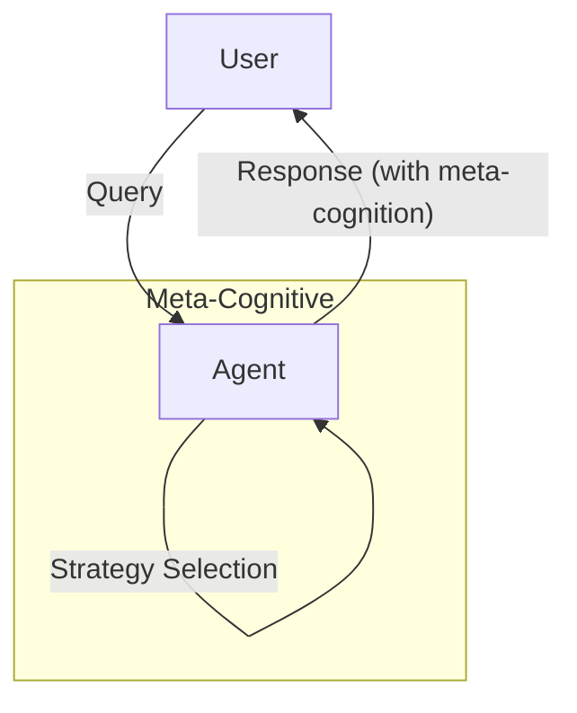

# Meta-Cognitive Agent Pattern

## Description

The Meta-Cognitive Agent Pattern enables agents to reason about their own reasoning processes. These agents can monitor, evaluate, and adjust their own strategies, confidence, and decision-making approaches. Meta-cognition allows agents to be aware of their limitations, uncertainty, and to select or switch strategies dynamically based on self-assessment.

### Key Characteristics

- **Self-Monitoring:** Agents track their own reasoning, confidence, and progress.
- **Strategy Selection:** Agents can choose or switch between different problem-solving strategies.
- **Uncertainty Awareness:** Agents can express or act upon uncertainty in their answers.
- **Self-Evaluation:** Agents critique or justify their own reasoning steps.

### Use Cases

- Agents that explain their reasoning and confidence
- Adaptive problem solvers that switch strategies when stuck
- Agents that ask for clarification when uncertain
- Self-aware tutoring or diagnostic systems

### Advantages

- Increased transparency and trust
- Improved robustness in complex or ambiguous tasks
- Ability to recover from errors or impasses

### Limitations

- More complex agent design and logic
- Requires mechanisms for self-assessment and strategy management
- Potential for over-analysis or indecision

---

## Mermaid Diagram

