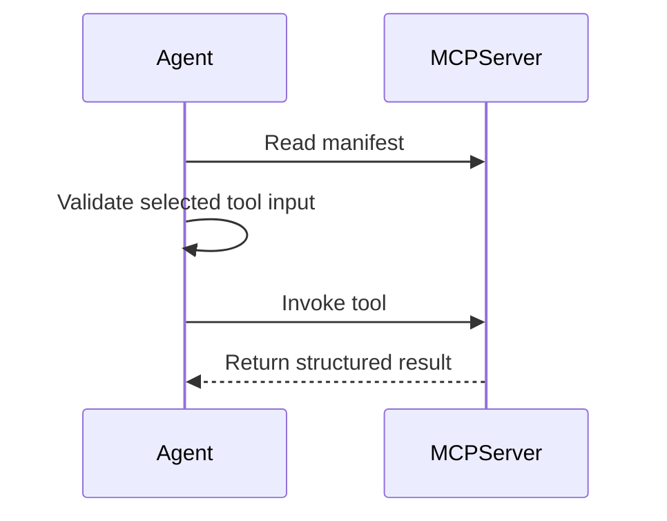

# Modern Tool Use Pattern (MCP-first)

MCP-first tool use separates tool capability from agent logic. The agent discovers tool manifests, validates inputs, calls tools through a stable boundary, and handles structured results.

This example includes two small MCP-style servers, search and cloud store, plus an agent that discovers manifests, validates inputs with Ajv, and invokes tools.

## Intent

Use this pattern when the set of tools may evolve independently from the agent. MCP gives tools a manifest boundary so the agent can inspect capabilities instead of relying on hard-coded assumptions.

## Use When

- Tools are shared across agents or applications.
- Tool schemas, context, and permissions need to be discoverable.
- You want to test tool invocation separately from model reasoning.

## Avoid When

- A local function call is enough and no discovery boundary is needed.
- Tool inputs cannot be validated.
- The agent has permission to call too many tools without policy checks.

## Core Flow

## Run

- Start search server: `npm run mcp:search`
- Start cloud server: `npm run mcp:cloud`
- Run agent: `npm run mcp:agent`
- Run test: `npm run mcp:test`

## Implementation Notes

- Validate tool input before every invocation.
- Keep tool results structured and observable.
- Put policy checks between model intent and tool execution.
- Prefer small tools with clear contracts over broad tools with vague descriptions.

## Failure Modes

- Tool manifests that describe capabilities too vaguely.
- Model-generated tool inputs used without schema validation.
- Hidden side effects that are not visible in the tool contract.
- No trace linking model decision, tool input, and tool result.
