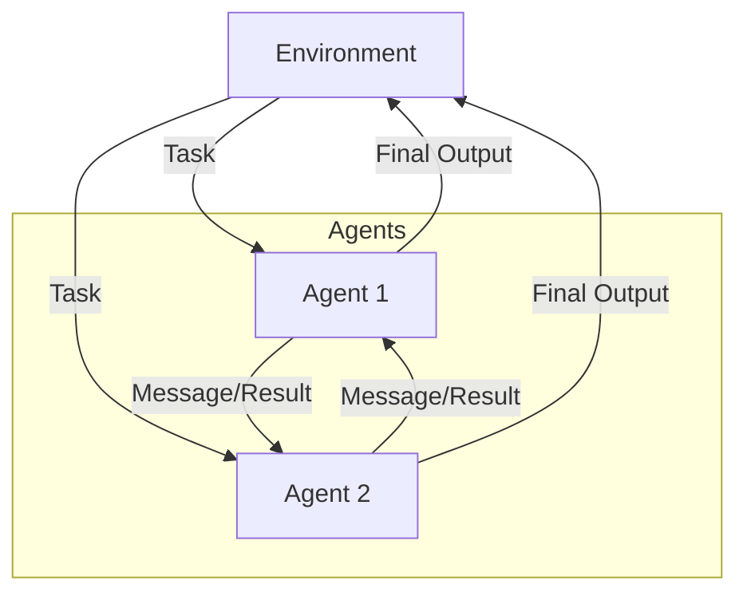

# Multi-Agent Collaboration Pattern

## Description

The Multi-Agent Collaboration Pattern involves multiple autonomous agents, each with distinct roles or expertise, working together to solve a problem or achieve a goal. Agents communicate, share information, and coordinate their actions, often leading to more robust and creative solutions than a single agent could achieve. This pattern is foundational for distributed AI, team-based problem solving, and complex workflows.

### Key Characteristics

- **Multiple Agents:** Each agent may have a unique role, skill, or perspective.
- **Communication:** Agents exchange messages, results, or plans.
- **Coordination:** Agents may negotiate, vote, or synchronize their actions.

### Use Cases

- Brainstorming and critique (e.g., one agent generates, another critiques)
- Distributed data analysis
- Multi-step workflows with specialized agents
- Team-based decision making

### Advantages

- Leverages diverse expertise and perspectives
- Enables parallelism and division of labor
- Can solve more complex or creative tasks

### Limitations

- Increased system complexity
- Requires robust communication and coordination protocols
- Potential for conflicts or deadlocks

---

## Mermaid Diagram

