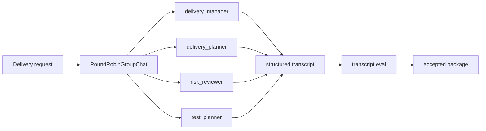

# Native AutoGen Delivery Example

This example maps the Multi-Agent Delivery Workflow capstone into native AutoGen AgentChat concepts: `AssistantAgent`, `RoundRobinGroupChat`, and termination conditions.

It is the native counterpart to Lab 13. The deterministic lab teaches the transcript contract; this example shows how the same contract maps to a real AgentChat team.

Download bundle: [native-autogen-delivery.zip](/downloads/native-autogen-delivery.zip)

It demonstrates:

- manager, planner, reviewer, and tester role contracts;
- a round-robin team shape;
- explicit termination rules;
- transcript extraction into a reviewable structure;
- evals over role coverage, turn order, final owner, and stop reason;
- dependency isolation from the repository root.

## Official References

- [AutoGen AgentChat installation](https://microsoft.github.io/autogen/stable//user-guide/agentchat-user-guide/installation.html)
- [AutoGen AgentChat agents](https://microsoft.github.io/autogen/stable//user-guide/agentchat-user-guide/tutorial/agents.html)
- [AutoGen AgentChat teams](https://microsoft.github.io/autogen/stable//user-guide/agentchat-user-guide/tutorial/teams.html)
- [AutoGen termination conditions](https://microsoft.github.io/autogen/stable//user-guide/agentchat-user-guide/tutorial/termination.html)
- [AutoGen to Microsoft Agent Framework migration guide](https://learn.microsoft.com/en-us/agent-framework/migration-guide/from-autogen/)

AutoGen is currently community-maintained. For new long-lived Microsoft-stack projects, review the Microsoft Agent Framework migration guide before standardizing on AutoGen.

## Setup

```sh
cd native-framework-examples/autogen-delivery
python3 -m venv .venv
source .venv/bin/activate
pip install -r requirements.txt
cp .env.example .env
```

Set the model provider variables required by your AutoGen setup. Keep real values in environment variables; do not commit them.

## Run

```sh
python delivery_team.py
```

Expected local surface:

```text
team: RoundRobinGroupChat
agents: delivery_manager, delivery_planner, risk_reviewer, test_planner
termination: TextMentionTermination("ACCEPTED") OR MaxMessageTermination(8)
eval gate: delivery_transcript_acceptance
```

## Architecture



## Validate The Slice

From the repository root:

```sh
npm run native-examples:validate
```

The root validation checks Python syntax without installing optional AutoGen dependencies. A full native run still requires the setup above.

## Expected Behavior

The team should:

1. assign work from a manager or workflow owner;
2. produce planner, reviewer, and tester outputs;
3. end with one accountable final owner;
4. terminate with an explicit accepted or max-message stop reason;
5. export transcript events for eval replay;
6. fail the eval if review or test planning is skipped.

## Modify This Next

Make one focused change before moving to production design:

1. remove the `risk_reviewer` turn or change its message type;
2. update the transcript eval so the run fails;
3. restore the reviewer turn and confirm the eval passes again.

This change teaches the AutoGen boundary: a multi-agent transcript must prove role coverage and turn order, not only produce a final answer.

## Production Notes

Do not use raw chat history as the only system of record. Store a normalized transcript with sender, recipient, type, turn number, task ID, tool calls, stop reason, and redaction status.

Before production, add role-specific tools, permission wrappers, transcript redaction, max-turn budgets, regression replay, and a rollback path that disables multi-agent delegation while preserving a single-owner workflow.
