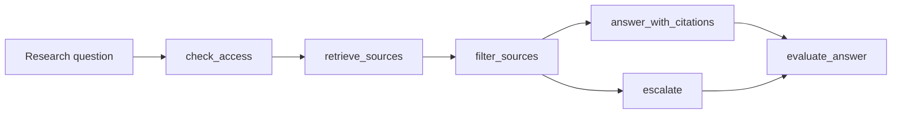

# Native LangGraph Research RAG Example

This example maps the Research RAG Agent capstone into a real LangGraph `StateGraph`. It is the native counterpart to Lab 03 and the Research RAG capstone.

Download bundle: [native-langgraph-research-rag.zip](/downloads/native-langgraph-research-rag.zip)

It demonstrates:

- graph state for question, actor, retrieved sources, evidence, omissions, answer, trace, and eval failures;
- nodes for access policy, retrieval, source filtering, answer synthesis, escalation, and evaluation;
- conditional edges for denied access and missing approved evidence;
- citation and source-policy evals outside model text;
- deterministic fixtures that make retrieval and grounding behavior reviewable.

## Setup

Official references:

- [LangGraph graph API](https://docs.langchain.com/oss/python/langgraph/graph-api)
- [LangGraph persistence](https://docs.langchain.com/oss/python/langgraph/persistence)
- [LangChain vector stores](https://docs.langchain.com/oss/python/integrations/vectorstores)

```sh
cd native-framework-examples/langgraph-research-rag
python3 -m venv .venv
source .venv/bin/activate
pip install -r requirements.txt
```

## Run

```sh
python research_rag_graph.py
```

This command requires the optional LangGraph dependencies from this folder's `requirements.txt`. The retrieval fixture is deterministic so the graph behavior can be inspected without model provider keys.

## Validate The Slice

From the repository root:

```sh
npm run native-examples:validate
```

The root validation checks Python syntax without installing optional LangGraph dependencies. A full native run still requires the setup above.

## Expected Behavior

1. access policy allows the `support_researcher` actor;
2. retrieval returns current, stale, and forbidden candidate sources;
3. source filtering keeps only approved current evidence;
4. answer synthesis cites `refund-policy-v4#p3`;
5. evals fail if the answer cites stale or forbidden sources;
6. missing approved evidence routes to escalation instead of fabrication.

## Architecture



## Modify This Next

Make one focused change before moving to production design:

1. add a source with `allowed: true` and `status: "stale"`;
2. make the answer cite it;
3. confirm `evaluate_answer` fails with `stale_source_cited`;
4. restore the answer to cite only current approved evidence.

This change teaches the Research RAG boundary: retrieval can find many candidates, but the context packet and citation eval decide what the answer may use.

## Production Notes

Replace the deterministic retriever with a real vector store only after the source contract is stable. Each source should carry ID, title, ACL result, freshness, citation label, retention class, and ingestion version.

Do not let graph execution hide source policy. LangGraph should host the state transitions and conditional edges; the application should still own access control, freshness rules, citation requirements, trace retention, and release evals.
