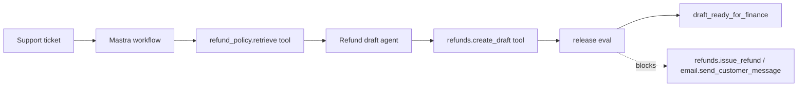

# Native Mastra Refund Example

This example maps the Support Refund Agent capstone into native Mastra concepts: `Agent`, `createTool`, `createStep`, `createWorkflow`, and a release-blocking eval.

It is the native counterpart to Lab 07. The deterministic lab teaches the architecture; this example shows where those contracts land in a Mastra project.

It demonstrates:

- a refund draft agent with constrained instructions;
- typed read and draft tools;
- a workflow that retrieves policy before drafting;
- a release eval that blocks forbidden side-effect tools;
- trace fields that remain readable outside Mastra internals;
- dependency isolation from the repository root.

## Official References

- [Mastra quickstart](https://mastra.ai/guides/getting-started/quickstart)
- [Mastra manual install](https://mastra.ai/docs/getting-started/manual-install)
- [Mastra agents](https://mastra.ai/docs/agents/overview)
- [Mastra tools](https://mastra.ai/docs/agents/using-tools)
- [Mastra workflows](https://mastra.ai/docs/workflows/overview)
- [Mastra scorers and evals](https://mastra.ai/docs/evals/overview)
- [Mastra suspend and resume](https://mastra.ai/docs/workflows/suspend-and-resume)

## Setup

```sh
cd native-framework-examples/mastra-refund
npm install
cp .env.example .env
```

Set the model provider variables required by your Mastra setup. Keep real values in environment variables; do not commit them.

## Run

```sh
npm run dev
```

Use the Mastra local project to inspect the registered agent and workflow.

Expected local surface:

```text
agent: refundDraftAgent
workflow: refundDraftWorkflow
tools: refund_policy.retrieve, refunds.create_draft
eval gate: refund_draft_no_money_movement
```

## Architecture



## Validate The Slice

From the repository root:

```sh
npm run native-examples:validate
```

The root validation checks TypeScript syntax without installing the optional Mastra dependencies.

## Expected Behavior

The workflow should:

1. accept a support ticket ID and tenant ID;
2. retrieve refund policy before drafting;
3. create only a draft recommendation;
4. refuse to issue money or send customer messages;
5. emit trace fields for workflow, tool, agent, policy, and eval evidence;
6. fail the release eval if forbidden tools appear.

## Production Notes

Do not let Mastra packaging hide product authority. Mastra should host the agent, tools, workflow, memory, observability, and eval plumbing. The application still owns refund policy, tenant checks, side-effect permissions, approval records, trace retention, and rollback.

Before production, add durable storage, approval gates for write tools, trace export, regression fixtures, and a kill switch for `refunds.create_draft`.
