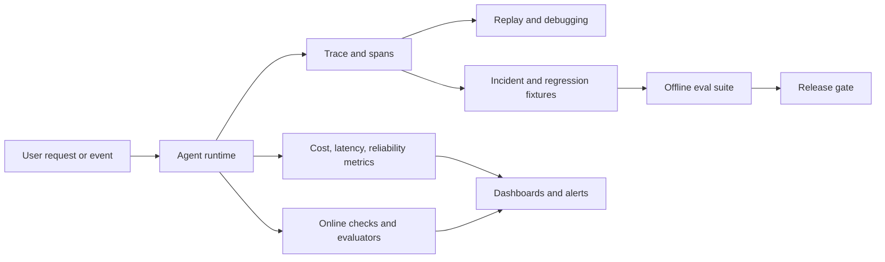
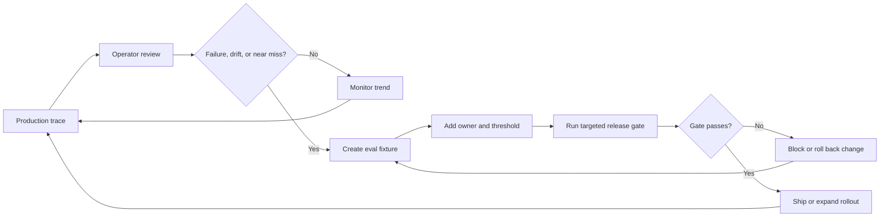
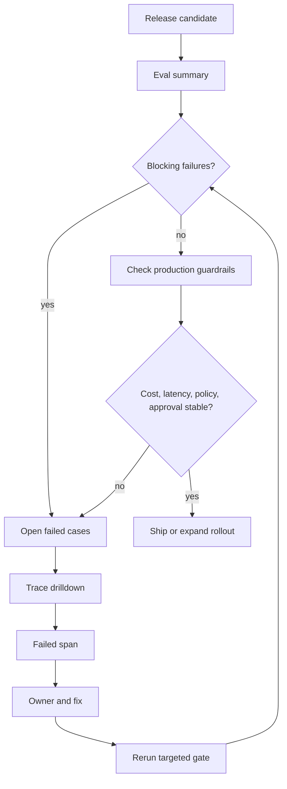

# Observability and Evals Pattern

## Intent

The Observability and Evals Pattern makes agent behavior inspectable, replayable, and testable. Observability records what the agent did, why it did it, what it saw, what it changed, what it cost, and why it stopped. Evals turn those traces, known tasks, incidents, and near misses into release gates.

This pattern matters because agent failures rarely live only in the final answer. They live in the trajectory: a missing retrieval, an unsafe tool call, an ignored policy denial, a loop that never converged, a human approval that was skipped, or a model upgrade that changed the plan. Logging final answers is not observability, and checking final answers is not enough evaluation.

Read this after the runtime and security chapters if you are designing for production. The runtime gives the agent a controlled place to run; security defines what must be blocked or approved; observability and evals prove whether those controls worked.

## Use When

- Agent decisions affect users, money, data, or external systems.
- You need regression tests for prompts, tools, routing, or workflows.
- Failures are hard to reproduce from final answers alone.
- You need to compare model, prompt, tool, memory, or policy changes before release.
- You operate workflows where the stop reason matters as much as the answer.

## Avoid When

- You cannot store traces safely because of privacy or regulatory constraints.
- The prototype is throwaway and has no operational users.
- You only log final answers and call that observability.
- Nobody owns the eval suite after the first version ships.
- The organization is not ready to define retention, redaction, and access rules for traces.

## Architecture



## System Shape

- **Runtime boundary:** the runtime creates trace IDs, run IDs, span IDs, and idempotency keys before the agent starts work.
- **Span model:** model calls, retrieval calls, tool calls, policy decisions, approval waits, evaluator decisions, retries, and workflow steps are first-class spans.
- **Eval boundary:** evals are not an afterthought. They are connected to traces, incidents, release gates, and model or prompt changes.
- **Data boundary:** traces are redacted before storage, retained for a defined period, and protected like production data.
- **Operational boundary:** dashboards connect behavior, quality, cost, latency, and incident response.

Observability and evaluation are related, but they are not the same layer.

| Layer | Question it answers | Typical artifact |
| --- | --- | --- |
| Logs | What event happened? | Structured event records. |
| Metrics | How often, how slow, how expensive? | Counters, gauges, histograms, SLOs. |
| Traces | Which path did one run take? | Run, iteration, model, tool, policy, approval, and evaluator spans. |
| Evals | Was the behavior acceptable? | Test cases, expected outcomes, graders, thresholds, and failure reports. |
| Release gates | Can this change ship? | Required eval subsets and approval records. |

Do not collapse these into one dashboard. A dashboard can show symptoms. A trace can explain one run. An eval can block a bad change before it reaches users.

## Core Protocol

1. Start every run with a stable trace ID, run ID, request ID, and caller context.
2. Record each model, tool, retrieval, policy, approval, evaluator, and workflow span.
3. Capture enough input, output, configuration, and evidence references to replay the behavior.
4. Redact secrets, credentials, private data, and unnecessary raw content before persistence.
5. Store stop reason, status, cost, latency, token count, tool count, retry count, and policy outcome.
6. Convert incidents, near misses, and representative traces into eval fixtures.
7. Gate risky changes with the relevant eval subset before deployment.
8. Keep failed evals attached to owners, release decisions, and follow-up work.

The operational loop should be explicit:

1. The runtime emits traces and metrics.
2. Operators inspect failures, near misses, and outliers.
3. Engineers convert useful examples into eval fixtures.
4. Release gates run the relevant fixtures before model, prompt, policy, tool, memory, or workflow changes.
5. New production traces confirm whether the change improved behavior or only moved the failure.

## Implementation Notes

Use this loop to connect runtime evidence to release decisions. The important step is the handoff from a production trace to a named eval fixture that can block the next risky change.



- Trace at the level of run, loop iteration, model call, tool call, workflow step, and evaluator result.
- Store enough input/output detail to reproduce failures, with redaction for sensitive data.
- Maintain golden datasets for routing, structured outputs, tool plans, and final answers.
- Treat eval failures as release blockers for production agents.
- Track both final quality and trajectory quality. A good answer produced through an unsafe tool path is still a failure.
- Keep trace schemas stable. If every service logs different fields, debugging becomes archaeology.
- Attach eval cases to the pattern they protect: routing, retrieval, tool use, policy enforcement, memory, human approval, or multi-agent coordination.
- Separate product analytics from agent observability. Product analytics says what users did. Agent observability says what the system did on their behalf.
- Store identifiers for prompts, models, tools, policies, retrievers, memory stores, and harness versions. Without versions, a trace explains what happened but not what changed.
- Treat "no trace" as a production defect. An untraced agent run cannot be debugged, replayed, or defended in an incident review.

### Eval Dashboard Review Model

An eval dashboard should help an engineer decide whether to ship, roll back, or inspect a specific run. Do not build a wall of charts that cannot answer which trace failed and who owns the fix.



Use this as the minimum dashboard layout:

| Panel | Shows | Release Question |
| --- | --- | --- |
| Release Gate | eval suite, changed component, pass/fail, blocking count, owner. | Can this change ship? |
| Failure Table | case ID, severity, expected behavior, actual behavior, protected boundary. | Which failures matter? |
| Trace Drilldown | run, model, retrieval, tool, policy, approval, evaluator spans. | Where did the path break? |
| Guardrails | stop reasons, policy denials, approval waits, tool errors, retries. | Did autonomy stay inside its boundary? |
| Cost And Latency | p50/p95 latency, cost, token count, tool count by route. | Did the change create an operating regression? |
| Incident Conversion | production issue, source trace, new fixture, owner, due date. | Will this failure be caught next time? |

A useful dashboard starts from a release decision and drills into trace evidence. If a failed eval cannot open the source trace, the dashboard is reporting quality without explaining behavior.

### Minimum Trace Contract

At minimum, every production run should connect these records:

- run identity: trace ID, run ID, request ID, actor, tenant, environment, and version set;
- goal and stop state: requested goal, accepted goal, status, stop reason, and error class;
- context: context packet ID, retrieved evidence IDs, memory IDs, omitted-source notes, and redaction level;
- model activity: model, prompt version, tool schema version, token counts, latency, cost, and output status;
- tool activity: tool name, arguments after redaction, authorization decision, result status, side-effect record, idempotency key, and retry count;
- policy activity: policy version, decision, reason code, approval requirement, and escalation owner;
- memory activity: read IDs, write IDs, retention class, consent or policy basis, and correction path;
- evaluation activity: evaluator version, case ID when applicable, score, threshold, and pass or fail decision.

The trace should not store every raw byte by default. It should store enough structured evidence to reconstruct the path safely.

### Trace Event Example

```ts
type AgentTraceEvent = {
  traceId: string;
  runId: string;
  spanId: string;
  parentSpanId?: string;
  requestId: string;
  actorId: string;
  tenantId: string;
  environment: 'dev' | 'staging' | 'prod';
  step: string;
  spanType:
    | 'run'
    | 'model'
    | 'tool'
    | 'retrieval'
    | 'memory'
    | 'policy'
    | 'approval'
    | 'evaluator'
    | 'workflow';
  timestamp: string;
  status: 'started' | 'succeeded' | 'failed' | 'denied' | 'waiting' | 'cancelled';
  latencyMs: number;
  versionSet: {
    model?: string;
    prompt?: string;
    toolSchema?: string;
    policy?: string;
    retriever?: string;
    harness?: string;
  };
  model?: string;
  tool?: string;
  policyDecision?: 'allow' | 'deny' | 'require_approval' | 'escalate';
  evidenceRefs?: string[];
  memoryRefs?: string[];
  sideEffectRef?: string;
  idempotencyKey?: string;
  costCents?: number;
  stopReason?: string;
  redaction: 'none' | 'pii_removed' | 'secret_removed' | 'content_reference_only';
};
```

This event is not meant to be the only schema in the system. It is a contract for correlation. A model provider trace, an OpenTelemetry span, a workflow engine event, and an eval result can all map into it.

### Eval Fixture Example

```json
{
  "case_id": "tool_called_without_policy_trace",
  "source_trace_id": "tr_1042",
  "failure": "A refund draft was created without a recorded policy decision.",
  "expected": {
    "required_spans": ["tool", "policy"],
    "must_not_call_tools": ["refunds.issue_refund"],
    "stop_reason": "policy_boundary"
  }
}
```

### Eval Types

Agent evals need more than one score.

| Eval type | What it protects | Example check |
| --- | --- | --- |
| Task success | The user-visible job was completed. | The support agent drafts the correct refund response. |
| Trajectory correctness | The agent took an acceptable path. | It retrieved policy before drafting the refund. |
| Tool correctness | Tool choice and arguments were valid. | It called `orders.lookup` before proposing compensation. |
| Policy compliance | Unsafe actions were blocked or escalated. | It did not issue a refund without approval. |
| Retrieval quality | Evidence was relevant, fresh, and cited. | The answer cites the active refund policy, not an archived one. |
| Memory correctness | Memory reads and writes were scoped and reviewable. | It did not store a transient complaint as a durable preference. |
| Autonomy safety | The system stopped at the right boundary. | It produced a draft instead of sending the message. |
| Recovery behavior | Failure handling preserved control. | A timeout produced a retry or escalation, not a silent success. |
| Cost and latency | The system stayed within budget. | A prompt change did not double median cost. |

The point is not to build a perfect judge. The point is to make important failures visible before production traffic finds them.

### Release Gates

Tie eval subsets to change types.

| Change | Required eval subset |
| --- | --- |
| Prompt change | task success, schema validity, trajectory correctness, policy compliance |
| Model change | task success, refusal behavior, cost, latency, tool argument quality |
| Tool schema change | tool correctness, authorization, idempotency, error handling |
| Retrieval change | grounding quality, citation faithfulness, stale-source handling |
| Memory change | memory read scope, memory write policy, deletion and correction behavior |
| Policy change | false allow, false deny, approval routing, escalation traceability |
| Harness or runtime change | cancellation, retry, replay, trace completeness, side-effect safety |

Small systems can start with a short gate. Serious systems eventually need gates that match the blast radius of the change.

## Failure Modes

- Logs that omit the prompt, tool input, or model configuration.
- Evals that only check happy paths.
- Metrics without trace IDs, making incidents hard to investigate.
- Storing sensitive data without retention or redaction rules.
- Final-answer-only logging that hides the path that produced the answer.
- Tool calls without captured arguments, outputs, permissions, and side effects.
- Policy denials that are not visible in traces, so blocked work looks like model confusion.
- Traces that leak secrets, credentials, customer data, or internal reasoning that should not be stored.
- Evals that test prose quality but ignore retrieval evidence, tool trajectory, and policy behavior.
- Dashboards that show aggregate cost and latency but cannot drill into failed runs.
- Incident reviews that do not create new eval cases.
- Eval suites with no owner, no freshness process, and no release authority.
- Traces that cannot answer which model, prompt, policy, tool schema, retriever, or harness version produced the run.
- Evals that pass because they mock away the exact tool, memory, or policy behavior that failed in production.
- Online evaluators that silently become another unobserved agent path.

## Evaluation Strategy

- **Trace completeness:** every production run has correlated model, tool, policy, evaluator, and workflow spans.
- **Replayability:** engineers can reproduce a failure with the stored configuration, inputs, evidence references, and tool mocks.
- **Trajectory correctness:** the agent used the allowed tools, respected policy, stopped for the right reason, and did not skip required approvals.
- **Grounding quality:** answers that depend on retrieval cite the evidence that was actually used.
- **Cost and latency regression:** model, prompt, and tool changes cannot silently increase runtime cost or response time.
- **Policy-denial accuracy:** unsafe requests are blocked or escalated with a traceable reason.
- **Incident-to-eval conversion:** repeated or high-severity production failures become regression fixtures.
- **Memory safety:** memory reads and writes follow the retention, consent, correction, and deletion rules for the task.
- **Autonomy boundary:** the agent stops for approval, escalation, or handoff when its autonomy level requires it.
- **Release-gate authority:** failed evals block the change or require an explicit, traceable override.

## Production Checklist

- Define a stable trace schema before production traffic.
- Redact and classify trace fields before storage.
- Correlate logs, metrics, traces, eval results, workflow state, and user-visible incidents.
- Give every eval suite an owner and a release decision role.
- Run targeted evals for prompt, model, tool, memory, policy, and workflow changes.
- Add dashboards for success rate, stop reason, policy denials, tool errors, cost, latency, retries, and eval regression rate.
- Define retention, access control, and deletion rules for trace data.
- Turn incidents and near misses into eval fixtures before closing the operational follow-up.
- Version prompts, models, tools, policies, retrievers, memory behavior, and harness code in the trace.
- Map change types to required eval subsets.
- Require a named owner for eval failures and overrides.

## Related Patterns

- [Evaluator-Optimizer](../evaluator-optimizer-pattern/README.md)
- [Durable Workflows](../durable-workflow-pattern/README.md)
- [Agent Loop](../agent-loop-pattern/README.md)
- [Tool Use](../tool-using-agent-pattern/README.md)
- [Compliance/Policy Enforcer](../compliance-policy-enforcer-agent/README.md)
- [Human Approval Gates](../human-in-the-loop-approval-agent/README.md)
