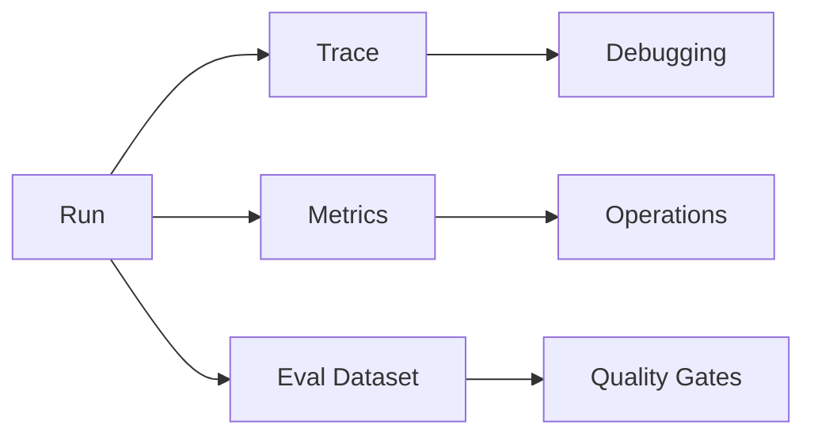

# Observability and Evals Pattern

## Intent

The Observability and Evals Pattern makes agent behavior inspectable and testable. It captures traces, tool calls, prompts, model outputs, costs, latencies, and evaluation results so teams can debug and improve systems over time.

## Use When

- Agent decisions affect users, money, data, or external systems.
- You need regression tests for prompts, tools, routing, or workflows.
- Failures are hard to reproduce from final answers alone.

## Avoid When

- You cannot store traces safely because of privacy or regulatory constraints.
- The prototype is throwaway and has no operational users.
- You only log final answers and call that observability.

## Architecture

## Implementation Notes

- Trace at the level of run, loop iteration, model call, tool call, workflow step, and evaluator result.
- Store enough input/output detail to reproduce failures, with redaction for sensitive data.
- Maintain golden datasets for routing, structured outputs, tool plans, and final answers.
- Treat eval failures as release blockers for production agents.

## Failure Modes

- Logs that omit the prompt, tool input, or model configuration.
- Evals that only check happy paths.
- Metrics without trace IDs, making incidents hard to investigate.
- Storing sensitive data without retention or redaction rules.

## Related Patterns

- [Evaluator-Optimizer](../evaluator-optimizer-pattern/README.md)
- [Mastra Runtime](../mastra-runtime-pattern/README.md)
- [Compliance/Policy Enforcer](../compliance-policy-enforcer-agent/README.md)
