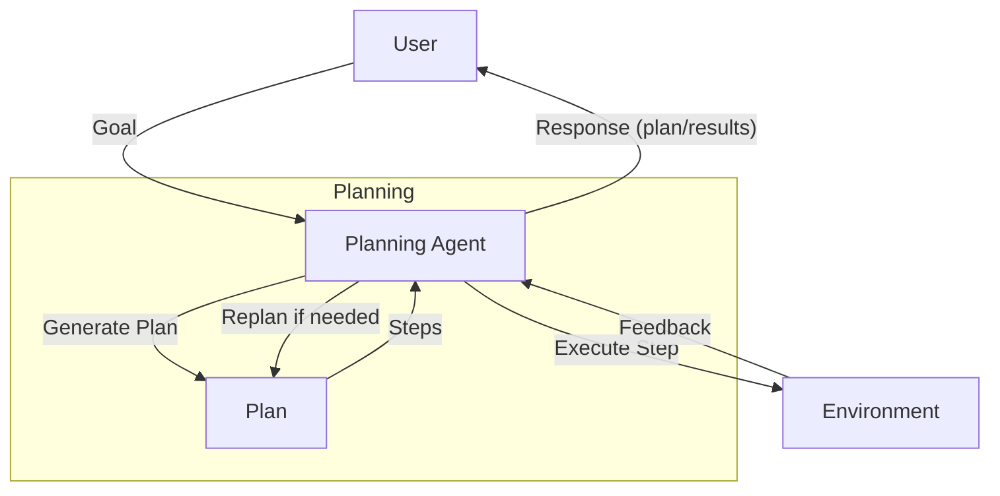

# Planning Agent Pattern

## Description

The Planning Agent Pattern equips agents with the ability to generate, evaluate, and execute multi-step plans to achieve complex goals. These agents can break down high-level objectives into actionable steps, sequence them logically, and adapt their plans based on feedback or changing circumstances. Planning agents are foundational for tasks that require foresight, coordination, and dynamic adjustment.

### Key Characteristics

- **Plan Generation:** Agents create step-by-step plans to achieve a goal.
- **Plan Execution:** Agents carry out each step, monitoring progress.
- **Plan Evaluation:** Agents assess the effectiveness of their plan and adjust as needed.
- **Dynamic Replanning:** Agents can revise their plan in response to obstacles or new information.

### Use Cases

- Automated workflow execution
- Multi-step problem solving
- Agents that coordinate complex tasks
- Adaptive assistants for dynamic environments

### Advantages

- Enables complex, multi-step task completion
- Flexible and adaptive to changing conditions
- Improves reliability and robustness

### Limitations

- Requires robust planning and execution logic
- May be computationally intensive
- Risk of plan failure or suboptimal plans

---

## Mermaid Diagram

