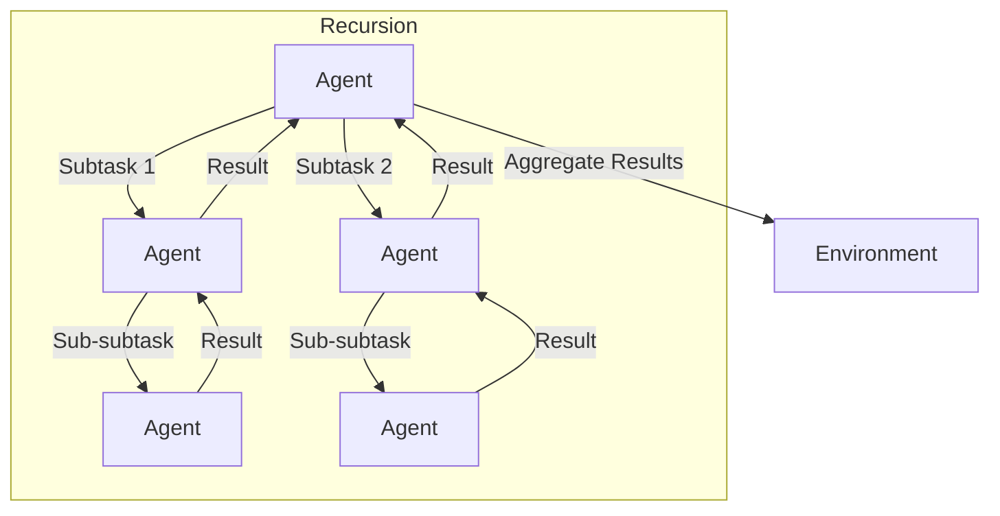

# Recursive Agent Pattern

## Description

The Recursive Agent Pattern allows agents to spawn or call other agents recursively to solve subproblems. This enables dynamic decomposition of complex tasks, where each agent can delegate subtasks to new agent instances as needed. The pattern is useful for hierarchical problem solving, divide-and-conquer strategies, and tasks with unknown or variable depth.

### Key Characteristics

- **Recursion:** Agents can create or invoke other agents to handle subtasks.
- **Dynamic Decomposition:** Task structure can be determined at runtime.
- **Hierarchical Problem Solving:** Supports divide-and-conquer and tree-like workflows.

### Use Cases

- Recursive planning and scheduling
- Hierarchical data processing
- Multi-level reasoning or search
- Dynamic workflow generation

### Advantages

- Handles arbitrarily complex or deep tasks
- Highly flexible and adaptive
- Supports modular, reusable agent logic

### Limitations

- Risk of infinite recursion or excessive resource use
- Harder to debug and monitor
- Requires careful state and result aggregation

---

## Mermaid Diagram

