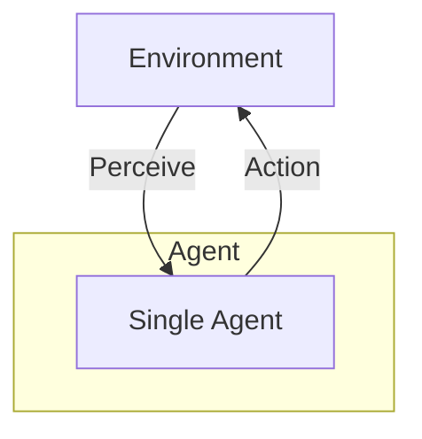

# Single Agent Pattern

## Description

The Single Agent Pattern is the simplest and most fundamental agentic system architecture. In this pattern, a single autonomous agent interacts with its environment to achieve a specific goal. The agent perceives its environment, reasons about its observations, and takes actions to influence the environment. This pattern is the basis for more complex agentic systems and is ideal for tasks that do not require collaboration or tool use.

### Key Characteristics

- **Autonomy:** The agent operates independently, making decisions without external intervention.
- **Perception:** The agent receives input from its environment (e.g., user queries, sensor data).
- **Action:** The agent performs actions to achieve its objectives (e.g., responding to queries, moving in a space).
- **Goal-Oriented:** The agent is designed to achieve specific goals or complete tasks.

### Use Cases

- Chatbots and virtual assistants
- Automated customer support
- Simple recommendation systems
- Data processing bots

### Advantages

- Simplicity and ease of implementation
- Clear and predictable behavior
- Good for well-defined, narrow tasks

### Limitations

- Cannot handle complex tasks requiring collaboration or specialization
- Limited scalability and adaptability
- No division of labor or parallelism

---

## Mermaid Diagram

