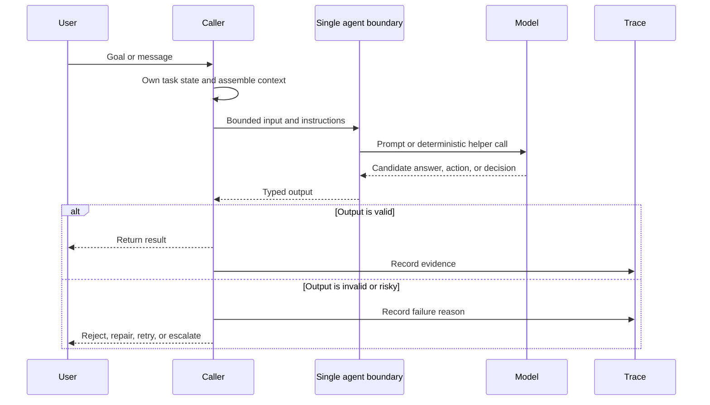

# Single Agent Pattern

## Description

The Single Agent Pattern is the simplest and most fundamental agentic system architecture. In this pattern, a single autonomous agent interacts with its environment to achieve a specific goal. The agent perceives its environment, reasons about its observations, and takes actions to influence the environment. This pattern is the basis for more complex agentic systems and is ideal for tasks that do not require collaboration or tool use.

### Key Characteristics

- **Autonomy:** The agent operates independently, making decisions without external intervention.
- **Perception:** The agent receives input from its environment (e.g., user queries, sensor data).
- **Action:** The agent performs actions to achieve its objectives (e.g., responding to queries, moving in a space).
- **Goal-Oriented:** The agent is designed to achieve specific goals or complete tasks.

### Use Cases

- Chatbots and virtual assistants
- Automated customer support
- Simple recommendation systems
- Data processing bots

### Advantages

- Simplicity and ease of implementation
- Clear and predictable behavior
- Good for well-defined, narrow tasks

### Limitations

- Cannot handle complex tasks requiring collaboration or specialization
- Limited scalability and adaptability
- No division of labor or parallelism

---

## Scenario

A support team wants a small assistant that rewrites rough internal notes into a customer-facing reply. The input contains the ticket summary, policy excerpt, and desired tone. The output is a draft response with no tool calls, no memory writes, and no payment authority.

This is a good single-agent baseline because the task has one worker, one bounded context packet, and one typed output. The caller still owns ticket state, policy version, escalation, and final send. The agent owns only the draft.

```text
input:
  ticket_id: T-918
  customer_issue: "Package arrived two days late."
  policy_excerpt: "Late delivery may receive shipping-fee credit, not full refund."
  requested_output: "draft customer reply"

single_agent_allowed:
  - summarize issue
  - draft reply
  - explain policy-backed next step

single_agent_forbidden:
  - issue refund
  - update ticket status
  - send message to customer
  - remember customer preference
```

If the team later needs live order lookup, policy retrieval, approval, or message sending, this pattern has reached its boundary. Keep the single agent as the drafting worker and put tools, state, approval, and delivery in the surrounding workflow.

## Architecture


```mermaid
sequenceDiagram
    participant User
    participant Caller
    participant Agent as Single agent boundary
    participant Model
    participant Trace

    User->>Caller: Goal or message
    Caller->>Caller: Own task state and assemble context
    Caller->>Agent: Bounded input and instructions
    Agent->>Model: Prompt or deterministic helper call
    Model-->>Agent: Candidate answer, action, or decision
    Agent-->>Caller: Typed output
    alt Output is valid
        Caller-->>User: Return result
        Caller->>Trace: Record evidence
    else Output is invalid or risky
        Caller->>Trace: Record failure reason
        Caller-->>User: Reject, repair, retry, or escalate
    end
```

Use this as the baseline architecture. If the system needs durable retries, independent evaluation, tool orchestration, or specialist handoffs, it has moved beyond the single-agent pattern.
