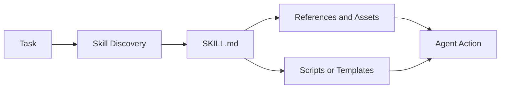

# Skills Pattern

## Intent

The Skills Pattern packages procedural knowledge as discoverable folders: concise instructions, references, scripts, templates, and tests that an agent loads only when relevant.

## Use When

- A capability requires repeatable domain procedure rather than only a tool API.
- You want reusable know-how across agents, teams, or projects.
- The agent benefits from progressive disclosure: short instructions first, deeper references only when needed.

## Avoid When

- A simple tool schema fully describes the capability.
- The skill would embed secrets, credentials, or unsafe scripts.
- The instructions are too vague to test with real tasks.

## Architecture

## Implementation Notes

- Keep `SKILL.md` short and route to deeper files only when needed.
- Bundle scripts and templates instead of asking the model to recreate fragile artifacts.
- Treat skills as supply-chain inputs: review, version, test, and restrict execution.
- Include examples of successful and unsuccessful use.

### CLI-First Skills

A useful skill should be callable by both a human and an agent. A command-line interface is often the simplest shared contract:

- one command per capability;
- predictable subcommands such as `list`, `get`, `create`, and `run`;
- structured output for agents and readable output for humans;
- non-interactive defaults with explicit `--yes` or `--force` flags;
- credentials from environment or platform stores, not prompts hidden inside the command.

This keeps the skill testable outside the agent loop. If a human cannot run the skill directly and inspect the output, the agent will be harder to debug when the skill fails.

## Failure Modes

- Skill descriptions that are too broad, causing irrelevant activation.
- Long instruction files that consume context before the task is understood.
- Hidden dependencies that only work on one machine.
- Malicious or outdated bundled scripts.

## Related Patterns

- [MCP-first Tool Use](../modern-tool-use-pattern/README.md)
- [Context Engineering](../context-engineering-pattern/README.md)
- [Human-in-the-Loop Approval](../human-in-the-loop-approval-agent/README.md)
